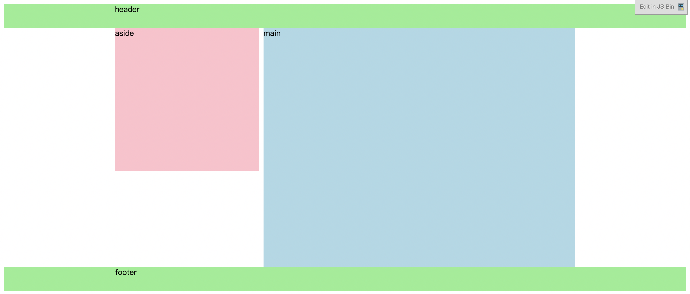
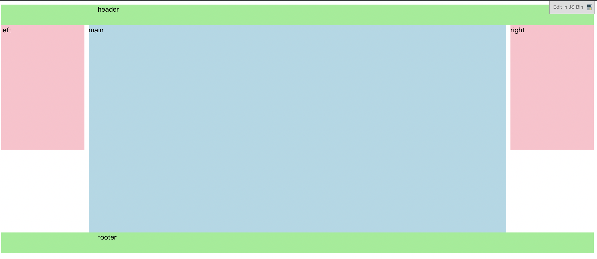

### 单列布局
```
<!DOCTYPE html>
<html>
<head>
  <meta charset="utf-8">
  <meta name="viewport" content="width=device-width">
  <title>JS Bin</title>
  <style>
    .header{
        background-color:pink;
        height:80px;
        min-width:500px;
    }
    .content{
        background-color:yellowgreen;
        height:180px;
    }
    .footer{
        background-color:lightblue;
        height:80px;
        min-width:500px;
    }
    .layout{
        width:500px;
        margin:0px auto;
    }
  </style>
</head>
<body>
  <div class='header'>
    <div class='layout'>header</div>
  </div>
  <div class='content layout'>content</div>
  <div class='footer'>
    <div class='layout'>footer</div>
  </div>
</body>
</html>
```

### 双列布局
一列固定宽度，另外一列自适应宽度。
```
<!DOCTYPE html>
<html>
<head>
  <meta charset="utf-8">
  <meta name="viewport" content="width=device-width">
  <title>JS Bin</title>
  <style>
    .header,.footer{
      background-color:lightgreen;
      height:50px;
      min-width:960px;
    }
    .layout{
      width:960px;
      margin:0 auto;
    }
    .content{
      margin:0 auto;
    }
    .content:after{
      display:block;
      content:'';
      clear:both;
    }
    .aside{
      float:left;
      width:300px;
      background-color:pink;
      height:300px;
    }
    .main{
      background-color:lightblue;
      height:500px;
      margin-left:310px;
    }
  </style>
</head>
<body>
  <div class='header'>
    <div class='layout'>header</div>
  </div>
  <div class='content'>
      <div class='aside'>aside</div>
      <div class='main'>main</div>
  </div>
  <div class='footer'>
    <div class='layout'>footer</div>
  </div>
</body>
</html>
```

**原理：浮动 + margin**
- 左边元素设置固定宽度，向左浮动。
- 右边元素margin-left为左边元素的宽度。
- 父元素清除浮动。
```
.content:after{
    display:block;
    content:'';
    clear:both;
}
.aside{
    float:left;
    width:300px;
    background-color:pink;
    height:300px;
}
.main{
    background-color:lightblue;
    height:500px;
    margin-left:310px;
}
```
### 三列布局
两侧两列固定宽度，中间列自适应宽度。
```
<!DOCTYPE html>
<html>
<head>
  <meta charset="utf-8">
  <meta name="viewport" content="width=device-width">
  <title>JS Bin</title>
  <style>
    .header,.footer{
      background-color:lightgreen;
      height:50px;
      min-width:960px;
    }
  
    .layout{
      width:960px;
      margin:0 auto;
    }
    .content{
      width:960px;
      margin:0 auto;
    }
    .content:after{
      display:block;
      content:'';
      clear:both;
    }
    .left{
      float:left;
      width:200px;
      background-color:pink;
      height:300px;
    }
    .right{
      float:right;
      width:200px;
      background-color:pink;
      height:300px;
    }
    .main{
      background-color:lightblue;
      height:500px;
      margin-left:210px;
      margin-right:210px;
    }
  </style>
</head>
<body>
  <div class='header'>
    <div class='layout'>header</div>
  </div>
  <div class='content'>
      <div class='left'>left</div>
      <div class='right'>right</div>
      <div class='main'>main</div>
  </div>
  <div class='footer'>
    <div class='layout'>footer</div>
  </div>
</body>
</html>
```

**原理：浮动 + margin**
- 左边元素设置固定宽度，向左浮动。
- 左边元素设置固定宽度，向右浮动。
- 中间元素margin-left为左边元素的宽度，margin-right为右边元素宽度。
- 父元素清除浮动。