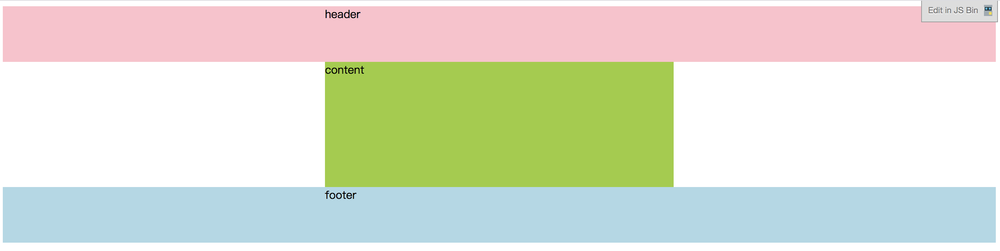

### 单栏布局
```
<!DOCTYPE html>
<html>
<head>
  <meta charset="utf-8">
  <meta name="viewport" content="width=device-width">
  <title>JS Bin</title>
  <style>
    .header{
        background-color:pink;
        height:80px;
        min-width:500px;
    }
    .content{
        background-color:yellowgreen;
        height:180px;
    }
    .footer{
        background-color:lightblue;
        height:80px;
        min-width:500px;
    }
    .layout{
        width:500px;
        margin:0px auto;
        border:1px solid red;
    }
  </style>
</head>
<body>
  <div class='header'>
    <div class='layout'>header</div>
  </div>
  <div class='content layout'>content</div>
  <div class='footer'>
    <div class='layout'>footer</div>
  </div>
</body>
</html>
```

### 双栏布局
### 三栏布局