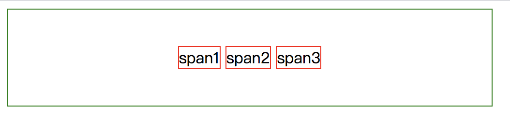
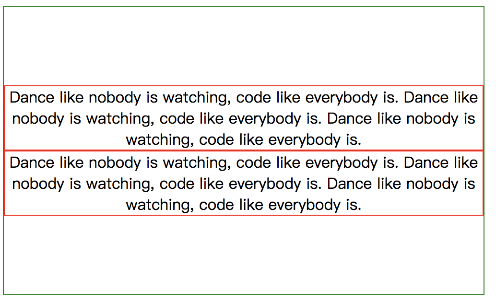

## 单行内联元素水平垂直居中
水平居中 ：父元素设置`text-align: center;`
垂直居中 ：父元素`line-height = height`
```
 <div class="parent">
    <span class="child">span1</span>
    <span class="child">span2</span>
    <span class="child">span3</span>
</div>
.parent {
    width: 500px;
    height: 100px;
    line-height: 100px;
    border: 1px solid green;
    text-align: center;
}
.child {
    border: 1px solid red;
}
```

### 多行内联元素水平垂直居中
水平居中 ：父元素设置`text-align: center;`
垂直居中 ：父元素设置：
```
display: flex;
flex-direction: column;
justify-content: center;
```
```
<div class="parent">
    <span class="child">
        Dance like nobody is watching, code like everybody is.Dance like nobody is watching, code like everybody is.Dance like nobody is watching, code like everybody is.
    </span>
    <span class="child">
        Dance like nobody is watching, code like everybody is.Dance like nobody is watching, code like everybody is.Dance like nobody is watching, code like everybody is.
    </span>
</div>
.parent {
    width: 500px;
    height: 300px;
    border: 1px solid green;
    text-align: center;
    display: flex;
    flex-direction: column;
    justify-content: center;
}
.child {
    border: 1px solid red;
}
```

## 单个块级元素水平垂直居中
