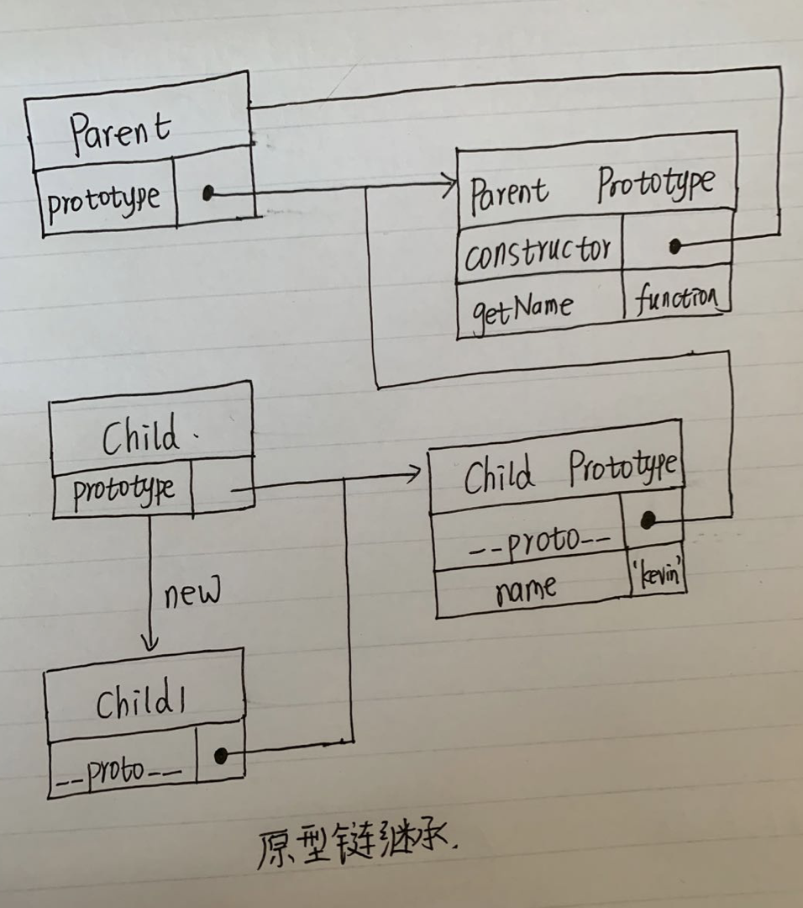
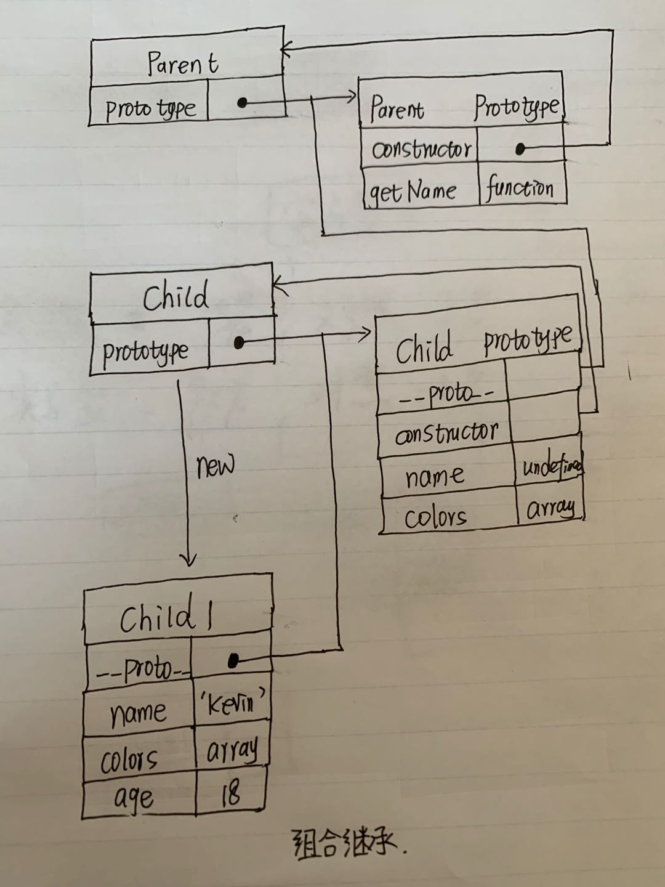
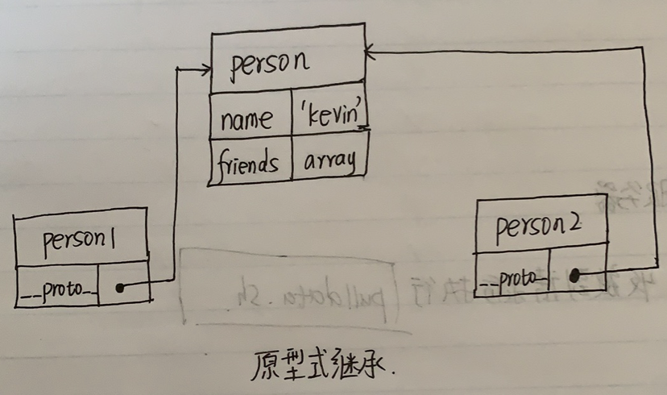
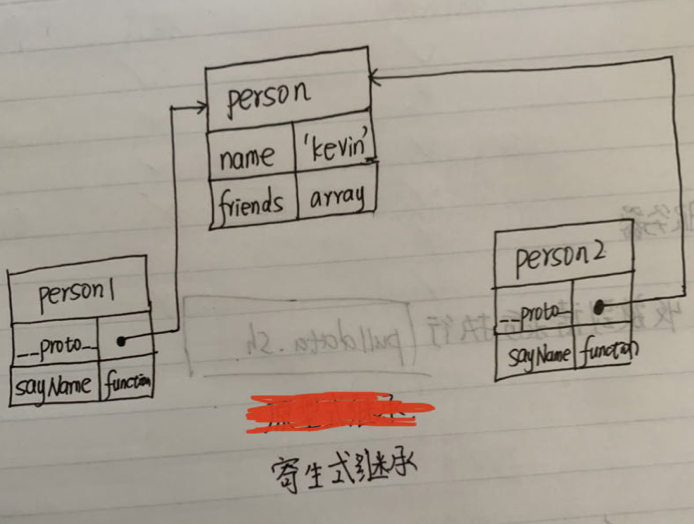
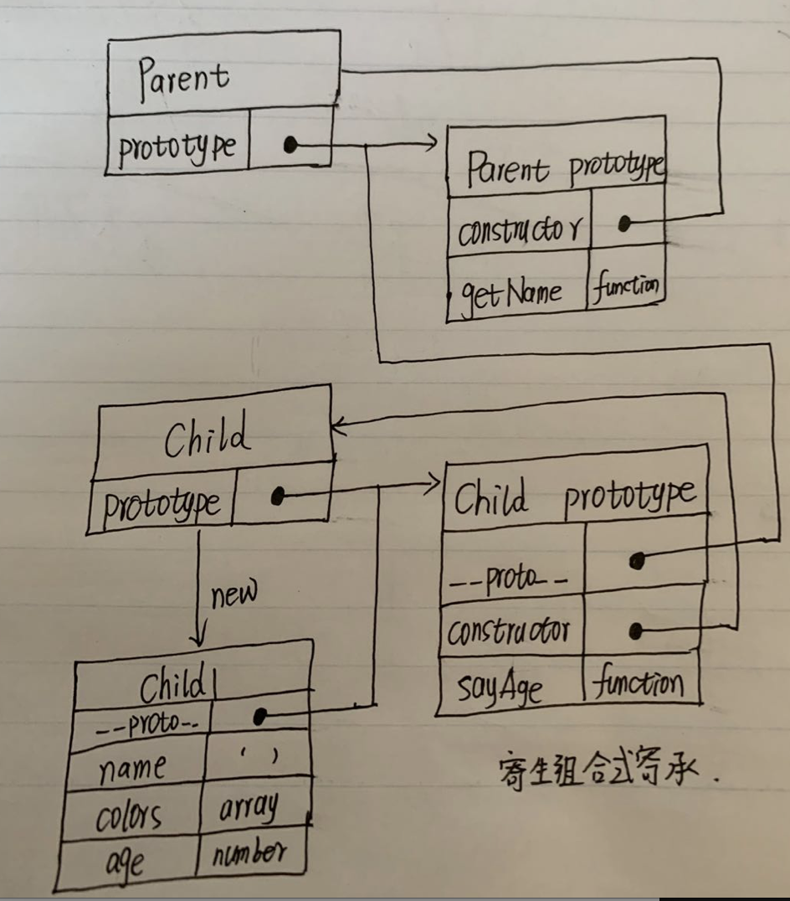

### 1.原型链继承
```
function Parent () {
    this.name = 'kevin';
}

Parent.prototype.getName = function () {
    console.log(this.name);
}

function Child () {

}

Child.prototype = new Parent();

var child1 = new Child();

console.log(child1.getName()) // kevin
```
**原型图：**

**本质：**
```
Child.prototype = new Parent()
```
**优点：**
1. 实现了最基本的原型继承。
**缺陷：**
1. 包含引用类型值的原型属性会被所有实例共享。
2. 在创建子类型实例时，不能向父类的构造函数传参。
### 2.构造函数继承
```
function Parent () {
    this.names = ['kevin', 'daisy'];
}

function Child () {
    Parent.call(this);
}

var child1 = new Child();

child1.names.push('yayu');

console.log(child1.names); // ["kevin", "daisy", "yayu"]

var child2 = new Child();

console.log(child2.names); // ["kevin", "daisy"]
```
**本质：**
```
function Child () {
    Parent.call(this);
}
```
**优点：**
1.  避免了引用类型的属性被所有实例共享。
   
**缺陷：**
1. 无法复用父类原型中的方法。
2. 方法都在构造函数中定义，因此函数复用无从谈起。
### 3.组合继承
将原型链继承和构造函数继承组合使用。
```
function Parent (name) {
    this.name = name;
    this.colors = ['red', 'blue', 'green'];
}

Parent.prototype.getName = function () {
    console.log(this.name)
}

function Child (name, age) {

    Parent.call(this, name);
    
    this.age = age;

}

Child.prototype = new Parent();
Child.prototype.constructor = Child;

var child1 = new Child('kevin', '18');

child1.colors.push('black');

console.log(child1.name); // kevin
console.log(child1.age); // 18
console.log(child1.colors); // ["red", "blue", "green", "black"]

var child2 = new Child('daisy', '20');

console.log(child2.name); // daisy
console.log(child2.age); // 20
console.log(child2.colors); // ["red", "blue", "green"]
```
原型图：

本质：
```
function Child () {
    Parent.call(this);
}
Child.prototype = new Parent();
Child.prototype.constructor = Child;
```
**优点：**
1. 子类构造函数可以向父类构造函数传递参数。
2. 避免了引用类型的属性被所有实例共享。
3. 子类可以复用父类原型中的方法。

**缺点：**
1.无论什么情况下，都会调用两次超类构造函数：一次是在创建子类型原型的时候，另一次是在子类型构造函数内部。以至于子类型最终会包含超类型对象的全部实例属性，但我们不得不在调用子类型构造函数时重写这些属性。

###4.原型式继承
```
function createObj(o) {
    function F(){}
    F.prototype = o;
    return new F();
}

var person = {
    name: 'kevin',
    friends: ['daisy', 'kelly']
}

var person1 = createObj(person);
var person2 = createObj(person);

person1.name = 'person1';
console.log(person2.name); // kevin

person1.firends.push('taylor');
console.log(person2.friends); // ["daisy", "kelly", "taylor"]
```
**注意：**
修改person1.name的值，person2.name的值并未发生改变，并不是因为person1和person2有独立的 name 值，而是因为person1.name = 'person1'，给person1添加了 name 值，并非修改了原型上的 name 值。
**原型图：**

**优点：**
1.如果只是想让一个对象与另外一个对象保持类似，这个方法完全可以胜任。
**缺点：**
1.包含引用类型的属性值始终都会共享相应的值，这点跟原型链继承一样。

###5.寄生式继承
创建一个仅用于封装继承过程的函数，该函数在内部以某种形式来做增强对象，最后返回对象。
```
function object(o) {
    function F() {}
    F.prototype = o;
    return new F();
}

function createObj (o) {
    var clone = object(o);
    clone.sayName = function () {
        console.log('hi');
    }
    return clone;
}

var person = {
    name: 'kevin',
    friends: ['daisy', 'kelly']
}

var person1 = createObj(person);
var person2 = createObj(person);

```
原型图：

缺点：跟借用构造函数模式一样，每次创建对象都会创建一遍方法。
###6.寄生组合式继承
```
function object(o) {
    function F() {}
    F.prototype = o;
    return new F();
}

function prototype(child, parent) {
    var prototype = object(parent.prototype);
    prototype.constructor = child;
    child.prototype = prototype;
}

// 当我们使用的时候：
function Parent (name) {
    this.name = name;
    this.colors = ['red', 'blue', 'green'];
}

Parent.prototype.getName = function () {
    console.log(this.name)
}

function Child (name, age) {
    Parent.call(this, name);
    this.age = age;
}

prototype(Child, Parent);

Child.prototype.sayAge = function(){
    console.log(this.age);
}

```
**本质：**
```
function Child (name, age) {
    Parent.call(this, name);
    this.age = age;
}

function object(o) {
    function F() {}
    F.prototype = o;
    return new F();
}

function prototype(child, parent) {
    var prototype = object(parent.prototype);
    prototype.constructor = child;
    child.prototype = prototype;
}
```
**原型图：**


**优点：**
这种方式的高效率体现它只调用了一次 Parent 构造函数，并且因此避免了在 Parent.prototype 上面创建不必要的、多余的属性。与此同时，原型链还能保持不变；因此，还能够正常使用 instanceof 和 isPrototypeOf。开发人员普遍认为寄生组合式继承是引用类型最理想的继承范式。
