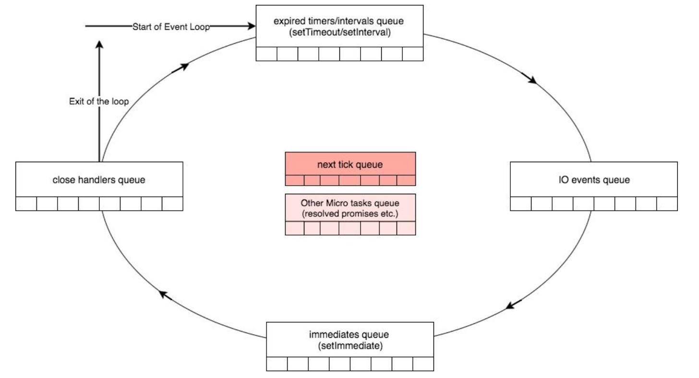

## Node.js运行原理
下图展示了整个 Node.js 的运行原理，从左到右，从上到下，Node.js 被分为了四层，分别是 应用层、V8引擎层、Node API层 和 LIBUV层。

- **应用层**：   即 JavaScript 交互层，常见的就是 Node.js 的模块，比如 http，fs
- **V8引擎层**：  即利用 V8 引擎来解析JavaScript 语法，进而和下层 API 交互
- **NodeAPI层**：  为上层模块提供系统调用，一般是由 C 语言来实现，和操作系统进行交互 。
- **LIBUV层**： 是跨平台的底层封装，实现了 事件循环、文件操作等，是 Node.js 实现异步的核心 。

## 事件循环概述
Node.js启动时，它将初始化事件循环，处理提供的输入脚本，这些脚本可能会进行异步API调用，调度计时器或调用process.nextTick， 处理完成后进入事件循环处理过程。


注：图中的Pending阶段，等同于下面的I/O callbacks阶段。

事件循环主要有以下六个阶段组成：

- **timers** 阶段：这个阶段执行 setTimeout 和 setInterval 的回调函数。
- **I/O callbacks** 阶段：这个阶段执行一些系统操作的回调。
- **idle, prepare** 阶段：event loop 内部使用的阶段（译注：我们不用关心这个阶段）
- **poll** 阶段：获取新的 I/O 事件。在某些场景下 Node.js 会阻塞在这个阶段。
- **check** 阶段：执行 setImmediate() 的回调函数。
- **close callbacks** 阶段：执行关闭事件的回调函数，如 socket.on('close', fn) 里的 fn。

除了执行上述阶段的队列外，还有2个有趣的队列，这些队列是“中间队列”并由Node处理。虽然这些队列不是libuv本身的一部分，但它们是NodeJS的一部分。他们是：
- **Next Ticks**队列：使用process.nextTick函数添加的回调。
- **Other Microtasks**队列：包括其他 microtask，如 resolved promise回调。

## 事件循环是如何工作的呢？
如下图所示，Node通过检查定时器队列中的任何过期定时器来启动事件循环，在每个步骤中经过每个队列。处理完close handlers队列后，如果在任何队列中没有要处理的项目，则循环将退出。执行事件循环中的每个队列可以被视为事件循环的一个阶段。



红色描述的中间队列的有趣之处在于，只要一个阶段完成，事件循环就会检查这两个中间队列中的任何可执行项。如果中间队列中有任何项可执行，则事件循环将立即开始处理它们，直到两个队列被清空。一旦它们是空的，事件循环将继续到下一个阶段。

Next tick队列比Other Microtasks队列具有更高的优先级，这意味着在开始处理microtasks队列中的 resolved promise之前，先清空Next tick队列。

## 阶段详解
事件循环的 I/O callbacks、Idle/Prepare 和 Close 是 Node 在内部使用的阶段。Node 开发者编写的代码仅在主线、计时器（Timers） 阶段、轮询（Poll） 阶段和 查询（Check） 阶段中运行。

所以我们主要关注timers、poll、check阶段。

**timers阶段**

计时器实际上是在指定多久以后可以执行某个回调函数，而不是指定某个函数的确切执行时间。当指定的时间达到后，计时器的回调函数会尽早被执行。如果操作系统很忙，或者 Node.js 正在执行一个耗时的函数，那么计时器的回调函数就会被推迟执行。


**poll 阶段（轮询阶段）**
poll 阶段有两个主要功能：（1）执行下限时间已经达到的timers的回调，（2）然后处理 poll 队列里的事件。
当event loop进入 poll 阶段，并且 没有设定的 timers（there are no timers scheduled），会发生下面两件事之一：

- 如果 poll 队列不空，event loop会遍历队列并同步执行回调，直到队列清空或执行的回调数到达系统上限；


- 如果 poll 队列为空，则发生以下两件事之一：

    - 如果代码已经被setImmediate()设定了回调, event loop将结束 poll 阶段进入 check 阶段来执行 check 队列（里面的回调 callback）。
    - 如果代码没有被setImmediate()设定回调，event loop将阻塞在该阶段等待回调被加入 poll 队列，并立即执行。

- 但是，当event loop进入 poll 阶段，并且 有设定的timers，一旦 poll 队列为空（poll 阶段空闲状态）：
event loop将检查timers,如果有1个或多个timers的下限时间已经到达，event loop将绕回 timers 阶段，并执行 timers 队列。

**check阶段**

这个阶段允许在 poll 阶段结束后立即执行回调。如果 poll 阶段空闲，并且有被setImmediate()设定的回调，event loop会转到 check 阶段而不是继续等待。

一般来说，当代码执行后，event loop 最终会达到 poll 阶段，等待新的连接、新的请求等。但是如果一个回调是由 setImmediate() 发出的，同时 poll 阶段空闲下来了，event loop就会结束 poll 阶段进入 check 阶段，不再等待新的 poll 事件。


## demo

**setImmediate() vs setTimeout()**

setImmediate() 的回调放在check阶段。

setTimeout() 的回调放在timers阶段。

这两者的回调的执行顺序取决于 setTimeout 和 setImmediate 被调用时的环境。

如果 setTimeout 和 setImmediate 都是在主模块（main module）中被调用的，那么回调的执行顺序取决于当前进程的性能，这个性能受其他应用程序进程的影响。


举例来说，如果在主模块中运行下面的脚本，那么两个回调的执行顺序是无法判断的：

```
// timeout_vs_immediate.js
setTimeout(() => {
  console.log('timeout');
}, 0);

setImmediate(() => {
  console.log('immediate');
});
```
运行结果如下：
```
$ node timeout_vs_immediate.js
timeout
immediate

$ node timeout_vs_immediate.js
immediate
timeout
```
原因是：

如果event loop 启动得比较慢，那么它启动时，timers阶段的队列已经有setTimeout的回调函数，那么它会先执行setTimeout的回调函数，然后事件循环进入poll阶段，poll阶段队列为空，setImmediate()设定了回调, event loop将结束 poll 阶段进入 check 阶段来执行 check 队列里面的回调 callback。

如果event loop启动的较快，那么js执行完代码后，timers队列和check队列都有回调函数，事件循环机制会先进入check阶段，执行setImmediate的回调，再触发第二轮事件循环，从而执行timers阶段setTimeout的回调函数。

但是，如果把上面代码放到 I/O 操作的回调里，setImmediate 的回调就总是优先于 setTimeout 的回调：
```
// timeout_vs_immediate.js
const fs = require('fs');

fs.readFile(__filename, () => {
  setTimeout(() => {
    console.log('timeout');
  }, 0);
  setImmediate(() => {
    console.log('immediate');
  });
});
```
运行结果如下：
```
$ node timeout_vs_immediate.js
immediate
timeout

$ node timeout_vs_immediate.js
immediate
timeout
```
setImmediate 的主要优势就是，如果在 I/O 操作的回调里，setImmediate 的回调总是比 setTimeout 的回调先执行。

**process.nextTick**    

process.nextTick会在各个事件阶段之间执行，一旦执行，要直到nextTick队列被清空，才会进入到下一个事件阶段，所以如果递归调用 process.nextTick()，会导致出现I/O starving（饥饿）的问题，比如下面例子的readFile已经完成，但它的回调一直无法执行：
```
const fs = require('fs')
const starttime = Date.now()
let endtime

fs.readFile('text.txt', () => {
  endtime = Date.now()
  console.log('finish reading time: ', endtime - starttime)
})

let index = 0

function handler () {
  if (index++ >= 1000) return
  console.log(`nextTick ${index}`)
  process.nextTick(handler)
  // console.log(`setImmediate ${index}`)
  // setImmediate(handler)
}

handler()
```
输出：
```
nextTick 1
nextTick 2
......
nextTick 999
nextTick 1000
finish reading time: 170
```
替换成setImmediate()，运行结果：
```
setImmediate 1
setImmediate 2
finish reading time: 80
......
setImmediate 999
setImmediate 1000
```
这是因为嵌套调用的 setImmediate() 回调，被排到了下一次event loop才执行，所以不会出现阻塞。
**setImmediate**
```
setImmediate(function(){
  console.log("setImmediate");
  setImmediate(function(){
    console.log("嵌套setImmediate");
  });
  process.nextTick(function(){
    console.log("nextTick");
  })
});
```
输出：
```
setImmediate
nextTick
嵌套setImmediate
```

事件循环check阶段执行回调函数输出setImmediate，之后输出nextTick。嵌套的setImmediate在下一个事件循环的check阶段执行回调输出嵌套的setImmediate。

**综合demo1**
```
setTimeout(() => {
    console.log('timeout0');
    new Promise((resolve, reject) => { resolve('resolved') }).then(res => console.log(res));
    new Promise((resolve, reject) => {
      setTimeout(()=>{
        resolve('timeout resolved')
      })
    }).then(res => console.log(res));
    process.nextTick(() => {
        console.log('nextTick1');
        process.nextTick(() => {
            console.log('nextTick2');
        });
    });
    process.nextTick(() => {
        console.log('nextTick3');
    });
    console.log('sync');
    setTimeout(() => {
        console.log('timeout2');
    }, 0);
}, 0);
```
输出：
```
timeout0
sync
nextTick1
nextTick3
nextTick2
resolved
timeout2
timeout resolved
```
解析：
1. 执行timers阶段的回调，输出同步代码`timeout0`，将第一个promise的回调放入微任务队列的promise队列里，执行第二个promise的执行器，并将setTimeout的回调放入下一轮循环的timers阶段。将两个process.nextTick回调放入微任务队列里的process.nextTick队列，输出`sync`，将最后一个setTimeout的回调放入下一个循环的timers阶段。
2. timers阶段执行完毕，会在进入下一个阶段之前执行完所有的微任务队列，由于process.nextTick比promise具有更高的优先级，因此会首先执行第一个process.nextTick回调，输出
`nextTick1`,并将第三个process.nextTick的回调放入队列中，然后执行第二个process.nextTick的回调，输出`nextTick3`,然后执行第三个process.nextTick的回调，输出`nextTick2`，接下来执行第一个promise的回调，输出`resolved`。
3. 接下来进入第二轮事件循环的timers阶段，将第二个promise resolve，并将其回调放入微任务队列的promise队列，接下来执行 第二个setTimeout的回调，输出`timeout2`,最后，再进入下一个阶段之前执行第二个promise的的回调，输出`timeout resolved`。


**综合demo2**

```
async function async1(){
    console.log('async1 start')
    await async2()
    console.log('async1 end')
  }
async function async2(){
    console.log('async2')
}
console.log('script start')
setTimeout(function(){
    console.log('setTimeout0') 
},0)  
setTimeout(function(){
    console.log('setTimeout3') 
},3)  
setImmediate(() => console.log('setImmediate'));
process.nextTick(() => console.log('nextTick'));
async1();
new Promise(function(resolve){
    console.log('promise1')
    resolve();
    console.log('promise2')
}).then(function(){
    console.log('promise3')
})
console.log('script end')
```
输出：
```
script start
async1 start
async2
promise1
promise2
script end
nextTick
async1 end
promise3
setImmediate
setTimeout0
setTimeout3
```
1. 执行主线程代码，输出script start
2. 将setTimeout、setImmediate、process.nextTick回调分别放入timers、check、微任务阶段的队列里面。
3. 执行async1输出async1 start
4. 执行async1输出async2 start，将async1 await后面的代码放入微任务队列。
5. 执行promise的执行器，输出promise1，promise2，并将其回调放入微任务队列回调。
6. 输出script end。
7. 主线程代码执行完毕，执行微任务队列，由于process.nextTick回调优先级更高，所以输出nextTick、async1 end、promise3。
8. 最后，假设event loop已经启动好了，那么它将处于poll阶段，那么会先执行check阶段的回调，输出setImmediate。
9. 进入第二轮循环的timers阶段，输出setTimeout0、setTimeout3。

## 参考
[Event Loop、计时器、nextTick](https://zhuanlan.zhihu.com/p/34924059)
[深入理解NodeJS事件循环机制](https://juejin.im/post/5dd24ecce51d453fb903ff37#heading-6)
[【译】NodeJS事件循环 Part 1](https://zhuanlan.zhihu.com/p/38395184)
[深入理解js事件循环机制（Node.js篇）](http://lynnelv.github.io/js-event-loop-nodejs)
[NodeJs 事件循环-比官方翻译更全面](https://cloud.tencent.com/developer/article/1558961)
