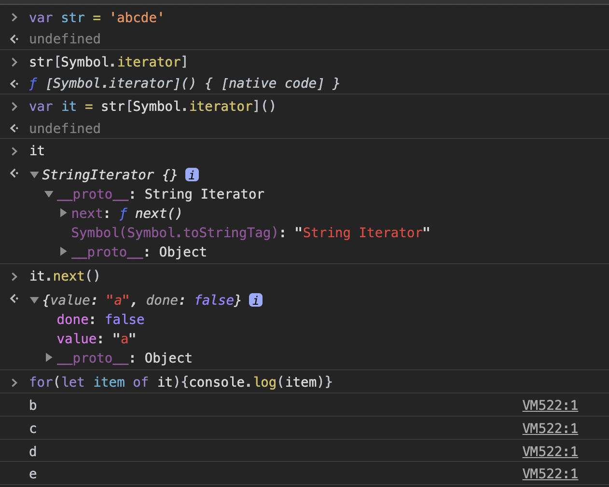
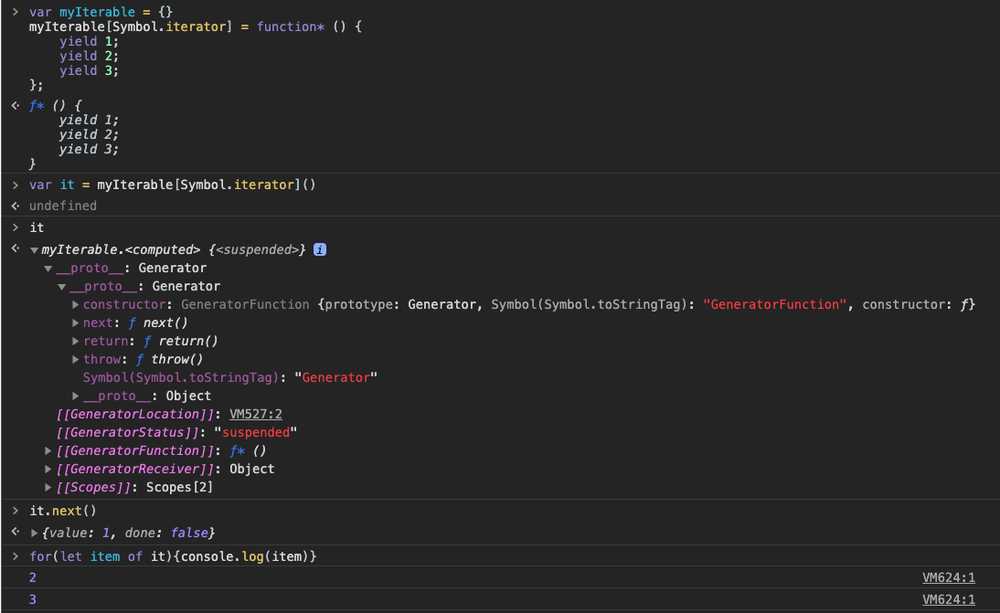

[TOC]
### Symbol的作用
Symbol的作用非常的专一，换句话说其设计出来就只有一个目的——作为对象属性的唯一标识符，防止对象属性冲突发生。
### Symbol的语法
```
Symbol([description])

[description] 可选的，字符串类型。对symbol的描述，可用于调试但不是访问symbol本身。
```
```
✨ 1. 创建symbol
var sym1 = Symbol();
var sym2 = Symbol('foo');

✨ 2. symbol是独一无二的
Symbol("foo") === Symbol("foo"); // false

✨ 3. symbol类型
typeof sym1     // 'symbol'

✨ 4. symbol的描述符
const sym = Symbol('foo');
sym.description // "foo"

✅ 5. Symbol 值可以显式转为字符串
let sym = Symbol('My symbol');
String(sym)     // 'Symbol(My symbol)'
sym.toString()  // 'Symbol(My symbol)'

✅ 6. Symbol 值也可以转为布尔值
let sym = Symbol();
Boolean(sym)    // true
!sym            // false

❌ 7. Symbol 值不能转为数值
let sym = Symbol();
Number(sym)     // TypeError
sym + 2         // TypeError

❌ 8. Symbol 不能使用new命令
var sym = new Symbol();     // TypeError
```
### 作为对象的属性名
```
✨ 1. 作为对象属性名

let mySymbol = Symbol();
✅ 第一种写法
let a = {};
a[mySymbol] = 'Hello!';
✅ 第二种写法
let a = {
  [mySymbol]: 'Hello!'
};
✅ 第三种写法
let a = {};
Object.defineProperty(a, mySymbol, { value: 'Hello!' });

// 以上写法都得到同样结果
a[mySymbol] // "Hello!"

❌ 不可以用点运算符，因为点运算符后面总是字符串
a.mySymbol = 'Hello!';
a[mySymbol] // undefined
a['mySymbol'] // "Hello!"

✨ 2. 遍历对象的symbol属性
✅ Object.getOwnPropertySymbols()获取所有 Symbol 属性名。
const obj = {};
let a = Symbol('a');
let b = Symbol('b');

obj[a] = 'Hello';
obj[b] = 'World';

const objectSymbols = Object.getOwnPropertySymbols(obj);

objectSymbols
// [Symbol(a), Symbol(b)]

✅ Reflect.ownKeys()返回对象所有类型的键名
let obj = {
  [Symbol('my_key')]: 1,
  enum: 2,
  nonEnum: 3
};

Reflect.ownKeys(obj)
//  ["enum", "nonEnum", Symbol(my_key)]

❌ Symbol 作为属性名，遍历对象的时候，该属性不会出现在

- for...in
- for...of
- Object.keys()
- Object.getOwnPropertyNames()
- JSON.stringify()
```
### Symbol.for()，Symbol.keyFor()
`Symbol.for() `

使用给定的key搜索现有的symbol，如果找到则返回该symbol。否则将使用给定的key在全局symbol注册表中创建一个新的symbol。
```
let s1 = Symbol.for('foo');
let s2 = Symbol.for('foo');

s1 === s2 // true
```
`Symbol.keyFor()`

返回一个已登记的 Symbol 类型值的key。
```
let s1 = Symbol.for("foo");
Symbol.keyFor(s1) // "foo"

let s2 = Symbol("foo");
Symbol.keyFor(s2) // undefined
```

`Symbol.for()与Symbol()区别：`

这两种写法，都会生成新的 Symbol。它们的区别是，前者会被登记在全局环境中供搜索，后者不会。

```
Symbol.for("bar") === Symbol.for("bar")
// true

Symbol("bar") === Symbol("bar")
// false
```
### Symbol.iterator
Symbol.iterator 可以为每一个对象定义默认的迭代器。该迭代器可以被 for...of 循环使用。
- js为String、Array、Map、Set等类型创建了默认的迭代器



- 我们也可以为对象创建自定义的迭代器：
```
var myIterable = {}
myIterable[Symbol.iterator] = function* () {
    yield 1;
    yield 2;
    yield 3;
};
[...myIterable] // [1, 2, 3]
```
