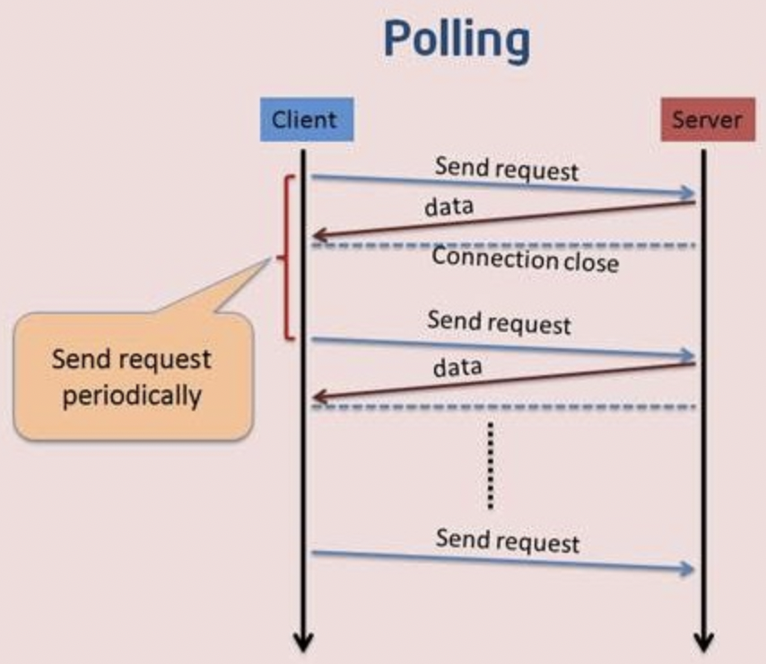

[TOC]
随着 Web 的发展，用户对于 Web 的实时推送要求也越来越高 ，比如，工业运行监控、Web 在线通讯、即时报价系统、在线游戏等，都需要将后台发生的变化主动地、实时地传送到浏览器端，而不需要用户手动地刷新页面。

HTTP 协议有一个缺陷：通信只能由客户端发起。举例来说，我们想了解今天的天气，只能是客户端向服务器发出请求，服务器返回查询结果。HTTP 协议做不到服务器主动向客户端推送信息。这种单向请求的特点，注定了如果服务器有连续的状态变化，客户端要获知就非常麻烦。有四种实现双向通信的方式：
- 轮询（polling）
- 长轮询（long-polling）
- iframe流（streaming）
- WebSocket

我们将分别介绍
### 轮询（polling）
轮询的原理非常简单，让浏览器通过setInterval每隔几秒就发送一次请求，询问服务器是否有新信息。



可以看到，使用轮询的方式，客户端和服务器之间会一直进行连接，每隔一段时间就询问一次。其缺点也很明显：连接数会很多，一个接受，一个发送。而且每次发送请求都会有Http的Header，会很耗流量，也会消耗CPU的利用率。
- 优点：实现简单，无需做过多的更改
- 缺点：轮询的间隔过长，会导致用户不能及时接收到更新的数据；轮询的间隔过短，会导致查询请求过多，增加服务器端的负担

**代码：**
```
// 客户端
<!DOCTYPE html>
<html lang="en">
<head>
    <meta charset="UTF-8">
    <meta name="viewport" content="width=device-width, initial-scale=1.0">
    <title>Document</title>
</head>
<body>
    <div id="clock"></div>
    <script>
        let clockDiv = document.getElementById('clock');
        setInterval(function () {
            let xhr = new XMLHttpRequest;
            xhr.open('GET', '/clock', true);
            xhr.onreadystatechange = function () {
                if (xhr.readyState == 4 && xhr.status == 200) {
                    console.log(xhr.responseText);
                    clockDiv.innerHTML = xhr.responseText;
                }
            }
            xhr.send();
        }, 2000);
    </script>
</body>
</html>

// 服务端
const koa = require('koa');
const router = require('koa-router')();
const server = require('koa-static');
const app = new koa();

router.get('/clock', async function (ctx, next) {
    ctx.body = new Date().toLocaleString();
    await next();
})
app.use(server('.'));
app.use(router.routes());
app.listen(3000);
```
### 长轮询 （long-polling）
长轮询其实原理跟轮询差不多，都是采用轮询的方式，不过采取的是阻塞模型（一直打电话，没收到就不挂电话），也就是说，客户端发起连接后，如果服务端没消息，就一直不返回Response给客户端。直到有消息才返回，返回完之后，客户端再次建立连接，周而复始。

用大白话解释就是：
客户端：妹子，请你吃饭有空吗？没有的话就等有了再返回给我吧！（Request）
服务端：（额。。现在好忙，先不回复他，电话先不挂。）
服务端：现在有空了。（Response）
客户端：妹子，请你吃饭有空吗？没有的话就等有了再返回给我吧！（Request）
服务端：（额。。现在好忙，先不回复他，电话先不挂。）
服务端：现在有空了。（Response）


- 优点：比 Polling 做了优化，有较好的时效性
- 缺点：保持连接会消耗资源; 服务器没有返回有效数据，程序超时。

**代码：**
```
// 客户端
let clockDiv = document.getElementById('clock')
function send() {
    let xhr = new XMLHttpRequest()
    xhr.open('GET', '/clock', true)
    xhr.timeout = 2000 // 超时时间，单位是毫秒
    xhr.onreadystatechange = function () {
        if (xhr.readyState == 4) {
            if (xhr.status == 200) {
                //如果返回成功了，则显示结果
                clockDiv.innerHTML = xhr.responseText
            }
            send() //不管成功还是失败都会发下一次请求
        }
    }
    xhr.ontimeout = function () {
        send()
    }
    xhr.send()
}
send()

// 服务端同上
```
### iframe流

### WebSocket
参考 [WebSocket](./WebSocket.md)