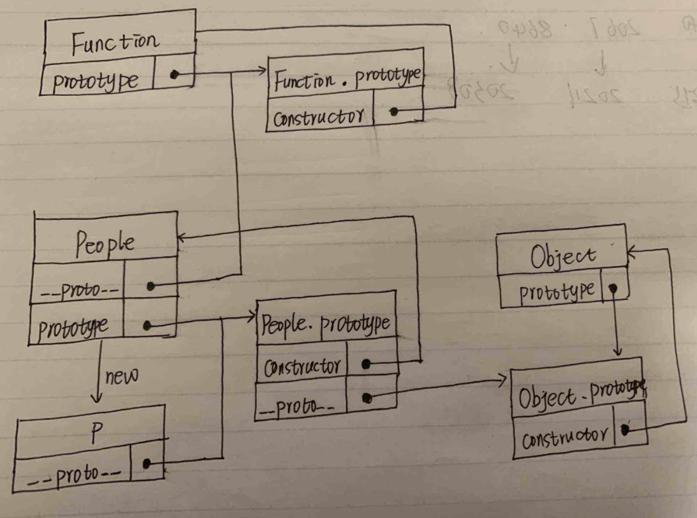
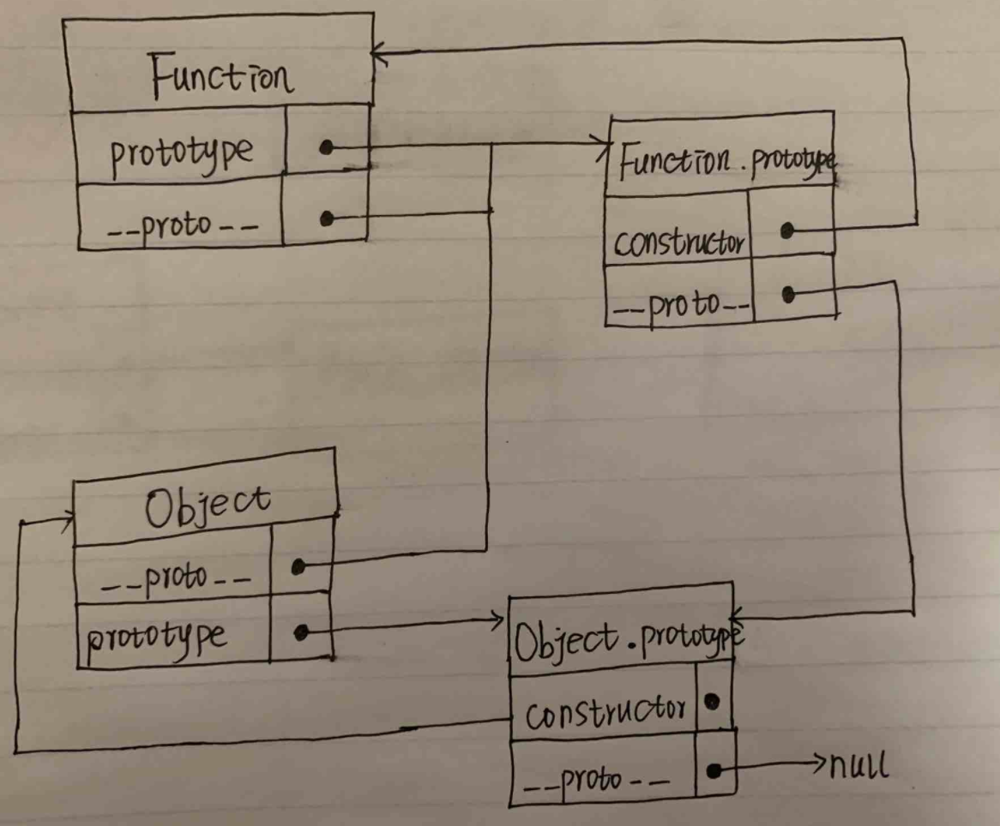

### 原型&原型链
1. 每个函数都有一个prototype属性，对应的值是一个对象，叫做原型对象。
2. 当 new 一个函数的时候会创建一个对象，函数.prototype === 被创建对象`.__proto__`
3. 访问一个对象的属性时，如果对象有这个属性，就获取到了，如果没有，则从对象`.__proto__`里面去找，如果还是没有找到，就从对象`.__proto__.__proto__`中去找，直到找到原型链的末端。

### demo
- 代码1
```
function People(){}
var p = new People()
p.__proto__ === People.prototype    ✅
People.__proto__ === Function.prototype     ✅    
People.prototype.__proto__ === Object.prototype     ✅
```
（1）People函数创建了对象 p，所以`People.prototype === p.__proto__`；
（2）People.prototype是一个对象，对象是由Object创建的，所以`Object.prototype === People.prototype.__proto__`；
（3）函数都是由Function创建，而People是一个函数，所以 `Function.prototype === People.__proto__`



- 代码2
```
Function.prototype === Function.__proto__      ✅
Function.prototype === Object.__proto__      ✅
Function.prototype.__proto__ === Object.prototype  ✅
Function instanceof Object   ✅
```
（1）任何函数都是 Function 创建，所以Function 创建了 Function，所以 `Function.prototype === Function.__proto__`；
（2）Object是一个函数，所以`Function.prototype === Object.__proto__ `；
（3）Function.prototype 是一个对象，所以
`Function.prototype.__proto__ === Object.prototype`
（4）
```
Function.prototype === Function.__proto__
Function.prototype.__proto__ === Object.prototype
Function.__proto__.__proto__ === Object.prototype
所以 Function instanceof Object
``` 

- 代码3 
```
Function instanceof Function  ✅
Object instanceof Function    ✅
Function instanceof Object    ✅
Object instanceof Object      ✅
```
instanceof 的作用是判断一个对象是不是一个函数的实例。比如 obj instanceof fn， 实际上是判断fn的prototype是不是在obj的原型链上。比如: 
```
obj.__proto__ === fn.prototype
obj.__proto__.__proto__ === fn.prototype
obj.__proto__..._proto__ === fn.prototype
```
只要一个成立即可。
（1）对于 Function instanceof Function，因为 `Function.__proto__ === Function.prototype`，所以为true。
（2）对于 Object instanceof Function， 因为 `Object.__proto__ === Function.prototype`，所以为 true。
（3）对于 Function instanceof Object, 因为 `Function.__proto__.__proto__ === Function.prototype.__proto__ === Object.prototype`， 所以为 true。
（4）对于 Object instanceof Object， 因为 ```Object.__proto__.__proto__ === Function.prototype.__proto__ === Object.prototype```， 所以为true。

### 参考文献
[1. 对原型、原型链、 Function、Object 的理解](https://zhuanlan.zhihu.com/p/22473059)
