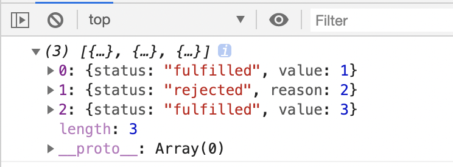

### 异步的概念：
- **delaying execution of a function until a particular time**
```
$('#btn').on('click', () =>
  console.log('Callbacks are everywhere')
)
```
In the jQuery example, is delaying execution of a function until a particular time. “Hey, here’s this function. Go ahead and invoke it whenever the element with an id of btn is clicked.” 

- **delay execution of a function until we have the data we need**
```
$.getJSON({
  url: `https://api.github.com/users/${id}`,
  success: updateUI,
  error: showError,
})
```
We can’t update the UI of our app until we have the user’s data. So what do we do? We say, “Hey, here’s an object. If the request succeeds, go ahead and call success passing it the user’s data. If it doesn’t, go ahead and call error passing it the error object. 

### 回调模式
```
function loadScript(src, callback) {
  let script = document.createElement('script');
  script.src = src;
  script.onload = () => callback(script);
  document.head.append(script);
}

loadScript('https://cdnjs.cloudflare.com/ajax/libs/lodash.js/3.2.0/lodash.js', script => {
  alert(`Cool, the ${script.src} is loaded`);
  alert( _ ); // function declared in the loaded script
});
```
这被称为“基于回调”的异步编程风格。异步执行某些动作的函数，应该提供一个在函数完成时可以运行的callback参数。

**处理错误：**
```
function loadScript(src, callback) {
  let script = document.createElement('script');
  script.src = src;

  script.onload = () => callback(null, script);
  script.onerror = () => callback(new Error(`Script load error for ${src}`));

  document.head.append(script);
}

loadScript('/my/script.js', function(error, script) {
  if (error) {
    // handle error
  } else {
    // 成功加载脚本
  }
});
```
惯例是：
- callback 的第一个参数是为了错误发生而保留的。一旦发生错误，callback(err) 就会被调用。
- 第二个参数（如果有需要）用于成功的结果。此时 callback(null, result1, result2…) 将被调用。

**缺点：回调地狱**
从上面可以看出，这是异步编码的一种可行性方案。的确如此，对于一个或两个的简单嵌套，这样的调用看起来非常好。但对于一个接一个的多个异步动作，代码就会变成这样：
```
loadScript('1.js', function(error, script) {

  if (error) {
    handleError(error);
  } else {
    // ...
    loadScript('2.js', function(error, script) {
      if (error) {
        handleError(error);
      } else {
        // ...
        loadScript('3.js', function(error, script) {
          if (error) {
            handleError(error);
          } else {
            // ...加载所有脚本后继续 (*)
          }
        });

      }
    })
  }
});
```
上述代码中：

- 我们加载 1.js，如果没有发生错误。
- 我们加载 2.js，如果没有发生错误。
- 我们加载 3.js，如果没有发生错误 —— 做其他操作 (*)。

如果嵌套变多，代码层次就会变深，维护难度也随之增加，这有时称为“回调地狱”或者“回调金字塔”。

### Promise
#### 1) How do you create a Promise?
```
const promise = new Promise()

```
#### 使用Promise来重写上述代码
```
function loadScript(src) {
  return new Promise(function(resolve, reject) {
    let script = document.createElement('script');
    script.src = src;

    script.onload = () => resolve(script);
    script.onerror = () => reject(new Error("Script load error: " + src));

    document.head.append(script);
  });
}

let promise = loadScript("https://cdnjs.cloudflare.com/ajax/libs/lodash.js/3.2.0/lodash.js");
promise.then(
  script => alert(`${script.src} is loaded!`),
  error => alert(`Error: ${error.message}`)
);

promise.then(script => alert('One more handler to do something else!'));
```
#### Promise的Api
在 Promise 类中，有 5 种静态方法:
a.`Promise.resolve`，根据给定值返回 resolved promise。
```
let promise = Promise.resolve(value);

等价于

let promise = new Promise(resolve => resolve(value));
```
b. `Promise.reject`，根据给定错误返回 rejected promise。
```
let promise = Promise.reject(error);

等价于

let promise = new Promise((resolve, reject) => reject(error));
```
c. `Promise.all` 等待所有的 promise 为 resolve 时返回存放它们结果的数组。如果任意给定的 promise 为 reject，那么它就会变成 Promise.all 的错误结果，所有的其他结果都会被忽略。
```
let promise = Promise.all([...promises...]);

作用：并行处理多个promise，当所有promise都被resolve时，其resolve参数会组成数组作为新promise的handler函数的参数。如果任意一个 promise 为 reject，Promise.all 返回的 promise 就会立即 reject 这个错误。

参数：promise数组作为其参数

返回值：返回一个新的 promise

说明：如果其中一个 promise 被 reject，Promise.all 就会立即被 reject 并忽略所有列表中其他的 promise。它们的结果也被忽略。
```
所有promise都resolve
```
Promise.all([
  new Promise(resolve => setTimeout(() => resolve(1), 3000)), // 1
  new Promise(resolve => setTimeout(() => resolve(2), 2000)), // 2
  new Promise(resolve => setTimeout(() => resolve(3), 1000))  // 3
]).then(function(result){console.log(result)});  // [1,2,3]
```


其中一个promise被reject
```
Promise.all([
  new Promise((resolve, reject) => setTimeout(() => resolve(1), 4000)),
  new Promise((resolve, reject) => setTimeout(() => reject(new Error("Whoops!")), 2000)),
  new Promise((resolve, reject) => setTimeout(() => resolve(3), 3000))
]).then(function (result) { console.log(result)},function(err){console.log('err is ',err)}); // 1
```


d. `Promise.allSettled` 等待所有的 promise 都被处理：即使其中一个 reject，它仍然会等待其他的 promise。处理完成后的数组有：

⭕️ `{status:"fulfilled", value:result}` 对于成功的响应，

⭕️ `{status:"rejected", reason:error}` 对于错误的响应。
```
let promise = Promise.allSettled([...promises...]);

Promise.allSettled([
    new Promise(resolve => setTimeout(() => resolve(1), 3000)), // 1
    new Promise((resolve, reject) => setTimeout(() => reject(2), 2000)), // 2
    new Promise(resolve => setTimeout(() => resolve(3), 1000))  // 3
]).then(function (result) { console.log(result) });
```


e. `Promise.race` 等待第一个 promise 被解决，其结果/错误即为结果。
与 Promise.all 类似，它接受一个可迭代的 promise 集合，但是它只等待第一个完成（或者 error）而不会等待所有都完成，然后继续执行。
```
let promise = Promise.race(iterable);

Promise.race([
  new Promise((resolve, reject) => setTimeout(() => resolve(1), 1000)),
  new Promise((resolve, reject) => setTimeout(() => resolve(2), 2000)),
  new Promise((resolve, reject) => setTimeout(() => resolve(3), 3000))
]).then(function (result) { console.log(result)},function(err){console.log('err is ',err)}); // 1

Promise.race([
  new Promise((resolve, reject) => setTimeout(() => resolve(1), 4000)),
  new Promise((resolve, reject) => setTimeout(() => reject(new Error("Whoops!")), 2000)),
  new Promise((resolve, reject) => setTimeout(() => resolve(3), 3000))
]).then(function (result) { console.log(result)},function(err){console.log('err is ',err)}); // err is  Error: Whoops!
```
### Async & Await
Async : 它可以被放置在以一个函数前面，像下面这样：
```
async function f() {
  return 1;
}
```
在函数前面的「async」这个单词表达了一个简单的事情：
1. 即这个函数总是返回一个 promise。即使这个函数实际上会返回一个非 promise 的值，函数定义前加上了「async」关键字会指示 JavaScript 引擎自动将返回值包装在一个（resolved）的 promise 内。
2. 允许在函数内部使用 await。

Await : 让 JavaScript 引擎等待直到 promise 完成并返回结果。
1. 如果有错误，就会抛出异常，就像那里有一个 throw error 语句一样。
2. 否则，就返回结果，并赋值。
```
// 只在 async 函数中有效
let value = await promise;

async function f() {

  let promise = new Promise((resolve, reject) => {
    setTimeout(() => resolve("done!"), 1000)
  });

  let result = await promise; // 等待直到 promise resolve

  alert(result); // "done!"
}
f();

```
⚠️ ：它只能用在async函数中
⚠️ ：await 不能在顶层代码运行
✨ ：await 可以接收「thenables」

处理异常：try..catch
```
async function f() {
  try {
    var response = await Promise.reject(1);
    console.log(response)
  } catch(err) {
    console.log('err is ',err);
  }
}
f(); err is  1
或
async function f() {
  let response = await Promise.reject(1);
}

f().catch(function(err){
    console.log('err is ',err);
});
```

