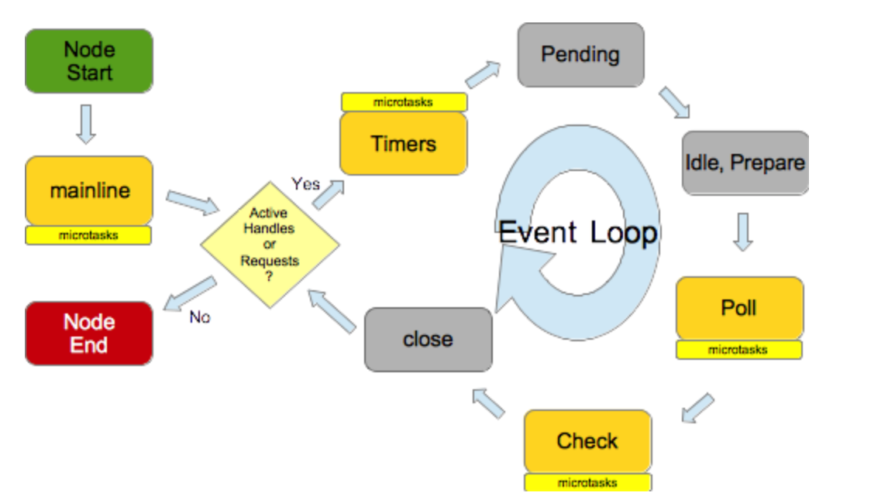

## 进程、线程
- 进程是系统分配的独立资源，是 CPU 资源分配的基本单位，进程是由一个或者多个线程组成的
- 线程是进程的执行流，是CPU调度和分派的基本单位，同个进程之中的多个线程之间是共享该进程的资源的。
## 浏览器内核
- 浏览器是多进程的，浏览器每一个 tab 标签都代表一个独立的进程（也不一定，因为多个空白 tab 标签会合并成一个进程），浏览器内核（浏览器渲染进程）属于浏览器多进程中的一种。
- 浏览器内核有多种线程在工作。

    - GUI 渲染线程:
        - 负责渲染页面，解析 HTML，CSS 构成 DOM 树等，当页面重绘或者由于某种操作引起回流都会调起该线程。
        - 和 JS 引擎线程是互斥的，当 JS 引擎线程在工作的时候，GUI 渲染线程会被挂起，GUI 更新被放入在 JS 任务队列中，等待 JS 引擎线程空闲的时候继续执行。
    - JS 引擎线程:
        - 单线程工作，负责解析运行 JavaScript 脚本。
        - 和 GUI 渲染线程互斥，JS 运行耗时过长就会导致页面阻塞。
    - 事件触发线程:

        - 当事件符合触发条件被触发时，该线程会把对应的事件回调函数添加到任务队列的队尾，等待 JS 引擎处理。
    - 定时器触发线程:

        - 浏览器定时计数器并不是由 JS 引擎计数的，阻塞会导致计时不准确。
        - 开启定时器触发线程来计时并触发计时，计时完成后会被添加到任务队列中，等待 JS 引擎处理。
        - 定时器指定的延时毫秒数其实并不准确，因为定时器只是在到了指定的时间时将事件放入到任务队列中，必须要等到同步的任务和现有的微任务队列中的事件全部执行完成之后，才会去读取定时器的事件到主线程执行，中间可能会存在耗时比较久的任务，那么就不可能保证在指定的时间执行。
    - http 请求线程:
        - http 请求的时候会开启一条请求线程。
        - 请求完成有结果了之后，将请求的回调函数添加到任务队列中，等待 JS 引擎处理。



## JS是单线程的
JavaScript语言的一大特点就是单线程，也就是说，同一个时间只能做一件事。那么，为什么JavaScript不能有多个线程呢？这样能提高效率啊。

JavaScript的单线程，与它的用途有关。作为浏览器脚本语言，JavaScript的主要用途是与用户互动，以及操作DOM。这决定了它只能是单线程，否则会带来很复杂的同步问题。比如，假定JavaScript同时有两个线程，一个线程在某个DOM节点上添加内容，另一个线程删除了这个节点，这时浏览器应该以哪个线程为准？
## JS引擎
JavaScript引擎是一个专门处理JavaScript脚本的虚拟机，一般会附带在网页浏览器之中，比如最出名的就是Chrome浏览器的V8引擎，如下图所示，JS引擎主要有两个组件构成：

 - 堆-堆中存放变量的值
 - 调用栈栈-执行栈中存放正在执行的代码

## 宏任务、微任务
实际上，js 引擎并不只维护一个任务队列，总共有两种任务

**宏任务**
产生宏任务的主要来源有：
 - DOM操作
 - 监听事件回调（键盘、鼠标事件等）
 - AJAX请求
 - 调用浏览器API（如：history.back()）
 - setTimeout/setInterval
 - 操作IndexDB

已上产生的事件，每次只会执行一件。

**微任务**
产生微任务的主要来源有：

- Promise.then、Promise.catch、Promise.finally
- MutationObserver
- Object.observe

## JS事件循环机制
事件循环的顺序，决定了JavaScript代码的执行顺序。它从script(整体代码)开始第一次循环。之后全局上下文进入函数调用栈。直到调用栈清空(只剩全局)，然后执行所有的micro-task。当所有可执行的micro-task执行完毕之后，本轮循环结束。下一轮循环再次从macro-task开始，按照顺序读取一个任务放入到栈中执行，然后再执行所有的micro-task，这样一直循环下去。

 - JS 调用栈
    - JS 调用栈是一种后进先出的数据结构。当函数被调用时，会被添加到栈中的顶部，执行完成之后就从栈顶部移出该函数，直到栈内被清空。

- 同步任务、异步任务
    - JavaScript 单线程中的任务分为同步任务和异步任务。同步任务会在调用栈中按照顺序排队等待主线程执行，异步任务则会在异步有了结果后将注册的回调函数添加到任务队列(消息队列)中等待主线程空闲的时候，也就是栈内被清空的时候，被读取到栈中等待主线程执行。任务队列是先进先出的数据结构。

- Event Loop
    - 调用栈中的同步任务都执行完毕，栈内被清空了，就代表主线程空闲了，这个时候就会去任务队列中按照顺序读取一个任务放入到栈中执行。每次栈内被清空，都会去读取任务队列有没有任务，有就读取执行，一直循环读取-执行的操作，就形成了事件循环。


总结一下就是以下几个步骤：
1. 从事件队列中取出一项「宏任务」进行处理；
2. 检查「微任务」队列中是否有需要处理的「微任务」
    - 如果有「微任务」，逐一处理
    - 在此期间产生的「微任务」，放入「微任务队列」末尾
3. 执行 UI 渲染
    - 判断是否需要渲染
        - 渲染只保证浏览器60Hz的刷新频率
        - 并非每次循环都会触发渲染
        - 触发resize、scroll等事件
        - 执行css动画
        - 等等
    - 执行requestAnimationFrame
    - 执行IntersectionObserver callback
    - 渲染UI
4. 如果「宏任务队列」为空，休眠直到一个「宏任务」出现
5. 回到第一步

## 视图渲染的时机
视图渲染发生在本轮事件循环的microtask队列被执行完之后，也就是说执行任务的耗时会影响视图渲染的时机。通常浏览器以每秒60帧（60fps）的速率刷新页面，据说这个帧率最适合人眼交互，大概16.7ms渲染一帧，所以如果要让用户觉得顺畅，单个macrotask及它相关的所有microtask最好能在16.7ms内完成。

但也不是每轮事件循环都会执行视图更新，浏览器有自己的优化策略，例如把几次的视图更新累积到一起重绘，重绘之前会通知requestAnimationFrame执行回调函数，也就是说requestAnimationFrame回调的执行时机是在一次或多次事件循环的UI render阶段。

```
setTimeout(function() {console.log('timer1')}, 0)

requestAnimationFrame(function(){
	console.log('requestAnimationFrame')
})

setTimeout(function() {console.log('timer2')}, 0)

new Promise(function executor(resolve) {
	console.log('promise 1')
	resolve()
	console.log('promise 2')
}).then(function() {
	console.log('promise then')
})

console.log('end')
```
chrome浏览器运行如下：


可以看到，结果1中requestAnimationFrame()是在一次事件循环后执行，而在结果2，它的执行则是在三次事件循环结束后。

## 总结

1. 每个 eventloop 由三个阶段构成：执行一个 task，执行 microtask 队列，可选的 ui render 阶段，requestAnimationFrame callback 在 render 阶段执行。我们平时写的逻辑代码会被分类为不同的 task 和 microtask。
2. microtask 中注册的 microtask 事件会直接加入到当前 microtask 队列。
3. microtask 执行时机『尽可能早』，只要 javascript 执行栈为空，就会执行。一轮 eventloop 中，可能执行多次 microtask。
4. requestAnimationFrame callback 的执行时机与浏览器的 render 策略有关，是黑箱的。
## 参考文献
[1. JS浏览器事件循环机制](https://segmentfault.com/a/1190000015559210)
[2. 事件循环以及浏览器渲染时机](https://www.jianshu.com/p/af302f8c388f)
[3. 深入探究 eventloop 与浏览器渲染的时序问题](https://www.404forest.com/2017/07/18/how-javascript-actually-works-eventloop-and-uirendering/#4-requestAnimationFrame-callback-%E7%9A%84%E6%89%A7%E8%A1%8C%E6%97%B6%E6%9C%BA)
[4. 理解event loop（浏览器环境与nodejs环境）](https://imweb.io/topic/5b148768d4c96b9b1b4c4ea1)
[5. 深入理解js事件循环机制（浏览器篇）](http://lynnelv.github.io/js-event-loop-browser)