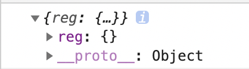
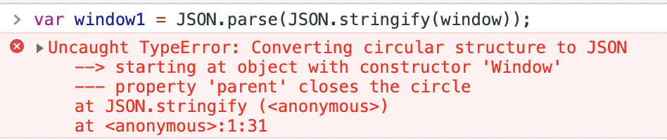
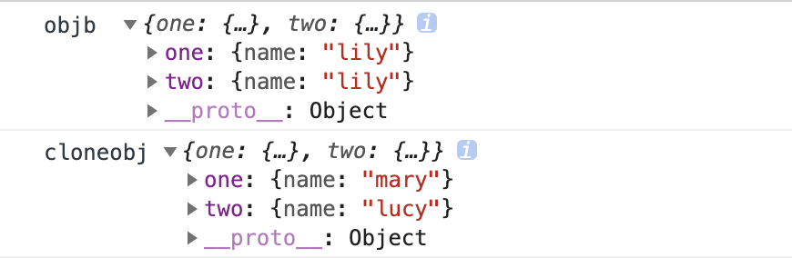

## 怎么理解深拷贝

## 深拷贝方式

### 一、json序列化
首先声明一下：
> js中有7大数据类型: number、bool、string、symbol、undefined、null、object

> json中有6大数据类型：number、bool、string、array、object、null

这是JS实现深拷贝最简单的方法了，原理就是先将对象转换为字符串，再通过JSON.parse重新建立一个对象。
```
cloneObj = JSON.parse(JSON.stringify(obj))
```
**缺点：**
- 1. 不支持json无法表示的数据类型，如(function、正则、symbol等)
```
var obj = {
    reg: new RegExp('^abc'),
    fn: function(){console.log('111')},
    symbol:Symbol()
}
 var obj1 = JSON.parse(JSON.stringify(obj))

console.log(obj1)
```

- 2. 环引用会报错

- 3. 相同的应用会被重复复制
```
var obja = {
    name :'lucy'
}
var objb = {
    one : obja,
    two : obja
}

var cloneobj = JSON.parse(JSON.stringify(objb))
objb.one.name = 'lily'

cloneobj.one.name = 'mary'

console.log('objb ',objb)
console.log('cloneobj',cloneobj)
```


在源对象中one和two都指向了同一个对象obja，而深拷贝时他们分别指向了不同的对象。复制对象时没有保持和源对象一样的结构。因此**JSON实现深复制不能处理指向相同引用的情况，相同的引用会被重复复制。**

### 二、递归
```
class DeepClone {

    constructor(){
        this.cache = []
    }

    clone(src) {
        if (src instanceof Object) {
            // 如果是已经缓存的对象直接返回
            for (var i = 0; i < this.cache.length; i++) {
                if (src == this.cache[i].src) {
                    return this.cache[i].target
                }
            }

            var target = new Object()

            if (src instanceof Array) {
                target = new Array()
            }

            if (src instanceof Function) {
                target = function () {
                    return src.apply(this, arguments)
                }
            }

            if (src instanceof RegExp) {
                target = new RegExp(src.source, src.flags)
            }

            if (src instanceof Date) {
                target = new Date(src)
            }

            this.cache.push({
                src,
                target
            })

            for (let key in src) {
                if (src.hasOwnProperty(key)) {
                    target[key] = this.clone(src[key])
                }
            }
            return target
        }
        return src;
    }
}

var cloner = new DeepClone()
var a = {
    arr:[1,2,3,{key:'123'}],//数组测试
};
a.self = a;//循环引用测试
a.common1 = {name:'bbb'};
a.common2 = a.common1;//相同引用测试

aa = cloner.clone(a)
aa.common1.name = 'ccc'
console.log('aa is ', aa)

```