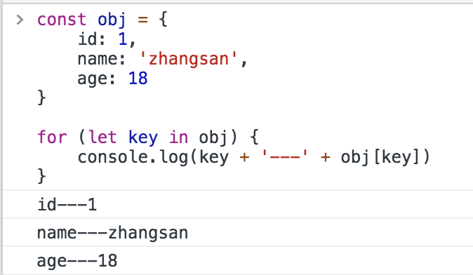
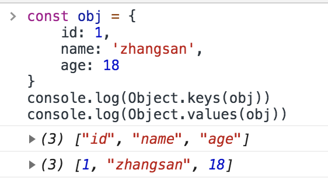
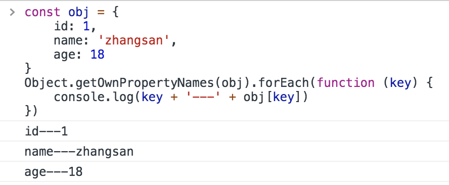

1. for in
```
const obj = {
    id: 1,
    name: 'zhangsan',
    age: 18
}

for (let key in obj) {
    console.log(key + '---' + obj[key])
}
```
for in 循环在查找对象属性时会遍历原型链上的所有属性，因此如果我们不想取得原型链上的属性，可以用`hasOwnProperty`过滤。
```
for(var i in obj) {
    if (obj.hasOwnProperty(i)) {
        console.log(i);
    }
}
```

2. Object.keys（obj）和 Object.values（obj）
```
const obj = {
    id: 1,
    name: 'zhangsan',
    age: 18
}
console.log(Object.keys(obj))
console.log(Object.values(obj))
```

3. Object.getOwnPropertyNames(obj)
```
const obj = {
    id: 1,
    name: 'zhangsan',
    age: 18
}
Object.getOwnPropertyNames(obj).forEach(function (key) {
    console.log(key + '---' + obj[key])
})
```
