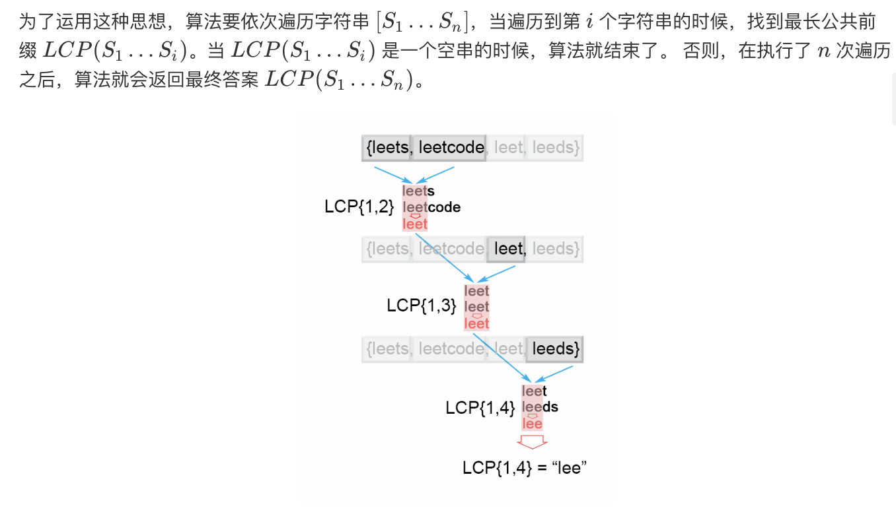
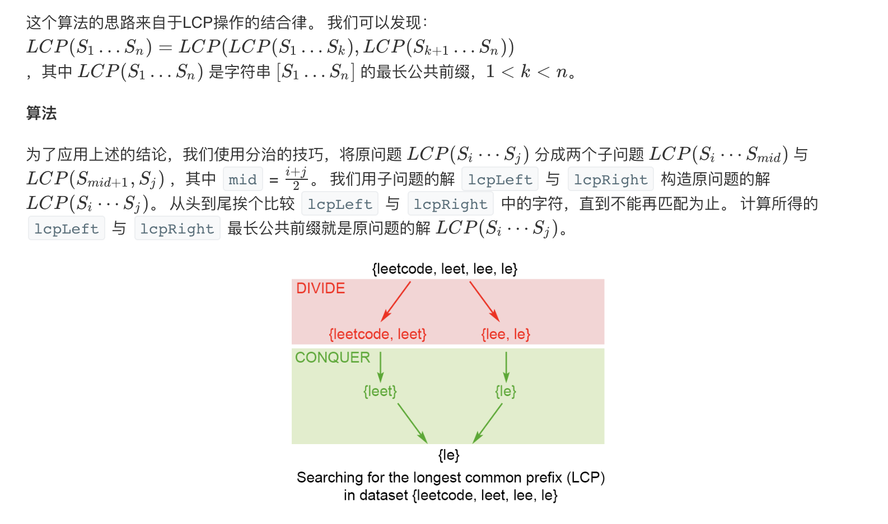

### 一、[Longest Common Prefix题目链接](https://leetcode-cn.com/problems/palindrome-number/)
### 二、思路
**1. 水平扫描**
$$LCP(S_1...S_n) = LCP(LCP(LCP(S_1,S_2),S_3),...,S_n)$$ 

```
var longestCommonPrefix = function(strs) {
    if(strs == null || strs.length == 0) {
        return '';
    }
    let prefix=strs[0];
    for(let i = 1;i<strs.length;i++){
        while(strs[i].indexOf(prefix)!=0){
            prefix = prefix.substring(0,prefix.length-1)
        }
        if(prefix == ''){
            return ''
        }
    }
    return prefix;
};
```
时间复杂度：。
空间复杂度：$O(1)$。

**2. 水平扫描**

**解法：**
从前往后比较字符串的每一列，先比较每个字符串相同列上的字符，若相同，则进行对下一列的比较；若有一个不同，则停止比较，并返回该列前面的共有字符串。

```
var longestCommonPrefix = function(strs) {
    if(strs == null || strs.length == 0) {
        return '';
    }
    let prefix=strs[0];
    for(let i = 1;i<strs.length;i++){
        while(strs[i].indexOf(prefix)!=0){
            prefix = prefix.substring(0,prefix.length-1)
        }
        if(prefix == ''){
            return ''
        }
    }
    return prefix;
};
```
时间复杂度：$O(s)$ ，s为所有字符串的字符总数。因为最坏情况是数组中的字符串都相同。
空间复杂度：$O(1)$
**3. 分而治之**
**解法：**

```
var longestCommonPrefix = function(strs) {
    if(strs == null || strs.length == 0){
        return ''
    }
    return devide(strs,0,strs.length-1)
};
function devide(strs,l,r){
    if(l==r){
        return strs[l]
    }else{
        let mid = parseInt((l+r)/2);
        let left = devide(strs,l,mid);
        let right = devide(strs,mid+1,r);
        return commonPrefix(left,right);
    }
}
function commonPrefix(left,right){
    let min = Math.min(left.length,right.length);
    for(let i = 0 ; i<min;i++){
        if(left[i]!=right[i]){
            return left.substring(0,i)
        }
    }
    return left.substring(0,min)
}
```