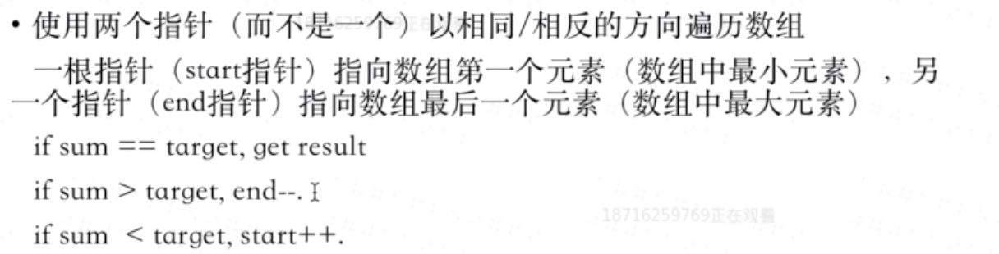

### 一、[ Two Sum II - Input array is sorted题目链接](https://leetcode.com/problems/two-sum-ii-input-array-is-sorted/)
### 二、思路

```
var twoSum = function(numbers, target) {
    let start=0,end=numbers.length-1;
    while(start<end){
        if(numbers[start] + numbers[end] == target){
            return [start+1,end+1];
        }else if(numbers[start] + numbers[end] < target){
            start++;
        }else {
            end--;
        }
    }
};
```
复杂度分析
时间复杂度：O(n)O(n)。每个元素最多被访问一次，共有 nn 个元素。
空间复杂度：O(1)O(1)。只是用了两个指针。