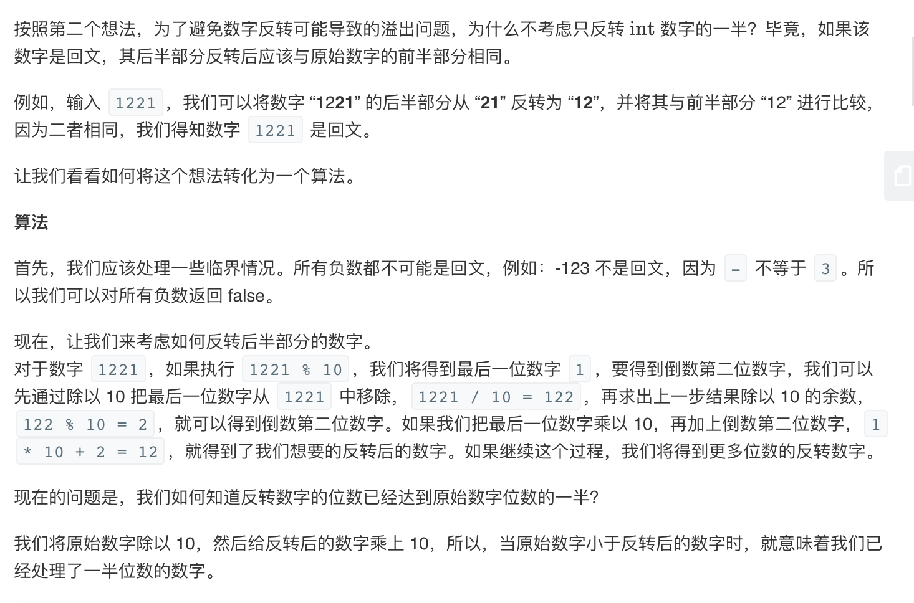

### 一、[Palindrome Number题目链接](https://leetcode-cn.com/problems/palindrome-number/)
### 二、思路
#### a. 将数字转换成字符串，对比转换前后字符串
映入脑海的第一个想法是将数字转换为字符串，并检查字符串是否为回文。
```
var isPalindrome = function(x) {
    let str = String(x)
    let newStr = str.split('').reverse().join('')
    return str === newStr
};
```
缺点：占用太多内存空间。
#### b. 数字本身反转
第二个想法是将数字本身反转，然后将反转后的数字与原始数字进行比较，如果它们是相同的，那么这个数字就是回文。

但是，如果反转后的数字大于$int.MAX$，我们将遇到整数溢出问题。
#### c.反转一半数字

```
var isPalindrome = function(x) {
    if(x<0 || (x%10==0 && x!=0)){
        return false
    }
    var r = 0
    while(x>r){
        r = r*10 + parseInt(x%10)
        x = parseInt(x/10)
    }
    return x == r || x == parseInt(r/10)
};
```
- 复杂度分析：
    - 时间复杂度：$O(log(x))$,对于每次迭代，我们会将输入除以10，$x$中大约有$log10(x)$位数字。
    - 空间复杂度：$O(1)$。

