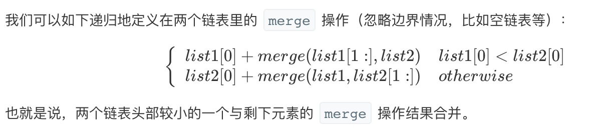

### 一、[Merge Two Sorted Lists
[题目链接](https://leetcode-cn.com/problems/merge-two-sorted-lists/)
### 二、思路
**1. 递归**

```
var mergeTwoLists = function(l1, l2) {
    if (l1 == null) {
        return l2;
    }
    if (l2 == null) {
        return l1;
    }
    if(l1.val < l2.val){
        l1.next = mergeTwoLists(l1.next,l2);
        return l1;
    } else {
        l2.next = mergeTwoLists(l1,l2.next);
        return l2;
    }
};
```
- 复杂度分析

  - 时间复杂度：`O(n + m)`。 因为每次调用递归都会去掉 l1 或者 l2 的头元素（直到至少有一个链表为空），函数 mergeTwoList 中只会遍历每个元素一次。所以，时间复杂度与合并后的链表长度为线性关系。

  - 空间复杂度：`O(n + m)`。调用 mergeTwoLists 退出时 l1 和 l2 中每个元素都一定已经被遍历过了，所以 `n + m`个栈帧会消耗 `O(n + m)` 的空间。

