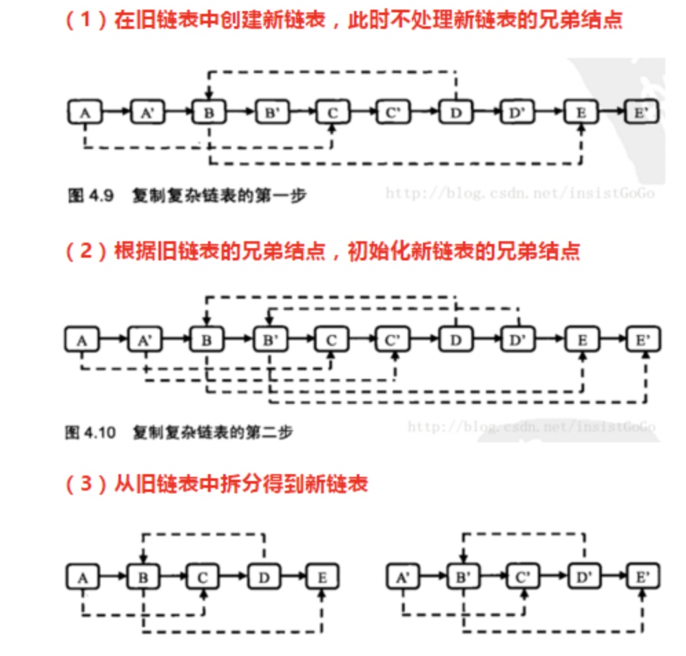

```javascript
/*function RandomListNode(x){
    this.label = x;
    this.next = null;
    this.random = null;
}*/
function Clone(pHead)
{
    // write code here
    if (!pHead) return null

    // 第一次遍历，先复制所有节点，且把复制节点添加到相应节点后面
    let p = pHead
    while (p) {
        let node = new RandomListNode(p.label)
        node.next = p.next
        p.next = node
        p = p.next.next
    }

    // 第二次遍历，复制random指针
    p = pHead
    while (p) {
        if (p.random) p.next.random = p.random
        else p.next.random = null
        p = p.next.next
    }
    
    // 第三次遍历，把链表拆开
    let clonedH = pHead.next;
    let temp;
    p = pHead;
    while(p.next !== null) {
        temp = p.next;
        p.next = p.next.next;
        p = temp;
    }   
    return clonedH;
}
```
分析：
