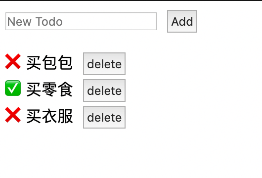

```javascript
// index.js
import React from "react";
import ReactDOM from "react-dom";
import shortid from "shortid";
import "./styles.css";

/*
  INSTRUCTIONS:
  Create a "todo" app with the following criteria.
    1. The user can add new todo items
    2. The user can remove todo items
*/

function TodoInput({ addTodo }) {
  let [text, setText] = React.useState("");
  return (
    <div>
      <input
        type="text"
        value={text}
        placeholder="New Todo"
        onChange={e => {
          setText(e.target.value);
        }}
      />
      <button
        onClick={() => {
          addTodo(text);
          setText("");
        }}
      >
        Add
      </button>
    </div>
  );
}

function TodoList({ lists, deleteTodo, ToggleTodo }) {
  console.log("lists ", lists);
  return (
    <div>
      <ul>
        {lists.map(item => {
          return (
            <li key={item.id}>
              {item.completed ? (
                <span role="img" aria-label="done">
                  ✅
                </span>
              ) : (
                <span role="img" aria-label="undone">
                  ❌
                </span>
              )}
              <span
                onClick={() => {
                  ToggleTodo(item.id);
                }}
              >
                {item.text}
              </span>
              <button
                onClick={() => {
                  deleteTodo(item.id);
                }}
              >
                delete
              </button>
            </li>
          );
        })}
      </ul>
    </div>
  );
}
function createNewTodo(text) {
  return {
    completed: false,
    id: shortid.generate(),
    text
  };
}
function Todo() {
  let [todos, setTodos] = React.useState([
    {
      completed: false,
      id: 123,
      text: "买包包"
    }
  ]);
  const addTodo = text => {
    let item = createNewTodo(text);
    setTodos([...todos, item]);
  };
  const deleteTodo = id => {
    todos = todos.filter(item => item.id !== id);
    setTodos(todos);
  };
  const ToggleTodo = id => {
    todos = todos.map(item => {
      if (item.id === id) {
        item.completed = !item.completed;
      }
      return item;
    });
    setTodos(todos);
  };
  return (
    <div>
      <TodoInput addTodo={text => addTodo(text)} />
      <TodoList
        lists={todos}
        deleteTodo={id => deleteTodo(id)}
        ToggleTodo={id => ToggleTodo(id)}
      />
    </div>
  );
}

const rootElement = document.getElementById("root");
ReactDOM.render(<Todo />, rootElement);

```

```css
// styles.css
button {
  margin-left: 10px;
}
* {
  padding: 0;
}
input {
  width: 150px;
}
li {
  list-style: none;
}
button {
  padding: 3px;
}
```
