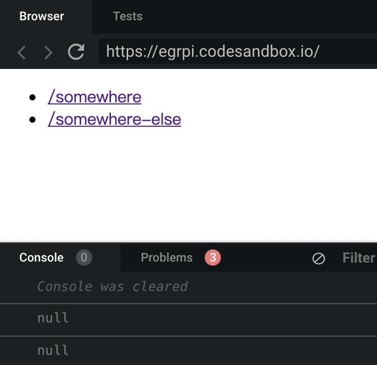
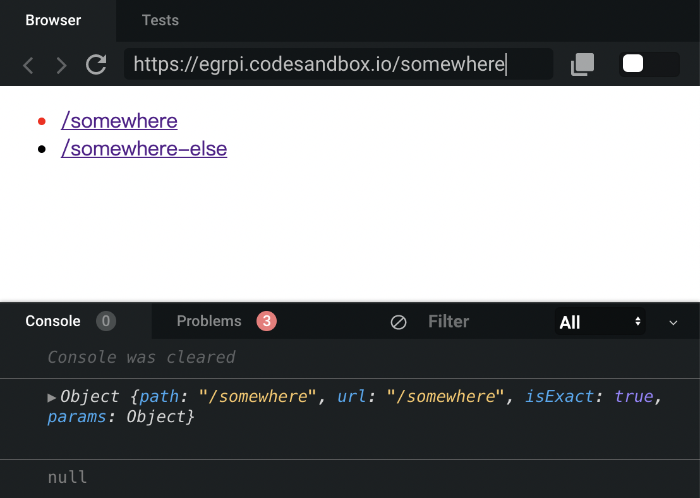
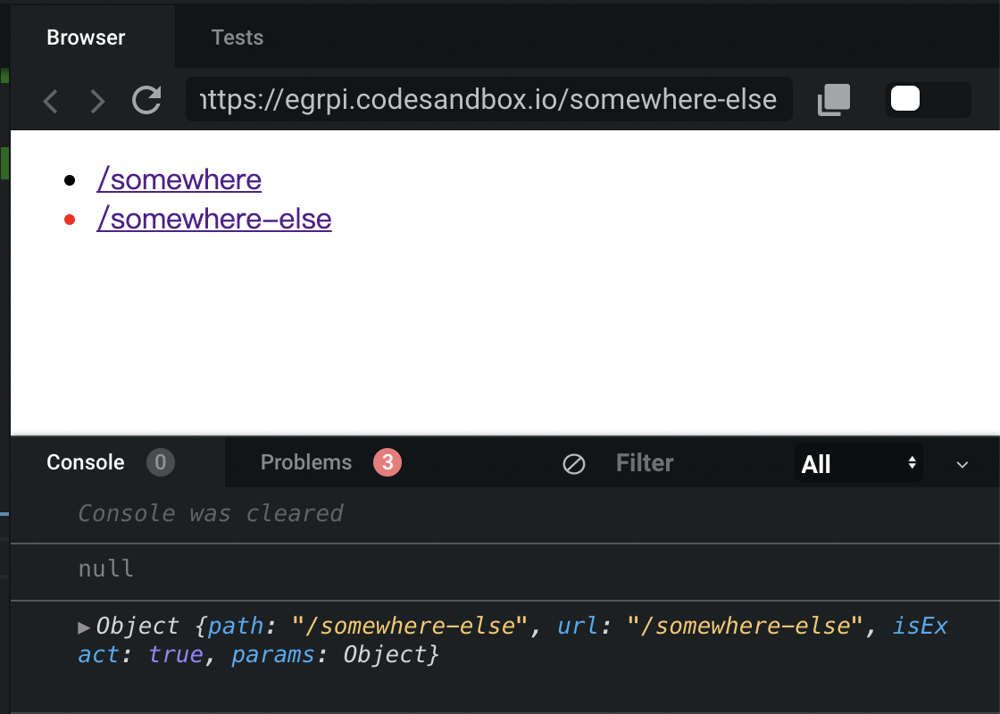

## 概念
在 React-Router 中的所有设置都是组件，因此路由是随着应用的渲染被同时计算得到，而不是独立于应用之外。
## code
一个简单的react-router例子如下：
```
import React from "react";
import ReactDOM from "react-dom";
import { BrowserRouter as Router, Route, Link } from "react-router-dom";

function App() {
  return (
    <Router>
      <ul>
        <li>
          <Link to="/">Home</Link>
        </li>
        <li>
          <Link to="/about">About</Link>
        </li>
        <li>
          <Link to="/users">Users</Link>
        </li>
      </ul>
      //如果用户访问/，Route组件会将路由形式的对象{match, location, history}作为属性参数传给<Home {...props}>组件进行渲染，否则不会渲染。
      <Route exact path="/" component={Home} />
      <Route exact path="/about" component={About} />
      <Route exact path="/users" component={Users} />
    </Router>
  );
}
function Home() {
  return <div>Home</div>;
}
function About() {
  return <div>About</div>;
}
function Users() {
  return <div>Users</div>;
}
const rootElement = document.getElementById("root");
ReactDOM.render(<App />, rootElement);

```
## 组件
### BrowserRouter
这是一个路由管理器，使用HTML5的history API（pushState, replaceState, popState)同步访问URL和组件。What BrowserRouter does is it allows React Router to pass the app’s routing information down to any child component it needs (via context)
### Link
该组件用以声明应用的链接（导航） It’s a simple component that allows the user to declaratively navigate around the app.
```
<Link to="/about">About</Link>
```
`to : string || object || function` ，定义导航的链接。

### Route
Route is both the backbone and the genius behind React Router v4. When the app’s location matches a certain path, Route will render a specified component, when it doesn’t, it will render null.

这是 React-Router 中最重要的组件了，当请求的状态路径与该组件给出的 path 一致时，会渲染所对应的 UI 组件。

在<Route>组件中有三种渲染方式:
```
<Route component>
<Route render>
<Route children>
```
每一种方式都会传入相同形式的路由属性 —— {match, location, history} 。

**component**

When you use component (instead of render or children, below) the router uses React.createElement to create a new React element from the given component. That means if you provide an inline function to the component prop, you would create a new component every render. This results in the existing component unmounting and the new component mounting instead of just updating the existing component. When using an inline function for inline rendering, use the render or the children prop (below).

使用 component 渲染方式时，React 会自动将所对应的组件转化为 React 组件，因此如果所对应组件是内联函数形式，请使用 render 或 children 渲染方式，避免每次都生成新的 React 组件。

```
<Route path="/user/:username" component={User} />;

// All route props (match, location and history) are available to User
function User(props) {
  return <h1>Hello {props.match.params.username}!</h1>;
}
```

**render : func**

This allows for convenient inline rendering and wrapping without the undesired remounting explained above.Instead of having a new React element created for you using the component prop, you can pass in a function to be called when the location matches. The render prop function has access to all the same route props (match, location and history) as the component render prop.

该方式取代了React 生成组件的过程，而是直接执行一个函数，此外还经常用于路由的打包。

```
// 直接执行函数
<Route path="/home" render={() => <div>Home</div>}/>

// 打包路由
const FadingRoute = ({ component: Component, ...rest }) => (
  <Route {...rest} render={props => (
    <FadeIn>
      <Component {...props}/>
    </FadeIn>
  )}/>
)

<FadingRoute path="/cool" component={Something}/>
```
**children : func**

有时无论路径是否匹配都要渲染组件，这种情况下使用 children 渲染方式，它和 render 方式类似,只是多了一个匹配过程。

Sometimes you need to render whether the path matches the location or not. In these cases, you can use the function children prop. It works exactly like render except that it gets called whether there is a match or not.

```
function AuthExample() {
  return (
    <Router>
      <ul>
        <ListItemLink to="/somewhere" />
        <ListItemLink to="/somewhere-else" />
      </ul>
    </Router>
  );
}
const ListItemLink = ({ to, ...rest }) => (
  <Route
    path={to}
    render={({ match }) => {
      console.log(match);
      return <li className={match ? "active" : ""}>
      <Link to={to} {...rest}>
        {to}
      </Link>
    </li>
    }
    }
  />
);
export default AuthExample;
```
上面这个例子，不管url是什么，两个<Link>都会被渲染出来。

a. 当location是'/'，Route的path和location并不匹配，但是children函数依然会执行，因此两个<Link>都能渲染出来，只不过这时的match是null，所以两个li都没有active。


b. 当location是'/somewhere'，第一个Route的path和location可以匹配，因此它的match属性不为空，li的class为active。第二个Route的path和location不能匹配，match为null，故而class为空。（这里为了看出区别，给.active添加了{color:red}）


c. 同b。


并不匹配，但是children函数依然会执行，因此两个<Link>都能渲染出来，只不过这时的match是null，所以两个li都没有active
> 注意： component 和 render 方式都优先于 children 方式，因此无法在一个 <Route> 组件中同时使用。