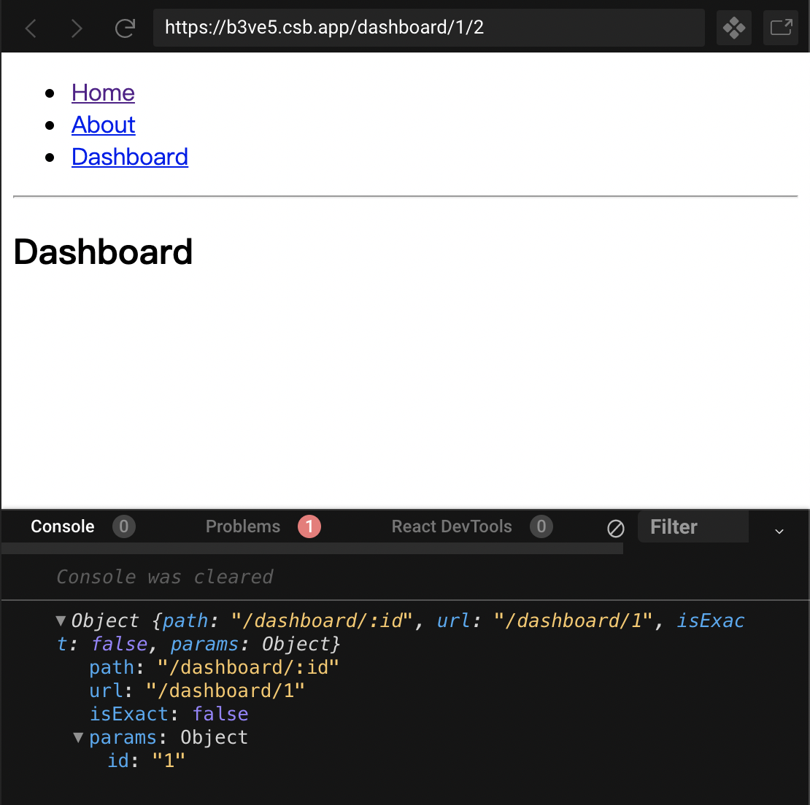

## match,location,history

Every time a component is rendered in a specific route, the component receive route props from React Router. There are 3 route props being passed down into component: match, location, history.

下面用这个例子分别对这3个对象做一个解释：
```js
import React from "react";
import {
  BrowserRouter as Router,
  Switch,
  Route,
  Link,
  useParams,
  useRouteMatch
} from "react-router-dom";

export default function BasicExample() {
  return (
    <Router>
      <div>
        <ul>
          <li>
            <Link to="/">Home</Link>
          </li>
          <li>
            <Link to="/about">About</Link>
          </li>
          <li>
            <Link to="/dashboard/1">Dashboard</Link>
          </li>
        </ul>
        <hr />

        <Switch>
          <Route exact path="/">
            <Home name="lily" />
          </Route>
          <Route path="/about">
            <About />
          </Route>
          <Route path="/dashboard/:id">
            <Dashboard />
          </Route>
        </Switch>
      </div>
    </Router>
  );
}

function Home(props) {
  let match = useRouteMatch();
  console.log(match);
  return (
    <div>
      <h2>Home</h2>
    </div>
  );
}

function About() {
  let match = useRouteMatch();
  console.log(match);
  return (
    <div>
      <h2>About</h2>
    </div>
  );
}

function Dashboard() {
  let match = useRouteMatch();
  console.log(match);
  let params = useParams();
  console.log(params);
  return (
    <div>
      <h2>Dashboard</h2>
    </div>
  );
}
```

### match

当路由路径和当前路径成功匹配，会生成一个对象match。match对象有更多关于URL和path的信息。这些信息可以通过它的属性获取，如下所示：

- match.url.返回URL中匹配部分的字符串。用于创建嵌套的`<Link>`很有用。
- match.path.用于匹配路径模式。用来创建嵌套的`<Route>`。
- match.isExact.返回布尔值，如果准确（没有任何多余字符）匹配则返回true。
- match.params. object ,根据 path 中指定的动态片段，从 URL 中解析出的键值对。

match.url 是指在浏览器中显示的真实 URL；
match.path是指写在 `<Route>`中的path参数；。
match.params : 用于获取url中动态的的参数。
```
<Route path='/:handle' component={Profile} />
```
Then the Profile component would be able to access the dynamic handle from `props.match.params.handle`。

上面的例子中，我们使用了React Router中的hook,`useRouteMatch`可以方便地获取macth，这在[react-router新增的hook](./react-router新增的hook.md)中详细介绍了。

```js
<li>
    <Link to="/dashboard/1">Dashboard</Link>
</li>

<Route path="/dashboard/:id">
    <Dashboard />
</Route>

function Dashboard() {
  let match = useRouteMatch();
  console.log(match);
  return (
    <div>
      <h2>Dashboard</h2>
    </div>
  );
}
```


### location

location 代表应用程序的位置。如当前的位置，将要去的位置，或是之前所在的位置。形如：
```json
{
  pathname: '/here',
  search: '?key=value',
  hash: '#extra-information',
  state: { modal: true },
  key: 'abc123'
}
```
- pathname：(string) 当前 url 的路径 path。
- search：(string) 当前 url 的查询参数 query string。
- hash：(string) 当前 url 的哈希值 hash。
- state：(object) 想要传递数据给一个Location除了使用query将数据放在URL中带过来，也可以使用state，这个state相当于是放在这个location上的数据，这些数据不会出现在URL中。
- key：每一个Location都会有一个独一无二的key，唯一的代表一个Location。

比如url是：`http://localhost:3000/dashboard/1?name=lily#4`,其`location`为：


### history
[1. history一](https://reacttraining.com/react-router/web/api/history)
[2. history二](https://github.com/ReactTraining/history/blob/master/docs/GettingStarted.md)
[3. 理解 react-router 中的 history](https://zhuzhengyuan.xyz/2018/07/29/understanding-history-in-react-router/#more)