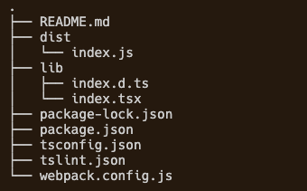
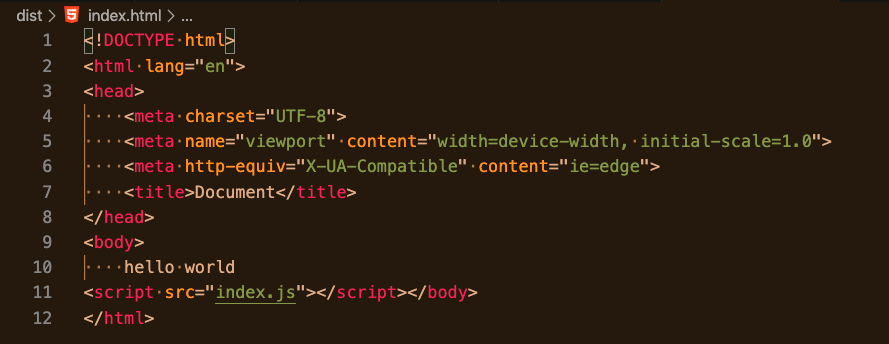
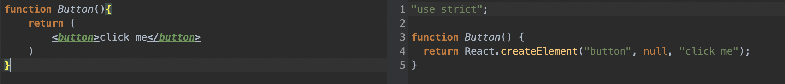
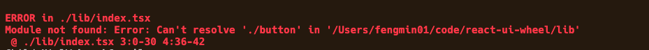
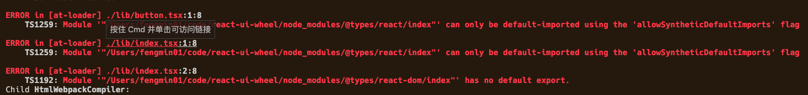
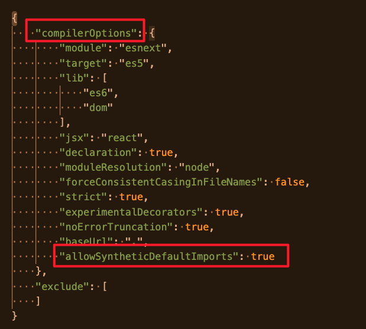
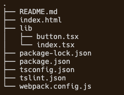
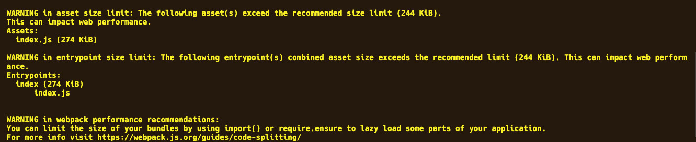
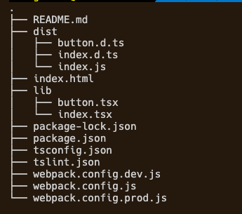

项目初始化可以参考（从0开始配置webpack），这里从支持tsx文件开始：
### 1. 支持`.tsx`后缀的文件
```
npm i awesome-typescript-loader --save-dev
npm i typescript --save-dev

// webpack.config.js

const p = require('path')
module.exports = {
    entry: {
        index: './lib/index.tsx'
    },
    output:{
        path:p.resolve(__dirname,'dist')
    },
    mode:'development',
    module: {
        rules: [
            {
                test: /\.tsx?$/,
                use: {
                    loader: "awesome-typescript-loader"
                }
            }
        ]
    }
};
```
此时目录结构：


运行`npx webpack`可在dist目录下生成打包后的文件



### 2. 配置`webpack-dev-server`自动打包
```
npm i webpack-dev-server --save-dev
```
运行`npx webpack-dev-server`访问下面的链接即可获取打包后的js

http://localhost:8080/index.js

### 3. 配置html插件
没用 html-webpack-plugin插件之前，我们用一个js文件，需要经过webpack打包之后，手动创建一个html文件，并在html文件中用script标签引用我们之前经过webpack打包好的js文件。
用了这个插件之后，插件会自动生成html文件并将打包好的js插入文件。
**安装依赖**
```
npm i html-webpack-plugin --save-dev
```
**配置webpack**
```
const p = require('path')
const HtmlWebPackPlugin = require("html-webpack-plugin");
module.exports = {
    entry: {
        index: './lib/index.tsx'
    },
    output:{
        path:p.resolve(__dirname,'dist')
    },
    mode:'development',
    module: {
        rules: [
            {
                test: /\.tsx?$/,
                use: {
                    loader: "awesome-typescript-loader"
                }
            }
        ]
    },
    plugins:[
        new HtmlWebPackPlugin({
            template: './index.html'
        })
    ]
};
```
此时执行`npx webpack`会在`webpack`配置下的`output`目录下生成`index.html`，并自动插入构建好的js代码



### 4. 打包命令写到`package.json`文件
```
// package.json

"scripts": {
    "test": "echo \"Error: no test specified\" && exit 1",
    "build": "webpack --mode production",
    "dev": "webpack --mode development",
    "start": "webpack-dev-server --mode development --open"
  }
```
### 5. 引入react
**安装依赖**
```
npm i react react-dom

// 因为是在写ts代码，所以还需安装对应的声明文件

npm i @types/react @types/react-dom -D 
```
### 6. 写react组件
```
+++  /lib/button.tsx
修改  /lib/index.tsx
配置 webpack.config.js
配置 tsconfig.json文件
```
**a. 增加button.tsx**
```
+++  /lib/button.tsx

import React from 'react';
function Button(){
    return (
        <button>click me</button>
    )
}
export default Button
```
注意button.tsx文件需要引入react，这是因为上述jsx语法实际上是下面调用的语法糖, 故而需要引入react。

**b. 修改index.tsx**
```
修改  /lib/index.tsx
import React from 'react';
import ReactDOM from 'react-dom';
import Button from './button'

ReactDOM.render(
    <Button />,
    document.getElementById('root')
)
```
**c. 配置 webpack.config.js**
上面代码`import Button from './button'`时，会报如下错误，

这是因为webpack没有找到'./button'文件，我们需要在`webpack.config.js`增加如下配置，告诉webpack在遇到`import Button from './button'`这样的导入语句时，会先寻找`./button.ts`文件，如果不存在，就去寻找`./button.tsx`,依次往后，如果都没有找到就会报错。
```
resolve:{
    extensions : ['.ts','.tsx','.js','.jsx']
},
```
**d. 配置 tsconfig.json**
在引入`'react','react-dom'`时报如下错误,

只需在`tsconfig.json`文件的`compilerOptions`属性里加上, 具体为什么，暂时留个坑，我也不知道啊。
```
"compilerOptions": {
    "allowSyntheticDefaultImports": true
}
```

此时文件目录树：


### 7. 解决production模式下打包文件太大的问题
当配置`webpack.config.js`的`mode : production`时，再执行`webpack-dev-server`时，控制台会报如下warning：


这是因为打包后的文件包括了react,react-dom等依赖库，所以会导致打包后的文件很大，超出了webpack建议的大小。我们可以配置webpack.config.js来使得打包时忽略它们：
```
// webpack.config.js
externals: {
        react: {
            commonjs: 'react',
            commonjs2: 'react',
            amd: 'react',
            root: 'React'
        },
        'react-dom': {
            commonjs: 'react-dom',
            commonjs2: 'react-dom',
            amd: 'react-dom',
            root: 'ReactDOM'
        }
    }
```
externals用来告诉在webpack要构建的代码中使用了哪些不用被打包的模块，也就是说这些模块是外部环境提供的，打包时可以忽略他们。
### 8. 添加webpack两种模式的配置文件
```
+++ webpack.config.dev.js
+++ webpack.config.prod.js
修改 webpack.config.js
修改 package.json
```
**a. 原有的webpack.config.js存放共有的配置**
```
const p = require('path')
module.exports = {
    entry: {
        index: './lib/index.tsx'
    },
    output: {
        path: p.resolve(__dirname, 'dist')
    },
    resolve: {
        extensions: ['.ts', '.tsx', '.js', '.jsx']
    },
    module: {
        rules: [
            {
                test: /\.tsx?$/,
                use: {
                    loader: "awesome-typescript-loader"
                }
            }
        ]
    },
};
```
**b. 新增webpack.config.dev.js存放开发模式下的配置**
```
const base = require('./webpack.config')
const HtmlWebPackPlugin = require("html-webpack-plugin");
module.exports = Object.assign({}, base, {
    mode: 'development',
    plugins: [
        new HtmlWebPackPlugin({
            template: './index.html'
            //会使用根目录下的index.html作为模板
        })
    ],
});
```
**c. 新增webpack.config.prod.js存放生产模式下的配置**
```
const base = require('./webpack.config')
module.exports = Object.assign({}, base, {
    mode: 'production',
    externals: {
        react: {
            commonjs: 'react',
            commonjs2: 'react',
            amd: 'react',
            root: 'React'
        },
        'react-dom': {
            commonjs: 'react-dom',
            commonjs2: 'react-dom',
            amd: 'react-dom',
            root: 'ReactDOM'
        }
    }
});
```
**d. 修改package.json文件**
可以通过 webpack --config file 来指定需要用到的配置文件，默认是 webpack.config.js，要是找不到则使用内置的 webpack 配置。
```
"scripts": {
    "build": "webpack --config webpack.config.prod.js",
    "start": "webpack-dev-server --config webpack.config.dev.js"
  }
```
### 9. 修改ts编译文件的输出路径
默认下ts的编译文件输出路径和原ts文件相同，可以在tsconfig.json文件中添加“outDir”: "dist"来改变输出路径到dist目录。或者在package.json文件中修改 `"tsc": "tsc --outDir dist"` 。
```
// tsconfig.json
{
    "compilerOptions": {
        "outDir": "dist"
    },
}
```
另外，如果你的包有一个index.js文件，你还需要在package.json文件中指明主声明文件。将types属性设置为指向打包的声明文件。
```
// package.json
  "main": "dist/index.jx",
  "types":"dist/index.d.ts",
```
此时文件夹的目录结构为：


