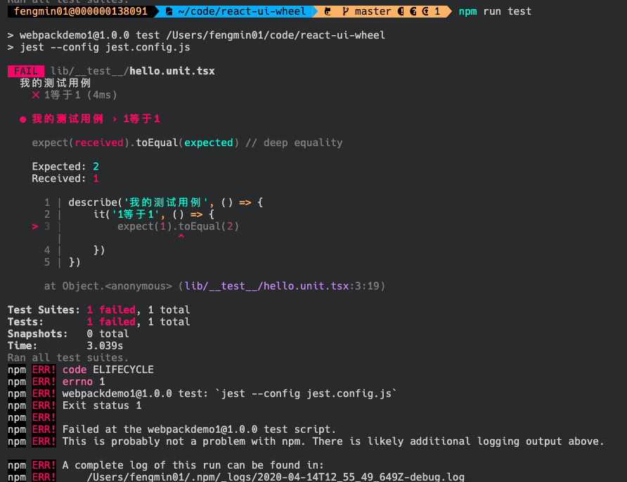
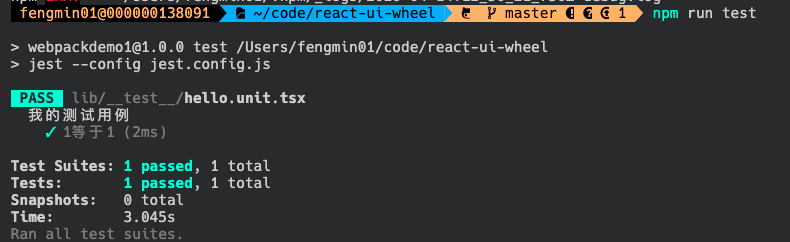
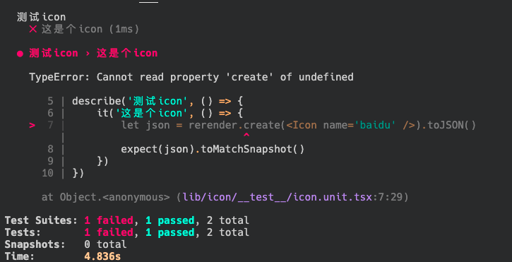
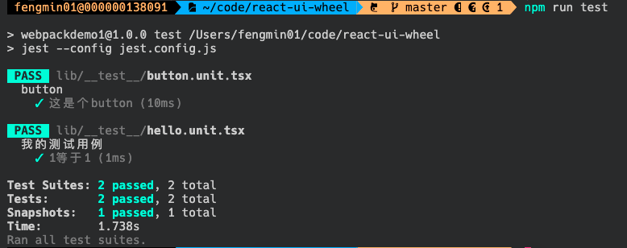

[toc]
## 配置jest测试
**1. 安装依赖**
由于jest只会在开发环境使用，因此只需要在开发环境安装
```
npm i -D jest babel-jest @babel/preset-env @babel/preset-react react-test-renderer @types/jest ts-jest @types/react-test-renderer 
```
**2. 添加babel配置文件**
在根目录添加babel.config.js文件
```
// babel.config.js
module.exports = {
  presets: ['@babel/preset-env', '@babel/preset-react'],
};
```
**3. 添加jest配置文件**
在根目录添加jest.config.js文件，并在package.json里面配置jest命令
```
// jest.config.js (配置字段的含义暂时不太清楚😞)
module.exports = {
    verbose: true,
    clearMocks: false,
    collectCoverage: false,
    reporters: ["default"],
    moduleFileExtensions: ["js", "jsx", "ts", "tsx"],
    testMatch: ["<rootDir>/**/__test__/**/*.unit.(js|jsx|ts|tsx)"],
    transform: {
        "^.+unit\\.(js|jsx)$": "babel-jest",
        "^.+\\.(ts|tsx)$": "ts-jest"
    }
}

// package.json
"scripts": {
    "test": "jest --config jest.config.js"
  },
```
**4. 新建测试文件**
在lib目录下新建__test__目录，并在该目录新建hello_unit.tsx文件，并写一点简单的测试用例
```
describe('我的测试用例', () => {
    it('1等于1', () => {
        expect(1).toEqual(2)
    })
})
```
在控制台运行`npm run test`，则会显示测试用例失败了。



我们将上述代码改成，再运行`npm run test`，
```
describe('我的测试用例', () => {
    it('1等于1', () => {
        expect(1).toEqual(1)
    })
})
```

至此我们的测试用例可以跑起来了👏，接下来我们可以写一些和我们代码相关的测试用例了。

### 使用`react-test-renderer`测试ui
**5. 测试我们的icon按钮**
在lib目录下新建__test__目录，并在该目录新建icon_unit.tsx文件，并写测试用例
```
import rerender from 'react-test-renderer'
import Icon from '../icon'
import React from 'react'

describe('测试icon', () => {
    it('这是个icon', () => {
        let json = rerender.create(<Icon name='baidu' />).toJSON()
        expect(json).toMatchSnapshot()
    })
})
```
**6. 为图片，css等配置桩数据**
a. 修改`test.config.js`，为图片、样式等文件添加模拟的桩数据：
```
moduleNameMapper: {
        "\\.(jpg|jpeg|png|gif|eot|otf|webp|svg|ttf|woff|woff2|mp4|webm|wav|mp3|aac|oga)$": "<rootDir>/test/__mocks__/file-mock.js",
        "\\.(css|less|sass|scss)$": "<rootDir>/test/__mocks__/object-mock.js"
    }
```
b. 在根目录下新建`test/__mocks__`目录，并新建`file-mock.js`和`object-mock.js`两个文件来模拟相应文件的导出：
```
// file-mock.js
module.exports = 'test-file-stub';

// object-mock.js
module.exports = {}
```
此时`jest.config.js`文件如下：
```
module.exports = {
    verbose: true,
    clearMocks: false,
    collectCoverage: false,
    reporters: ["default"],
    moduleFileExtensions: ["js", "jsx", "ts", "tsx"],
    moduleDirectories: ['node_modules', 'include'],
    moduleNameMapper: {
        "\\.(jpg|jpeg|png|gif|eot|otf|webp|svg|ttf|woff|woff2|mp4|webm|wav|mp3|aac|oga)$": "<rootDir>/test/__mocks__/file-mock.js",
        "\\.(css|less|sass|scss)$": "<rootDir>/test/__mocks__/object-mock.js"
    },  // ✨ 添加这两行
    testMatch: ["<rootDir>/**/__test__/**/*.unit.(js|jsx|ts|tsx)"],
    transform: {
        "^.+unit\\.(js|jsx)$": "babel-jest",
        "^.+\\.(ts|tsx)$": "ts-jest"
    }
}
```
**7. 配置rerender**

控制台执行`npm run test`，会显示我们的icon测试用例失败

报错显示rerender是undefined，这是因为`react-test-renderer`没有默认导出，我们可以修改`tsconfig.json`配置文件
```
{
    "compilerOptions": {
        "module": "esnext",
        "target": "es5",
        "lib": [
            "es6",
            "dom"
        ],
        "jsx": "react",
        "declaration": true,
        "moduleResolution": "node",
        "forceConsistentCasingInFileNames": false,
        "strict": true,
        "experimentalDecorators": true,
        "noErrorTruncation": true,
        "baseUrl": ".",
        // "allowSyntheticDefaultImports": true, 注释这行
        "esModuleInterop": true, // 添加这个属性
        "outDir": "dist"
    },
    "include": [
        "lib/**/*",
        "utils/**/*"
    ],
    "exclude": []
}
```
此时运行`npm run test`，我们的测试可以成功运行了，不过上面函数的含义，我还不知道为啥，先留个坑，之后再来回答：


**8. snapshots**
上述执行`npm run test`之后会自动在`icon/__test__`目录下生成`__snapshots__`目录，并生成`icon.unit.tsx.snap`文件，这是当前测试ui的快照，如果需要更新快照，则可以在`jest`后面加上`-u`：
```
jest --config jest.config.js -u
```

### 使用`enzyme`测试react中的事件。
**1. 安装相应的依赖**
```
npm i -D enzyme @types/enzyme enzyme-adapter-react-16 
```
**2. 添加相应的配置**
a. 在`jest.config.js`文件里面添加`setupFiles`选项：
```
setupFiles: ["<rootDir>test/setupTest.js"]
```
`setupFiles`：配置文件，在运行测试案例代码之前，Jest会先运行这里的配置文件来初始化指定的测试环境

b. 在根目录的test目录下新建`setupTest.js`来初始化测试环境
```
const enzyme = require('enzyme')
const Adapter = require('enzyme-adapter-react-16')

enzyme.configure({ adapter: new Adapter() })
```
**3. 写测试用例**
在`icon.unit.tsx`文件里添加点击事件的测试代码
```
import { mount } from 'enzyme'

it('它可以点击', () => {

    let fn = jest.fn()
    let componnet = mount(<Icon name='baidu' onClick={fn} />)
    componnet.find('svg').simulate('click')
    expect(fn).toBeCalled()
})
```

### 总结
至此，icon文件的测试就完成啦，目前icon的目录如下：
```
├── __test__
│   ├── __snapshots__
│   │   └── icon.unit.tsx.snap
│   └── icon.unit.tsx
├── icon.scss
├── icon.tsx
└── import.js
```