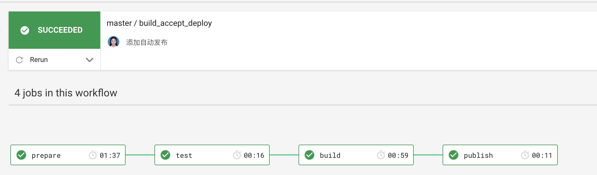

[TOC]
## 配置测试覆盖率
**1. 安装依赖**
```
npm i -D jest-junit
```
**2. 为ci添加配置文件**
根目录下新建`jest.config.ci.js`，其内容如下：
```
const base = require('./jest.config')
module.exports = Object.assign({}, base, {
    collectCoverage: true,
    collectCoverageFrom: ["lib/**/*.{ts,tsx}", "!**/node_modules/**"],
    collectDirectory: "coverage",
    coverageReporters: ["text", "lcov"],
    reporters: ["default", "jest-junit"],
});
```
**3. 为package.json文件ci命令**
```
"ci": "JEST_JUNIT_OUTPUT_NAME=./test-results/jest/results.xml jest --config jest.config.ci.js -u "
```
**4. 生成测试信息**
执行`npm run ci`之后，
a. 会在根目录下生成`covergae`目录，里面的`coverage/lcov-report/index.html`的文件给出了测试覆盖率，可在浏览器中打开：

b. 会在`test-results/jest/results.xml`生成测试信息。

## 配置ci时自动化测试
使用[circleci](https://circleci.com/)进行ci时自动化测试，即每次push代码后会自动测试，并生成测试文件等。

a. 用github账号登录后，即可添加项目部署，在这里我们为react-ui-wheel这个项目添加自动化测试


b. 添加circleci的配置文件，在根目录下新建`.circleci`目录，并在该目录下新建`config.yml`，其配置如下：
```
#https://github.com/revolunet/create-react-app-circleci/blob/master/.circleci/config.yml
defaults: &defaults
  docker:
    - image: circleci/node:10.16.3

version: 2
jobs:
  prepare:
    <<: *defaults
    steps:
      - checkout
      - restore_cache:
          keys:
            - v2-dependencies-{{ checksum "package.json" }}
      - run: npm install
      - save_cache:
          paths:
            - node_modules
          key: v2-dependencies-{{ checksum "package.json" }}
      - persist_to_workspace:
          root: .
          paths:
            - node_modules
  test:
    <<: *defaults
    steps:
      - checkout
      - attach_workspace:
          at: .
      - run: npm run ci
      - store_test_results:
          path: test-results
  build:
    <<: *defaults
    steps:
      - checkout
      - attach_workspace:
          at: .
      - run: npm run build
      - persist_to_workspace:
          root: .
          paths:
            - dist
            - package.json
            - README.md

workflows:
  version: 2
  build_accept_deploy:
    jobs:
      - prepare
      - test:
          requires:
            - prepare
      - build:
          requires:
            - test
```
c. 这样我们每次ci代码就会执行自动化测试:


## 发布包
```
npm who am i  // 查看是否登录
npm adduser   // 登录npm账号(登录后才能发布包)
npm publish   // 发布包（每次发布新的包需要更改版本号）
```
**1. 可以使用npm version命令来更新包版本**
```
npm version [major | minor | patch | premajor | preminor | prepatch | prerelease]
```
`版本号格式：主版本号.次版本号.修订号`
- major：主版本号，当你做了不兼容的 API 修改；
- minor：次版本号，当你做了向后兼容的功能性新增；
- patch：补丁号，当你做了向后兼容的问题修正。

参考 : [1. 版本号管理策略&&使用npm管理项目版本号](http://buzhundong.com/post/%E7%89%88%E6%9C%AC%E5%8F%B7%E7%AE%A1%E7%90%86%E7%AD%96%E7%95%A5-%E4%BD%BF%E7%94%A8npm%E7%AE%A1%E7%90%86%E9%A1%B9%E7%9B%AE%E7%89%88%E6%9C%AC%E5%8F%B7.html)

## 配置ci时自动发布包
给circleci的配置文件添加发布配置，即添加publish阶段，并添加过滤条件，使得在平常ci代码后不会自动发布，而是在git tag打上标签后才会执行自动发布，改完之后的配置如下：
```
#https://github.com/revolunet/create-react-app-circleci/blob/master/.circleci/config.yml
defaults: &defaults
  docker:
    - image: circleci/node:10.16.3

version: 2
jobs:
  prepare:
    <<: *defaults
    steps:
      - checkout
      - restore_cache:
          keys:
            - v2-dependencies-{{ checksum "package.json" }}
      - run: npm install
      - save_cache:
          paths:
            - node_modules
          key: v2-dependencies-{{ checksum "package.json" }}
      - persist_to_workspace:
          root: .
          paths:
            - node_modules
  test:
    <<: *defaults
    steps:
      - checkout
      - attach_workspace:
          at: .
      - run: npm run ci
      - store_test_results:
          path: test-results
  build:
    <<: *defaults
    steps:
      - checkout
      - attach_workspace:
          at: .
      - run: npm run build
      - persist_to_workspace:
          root: .
          paths:
            - dist
            - package.json
            - README.md
  publish:
    <<: *defaults
    steps:
      - attach_workspace:
          at: .
      - run: npm config set //registry.npmjs.org/:_authToken $NPM_TOKEN
      - run: npm publish

workflows:
  version: 2
  build_accept_deploy:
    jobs:
      - prepare
      - test:
          requires:
            - prepare
      - build:
          requires:
            - test
      - publish:
          requires:
            - build
          filters:
            tags:
              only: /^v[0-9]+(\.[0-9]+)*/
            branches:
              ignore: /.*/
```

至此，工程化配置就完成了，接下来我们可以安心写代码了。❀