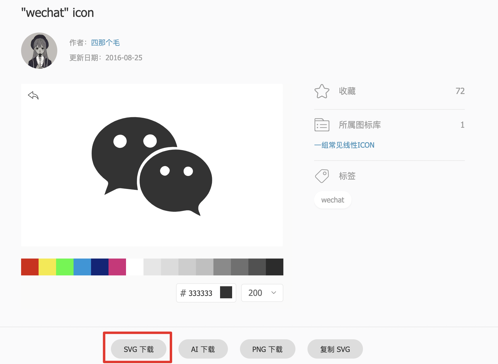

### 1. 安装`svg-sprite-loader`
它是一个 `webpack loader` ，可以将多个`svg` 打包成 `svg-sprite`
```
npm i -D svg-sprite-loader
```

### 2. 配置webpack.config.js的loader
```
{
    test: /\.svg$/,
    loader: 'svg-sprite-loader',
}
```
### 3. 从iconfont上下载svg图标

### 4. 使用svg
```
import './icons/wechat.svg';
<svg>
    <use xlinkHref='#wechat' style={{ 'fill': 'pink' }} />
</svg>
```
其中xlinkHref的值为`# + 文件名`
### 5. 批量引入文件夹下的svg文件
如果项目中有一百个 icon，导入每一个svg文件就显得非常不优雅，这是可以用下面的方法自动导入。
```
# 新建 importIcons.js
const requireAll = requireContext => requireContext.keys().forEach(requireContext)
const req = require.context('./icons', false, /\.svg$/)
requireAll(req)
```
在使用svg的文件里引用这个文件
```
import './importIcons.js'
```
> require.context("./test", false, /.test.js$/);
这行代码就会去 test 文件夹（不包含子目录）下面的找所有文件名以 .test.js 结尾的文件能被 require 的文件。
更直白的说就是 我们可以通过正则匹配引入相应的文件模块。

### 6. 参考文献
[React + Webpack + SVG Sprite](https://www.jianshu.com/p/03843654241e)
[使用require.context自动导入ES模块](https://juejin.im/post/5c10dbcbf265da61441fe8e2#heading-2)
[手摸手，带你优雅的使用 icon](https://juejin.im/post/59bb864b5188257e7a427c09#heading-9)