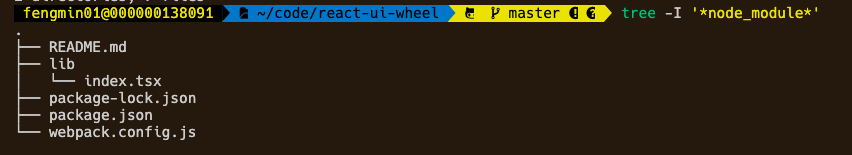

项目初始化可以参考（从0开始配置webpack），这里从支持tsx文件开始：
1. 支持`.tsx`后缀的文件
```
npm i awesome-typescript-loader --save-dev 

// webpack.config.js

module.exports = {
    entry: './lib/index.tsx',
    module: {
        rules: [
            {
                test : /\.tsx?$/,
                use: {
                    loader:"awesome-typescript-loader"
                }
            }
        ]
    }
};
```
此时目录结构：


