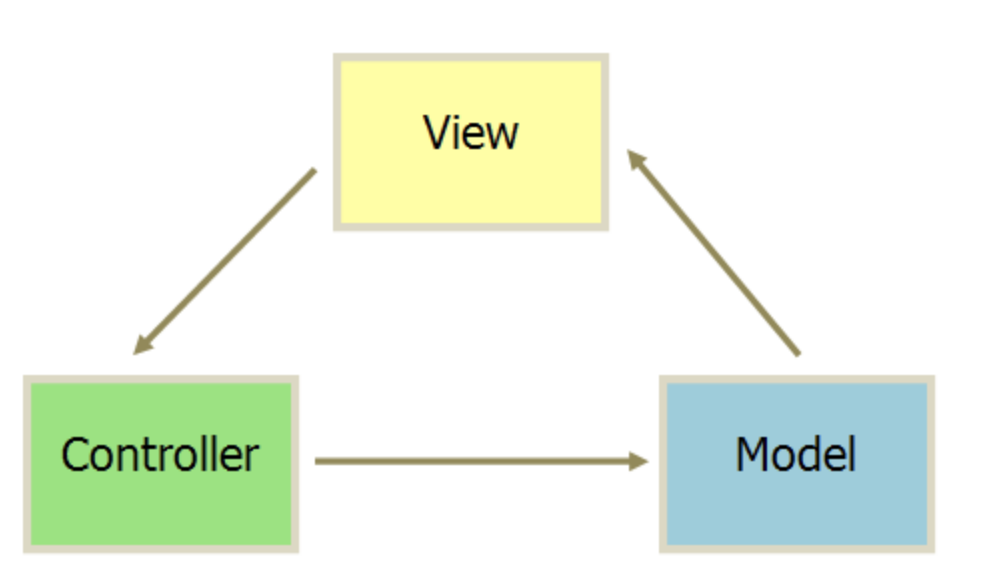
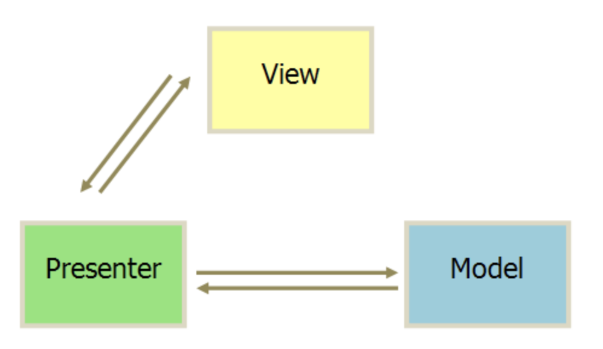
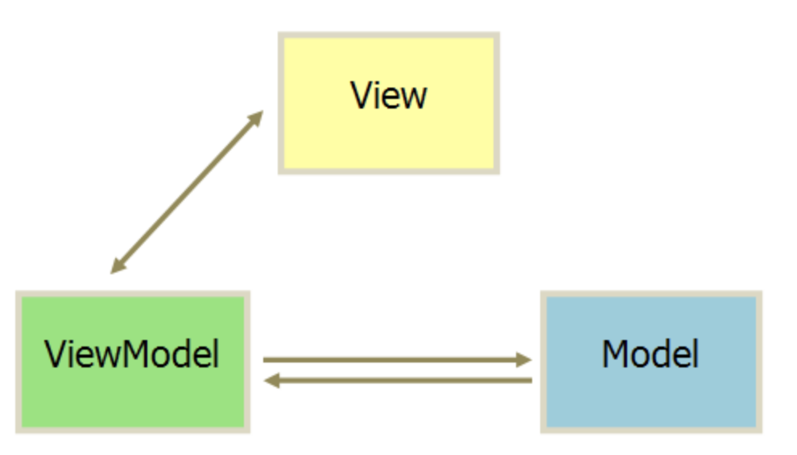

[TOC]
### MVC（Model-View-Controller）
MVC模式的意思是，软件可以分成三个部分:
- 视图(View): View是Model的可视化表示，表示当前状态的视图。前端View负责构建和维护DOM元素，View对应用程序的中的Model和Controller的了解是有限的，更新Model的实际任务都是在Controller中。
- 控制器(Controller): 负责连接View和Model，Model的任何改变都会应用到View中，View的操作会通过Controller应用到Model中。
- 模型(Model): Model不涉及用户界面，也不涉及表示层，而是代表应用程序可能需要的独特形式的数据。当Model改变时，它会通知它的观察者(如视图)作出相应的反应。

通信方式如下：
- View 传送指令到 Controller
- Controller 完成业务逻辑后，要求 Model 改变状态
- Model 将新的数据发送到 View，用户得到反馈

### MVP（Model-View-Presenter）
MVP是MVC模式的改良把，它把MVC中的Controller换成了Presenter（呈现），目的就是为了完全切断View跟Model之间的联系，由Presenter充当桥梁，做到View-Model之间通信的完全隔离。
- 各部分之间的通信，都是双向的。
- View 与 Model 不发生联系，都通过 Presenter 传递。
- View 非常薄，不部署任何业务逻辑，称为"被动视图"（Passive View），即没有任何主动性，而 Presenter非常厚，所有逻辑都部署在那里。

### MVVM （Model-View-ViewModel）
如果说MVP是对MVC的进一步改进，那么MVVM则是思想的完全变革。它是将“数据模型数据双向绑定”的思想作为核心，因此在View和Model之间没有联系，通过ViewModel进行交互，而且Model和ViewModel之间的交互是双向的。MVVM把View和Model的同步逻辑自动化了，以前Presenter负责的View和Model同步不再手动地进行操作，而是交给框架所提供的数据绑定功能进行负责，只需要告诉它View显示的数据对应的是Model哪一部分即可。

### 总结
MV*的目的是把应用程序的数据、业务逻辑和界面这三块解耦，分离关注点，不仅利于团队协作和测试，更有利于甩锅维护和管理。业务逻辑不再关心底层数据的读写，而这些数据又以对象的形式呈现给业务逻辑层。从 MVC --> MVP --> MVVM，就像一个打怪升级的过程，它们都是在MVC的基础上随着时代和应用环境的发展衍变而来的。

### 参考
[浅析前端开发中的 MVC/MVP/MVVM 模式](https://juejin.im/post/593021272f301e0058273468#heading-11)
[MVC，MVP 和 MVVM 的图示](https://www.ruanyifeng.com/blog/2015/02/mvcmvp_mvvm.html)