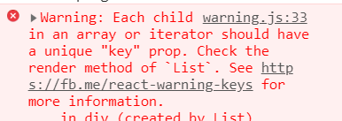
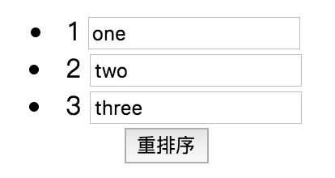
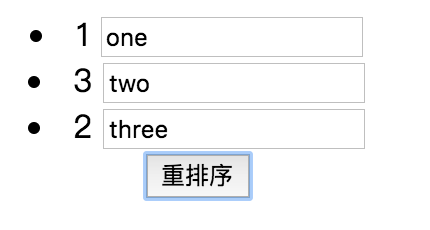

### React中key的作用
#### 抛出问题
在react项目中总会遇到这样一个的坑

这是警告数组遍历子元素要有一个唯一的key值，但是key到底是什么，在代码中到底起了什么作用？
#### key是什么
简单来说，react利用key来识别组件，它是一种身份标识标识，就像我们的身份证用来辨识一个人一样。每个key对应一个组件，相同的key react认为是同一个组件，这样后续相同的key对应组件都不会被创建。

此外，React 还需要借助 Key 值来判断元素与本地状态的关联关系。

> 举个例子：一个新闻列表，可点击列表项来将其标记为"已访问"，可通过tab切换“娱乐新闻”或是“社会新闻”。

> 不带key属性的情况下，在“娱乐新闻”下选中第二项然后切换到“社会新闻”，"社会新闻"里的第二项也会是被选中的状态，因为这里复用了组件，保留了之前的状态。要解决这个问题，可以为列表项带上新闻id作为唯一key，那么每次渲染列表时都会完全替换所有组件，使其拥有正确状态。
#### 需要注意的问题
##### 1. index作为key是危险的

在list数组中，用key来标识数组创建子组件时，若数组的内容只是作为纯展示，而不涉及到数组的动态变更，其实是可以使用index作为key的。

但是，若涉及到数组的动态变更，例如数组新增元素、删除元素或者重新排序等，这时index作为key会导致展示错误的数据。

```
export default function App() {
  let [data,setData] = React.useState([1, 2, 3]);
  return (
    <div className="App">
      {data.map((v, idx) => (
        <Item key={idx} v={v} />
      ))}
      <button onClick={()=>{setData([1,3,2])}}>重排序</button>
    </div>
  );
}
function Item(props) {
  return (
    <li>
      {props.v} <input type="text" />
    </li>
  );
```
刚开始页面展现：

重排序后：

上面实例中在数组重新排序后，key对应的实例都没有销毁，而是重新更新。具体更新过程我们拿key=1的元素来说明， 数组重新排序后：

- 组件重新render得到新的虚拟dom；
- 新老两个虚拟dom进行diff，新老版的都有key=1的组件，react认为同一个组件，则只可能更新组件；
- 然后比较其children，发现内容的文本内容不同（由2--->3)，从而更新其子组件文本内容;
- 因为组件的children中input组件没有变化，其又与父组件传入的任props没有关联，所以input组件不会更新，导致用户输入的值不会变化。
  
这就是index作为key存在的问题，所以不要使用index作为key。
##### 2. key的值要稳定唯一
```
{
    this.state.data.map(el=><MyComponent key={Math.random()}/>)
}
```
上面代码中中MyComponent的key值是用Math.random随机生成的，虽然能够保持其唯一性，但是它的值是随机而不是稳定的，在数组动态改变时会导致数组元素中的每项都重新销毁然后重新创建，有一定的性能开销；另外可能导致一些意想不到的问题出现。所以：
> key的值要保持稳定且唯一，不能使用random来生成key的值。
##### 3. key只有放在就近的数组上下文中才有意义
```
const listItems = numbers.map((number) =>
    // 正确！key 应该在数组的上下文中被指定
    <ListItem key={number.toString()} value={number} />
  );
```
一个好的经验法则是：在 map() 方法中的元素需要设置 key 属性。
##### 4. key只是在兄弟节点之间必须唯一
数组元素中使用的 key 在其兄弟节点之间应该是独一无二的。然而，它们不需要是全局唯一的。
##### 5. key属性不会传递给组件
key 会传递信息给 React ，但不会传递给你的组件。如果你的组件中需要使用 key 属性的值，请用其他属性名显式传递这个值：
```
const content = posts.map((post) =>
  <Post
    key={post.id}
    id={post.id}
    title={post.title} />
);
```
上面例子中，Post 组件可以读出 props.id，但是不能读出 props.key。
#### 生成key的方式
a. 我们可以像下面这样用一个全局的localCounter变量来添加稳定唯一的key值。
```
var localCounter = 1;
this.data.forEach(el=>{
    el.id = localCounter++;
});
//向数组中动态添加元素时，
function createUser(user) {
    return {
        ...user,
        id: localCounter++
    }
}
```
b. 我们也可以借助shortid来为数组生成id
shortid, 它可以快速的生成一系列**短的无序的对url友好的唯一的id**
```
var shortid = require('shortid');

function createNewTodo(text) {
    return {
        completed: false,
        id: shortid.generate(),
        text
    }
}
```
##### 参考文献
[react反模式之index作为key](https://segmentfault.com/a/1190000007910897)
[React之key详解](https://www.cnblogs.com/wonyun/p/6743988.html)
[Why do I need Keys in React Lists?](https://medium.com/@adhithiravi/why-do-i-need-keys-in-react-lists-dbb522188bbb)
[列表 & Key](https://zh-hans.reactjs.org/docs/lists-and-keys.html)
[React 列表组件中 key 的作用](http://www.feingto.com/?p=24050)