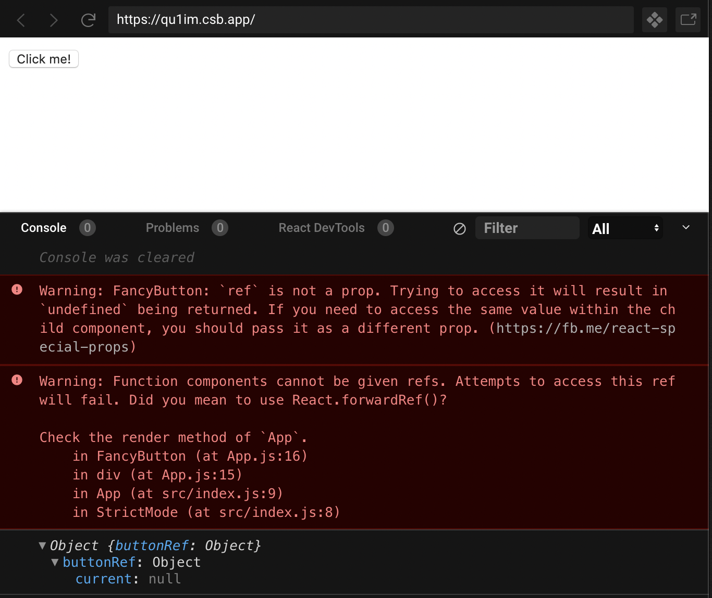
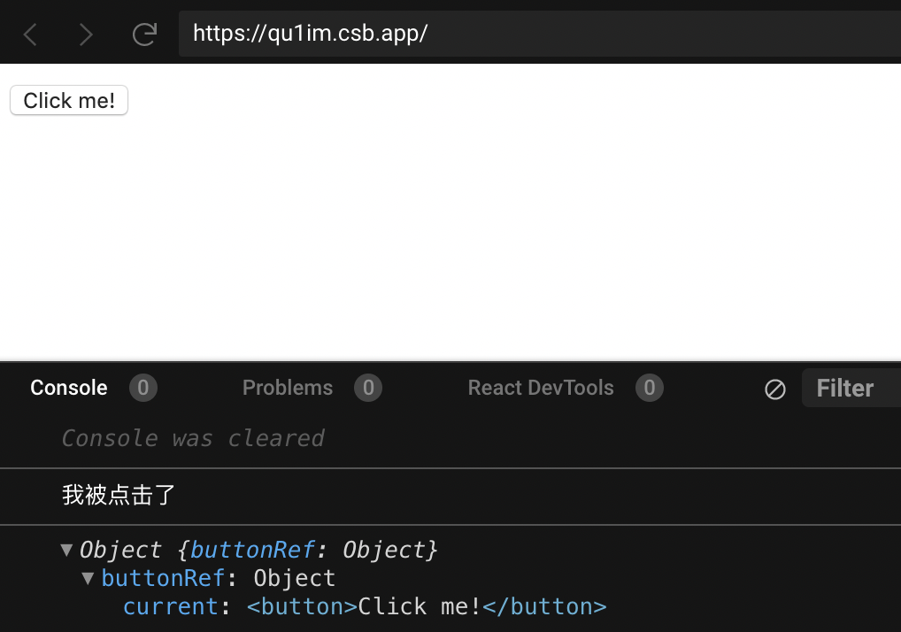

[TOC]
## 作用
Refs 提供了一种方式，允许我们访问 DOM 节点 或者 React实例。
## 使用
### 创建refs
#### 在class组件中创建refs
```js
class App extends React.Component {
  constructor(props) {
    super(props);
    this.inputRef = React.createRef();
  }
}
```
#### 在函数组件中创建refs，有两种方式
- React.createRef()
- React.useRef()
```js
export default function App() {
  const inputRef = React.createRef();
  const inputRef = React.useRef();
}
```
### 访问refs
当 ref 被传递给 render 中的元素时，对该节点的引用可以在 ref 的 current 属性中被访问。
```
const node = this.myRef.current;
```
ref 的值根据节点的类型而有所不同：

- 当 ref 属性用于 HTML 元素时，构造函数中使用 React.createRef() 创建的 ref 接收底层 DOM 元素作为其 current 属性。
- 当 ref 属性用于自定义 class 组件时，ref 对象接收组件的挂载实例作为其 current 属性。
- 你不能在函数组件上使用 ref 属性，因为他们没有实例。这种情况可以使用`forwardRef`来转发。

#### 为DOM元素添加ref
- 在class组件中为dom元素添加ref属性
```javascript
class App extends React.Component {
  constructor(props) {
    super(props);
    this.inputRef = React.createRef();
  }
  render() {
    return (
      <div className="box">
        <input ref={this.inputRef} />
        <button
          onClick={() => {
            this.inputRef.current.focus();
          }}
        >
          Click
        </button>
      </div>
    );
  }
}
```
- 在函数组件中为dom元素添加ref属性
```js
export default function App() {
  const inputRef = React.createRef();
  // const inputRef = React.useRef();   这种方式也可以
  return (
    <div className="box">
      <input ref={inputRef} />
      <button
        onClick={() => {
          inputRef.current.focus();
        }}
      >
        Click
      </button>
    </div>
  );
}
```
#### 为class组件实例添加ref属性
- 在class组件中为class组件实例元素添加ref属性
```js
export default class Parent extends React.Component {
  constructor(props) {
    super(props);
    this.childRef = React.createRef();
  }
  componentDidMount() {
    // this.childRef.current 指向 Child 实例
    this.childRef.current.sayHello();
  }
  render() {
    // 为class组件添加ref属性，仅在Child被声明为类组件才有效，因为函数组件没有实例
    return <Child ref={this.childRef} />;
  }
}

class Child extends React.Component {
  sayHello() {
    console.log("hello");
  }
  render() {
    return <div>Child</div>;
  }
}

```
- 在函数组件中为class组件实例元素添加ref属性
```js
export default function Parent() {
  const childRef = React.createRef();
  // const childRef = React.useRef();

  React.useEffect(() => {
    // childRef.current 指向Child 实例
    childRef.current.sayHello();
  }, []);

  // 为class组件添加ref属性，仅在Child被声明为类组件才有效，因为函数组件没有实例
  return <Child ref={childRef} />;
}

class Child extends React.Component {
  sayHello() {
    console.log("hello");
  }
  render() {
    return <div>Child</div>;
  }
}
```

#### 使用forwardRef为函数组件添加ref属性
默认情况下，**你不能在函数组件上使用 ref 属性**，因为它们没有实例：
```js
export default function App() {
  const buttonRef = React.useRef(null);

  React.useEffect(() => {
    if (buttonRef.current) {
      buttonRef.current.click();
    }
    console.log({ buttonRef });
  }, []);

  return (
    <div>
      <FancyButton ref={buttonRef}>Click me!</FancyButton>
    </div>
  );
}

const FancyButton = ({ children, ref }) => {
  const click = () => {
    console.log("我被点击了");
  };
  return (
    <button ref={ref} onClick={click}>
      {children}
    </button>
  );
};
```


如果要在函数组件中使用 ref，你可以使用 forwardRef来转发ref。这样，使用 FancyButton 的组件可以获取底层 DOM 节点 button 的 ref ，并在必要时访问，
```js
export default function App() {
  const buttonRef = React.useRef(null);

  React.useEffect(() => {
    if (buttonRef.current) {
      buttonRef.current.click();
    }
    console.log({ buttonRef });
  }, []);

  return (
    <div>
      <FancyButton ref={buttonRef}>Click me!</FancyButton>
    </div>
  );
}

const FancyButton = React.forwardRef((props, ref) => {
  const click = () => {
    console.log("我被点击了");
  };
  return (
    <button ref={ref} onClick={click}>
      {props.children}
    </button>
  );
});
```


以下是对上述示例发生情况的逐步解释：

- 我们通过调用 `React.createRef` 创建了一个 `React ref` 并将其赋值给 `ref` 变量。
- 我们通过指定 `ref` 为 `JSX` 属性，将其向下传递给 `<FancyButton ref={ref}>`。
- `React` 传递 `ref` 给 `forwardRef` 内函数 `(props, ref) => ...`，作为其第二个参数。
- 我们向下转发该 `ref` 参数到 `<button ref={ref}>`，将其指定为 `JSX` 属性。
- 当 `ref` 挂载完成，`ref.current` 将指向 `<button>` DOM 节点。

### refs回调函数
React 也支持另一种设置 refs 的方式，称为“回调 refs”。

不同于传递 createRef() 创建的 ref 属性，你会传递一个函数。这个函数中接受 React 组件实例或 HTML DOM 元素作为参数，以使它们能在其他地方被存储和访问。

```js
export default function App() {
  let [n, setN] = React.useState(0);
  let textInput = null;
  const focusTextInput = () => {
    console.log(textInput);
    if (textInput) {
      textInput.focus();
    }
  };
  React.useEffect(() => {
    focusTextInput();
  });
  return (
    <div>
      <input
        type="text"
        ref={element => {
          /* 如果 ref 回调函数是以内联函数的方式定义的，在更新过程中它会被执行两次，第一次传入参数 null，然后第二次会传入参数 DOM 元素。这是因为在每次渲染时会创建一个新的函数实例，所以 React 清空旧的 ref 并且设置新的。通过将 ref 的回调函数定义成 class 的绑定函数的方式可以避免上述问题，但是大多数情况下它是无关紧要的。 */
          console.log("element is ", element);
          textInput = element;
        }}
      />
      <input
        type="button"
        value="Focus the text input"
        onClick={focusTextInput}
      />
      <div>n : {n}</div>
      <button onClick={() => setN(n => n + 1)}>+1</button>
    </div>
  );
}

```
## 总结
Refs 提供了一种方式，允许我们访问 DOM 节点 或者 React实例。

ref属性默认只能添加到 dom 节点或 class 组件，如果需要给函数组件添加 ref 属性，需要使用 forwardRef 转发；

ref属性的值可以是 ：
- React.createRef()返回值
- refs回调函数
- React.useRef()返回值 (仅限在函数组件中使用)


