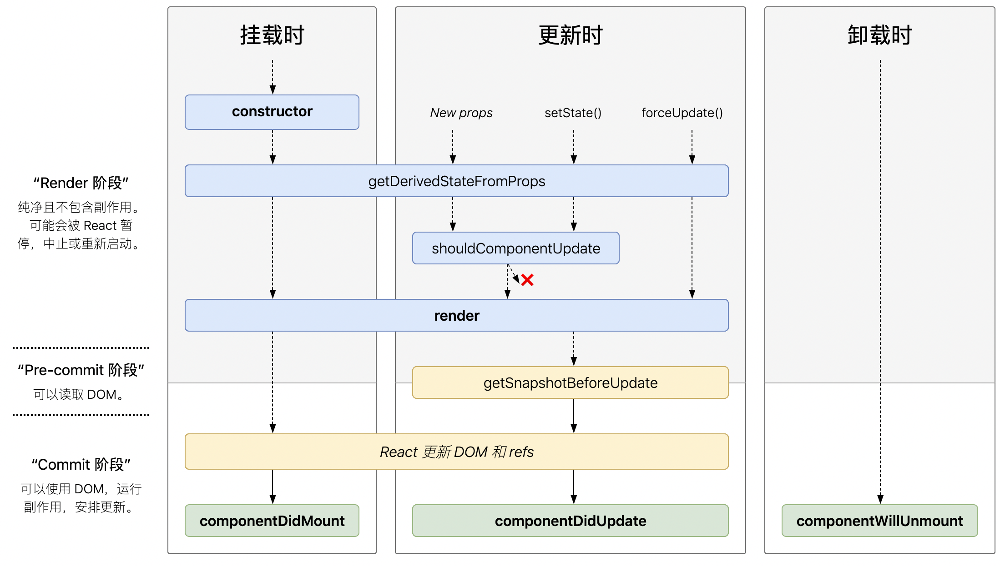

[TOC]
## 生命周期图

## 挂载
- constructor
- getDerivedStateFromProps
- render
- componentDidMount
### constructor
```
constructor()
```
**作用**：
- 通过给 this.state 赋值对象来初始化内部 state。
- 为事件处理函数绑定实例
- 调用 createRef，创建对 HTMLElement 元素的引用
```
class MyComponent extends React.Component {
    constructor(props) {
        super(props);
        this.state = {
            value: ''
        }
        this.inputRef = React.createRef();
        this.handleChange = this.handleChange.bind(this);
    }
    handleChange(e) {
        this.setState({
            value: e.target.value
        })
    }
    render() {
        return <input type="text" ref={this.inputRef} value={this.state.value} onChange={this.handleChange} />;
    }

    componentDidMount() {
        this.inputRef.current.focus();
    }
}
```
注意：这不适用于 Functional Component
### getDerivedStateFromProps
```
static getDerivedStateFromProps(nextProps, prevState)
```
getDerivedStateFromProps 会在调用 render 方法之前调用，并且在初始挂载及后续更新时都会被调用。它有两个参数nextProps和prevState，分别指接收到的新参数和当前的state对象，它应返回一个对象来更新 state，如果返回 null 则不更新任何内容。
### render
```
render()
```
- render() 方法是 class 组件中唯一必须实现的方法。
- render() 函数应该为纯函数，这意味着在不修改组件 state 的情况下，每次调用时都返回相同的结果。
### componentDidMount
```
componentDidMount()
```
componentDidMount() 会在组件挂载后（插入 DOM 树中）立即调用。依赖于 DOM 节点的初始化应该放在这里。如需通过网络请求获取数据，此处是实例化请求的好地方。
componentDidMount 触发时，组件已完成第一 render，所以可以进行一些操作：
- 访问 DOM 节点
- 添加事件侦听器
- 调用 AJAX 以加载组件的数据。
## 更新
当
- 组件的props改变了，
- 组件内部调用了setState
- forceUpdate发生

会触发更新阶段。
更新阶段有如下生命周期函数：
- getDerivedStateFromProps
- shouldComponentUpdate
- render
- getSnapshotBeforeUpdate
- componentDidUpdate

### getDerivedStateFromProps
同上
### shouldComponentUpdate
```
shouldComponentUpdate(nextProps, nextState)
```
当 props 或 state 发生变化时，shouldComponentUpdate() 会在渲染执行之前被调用。返回值默认为 true。首次渲染或使用 forceUpdate() 时不会调用该方法。

shouldComponentUpdate 方法的第一个参数为 nextProps，第二个参数为 nextState。shouldComponentUpdate 返回一个布尔值，用于控制组件是否更新。

shouldComponentUpdate 赋予我们一项能力，只有在你关心的 props 改变时组件会才更新，常用于优化 React。

### render
同上

### getSnapshotBeforeUpdate
```
getSnapshotBeforeUpdate(prevProps, prevState)
```
getSnapshotBeforeUpdate() 在最近一次渲染输出（提交到 DOM 节点）之前调用。它使得组件能在发生更改之前从 DOM 中捕获一些信息（例如，滚动位置）。此生命周期的任何返回值将作为参数传递给 componentDidUpdate()。

### componentDidUpdate
```
componentDidUpdate(prevProps, prevState, snapshot)
```
componentDidUpdate 包含三个参数，prevProps、prevState，以及 getSnapshotBeforeUpdate 的返回。

在这个函数里我们可以操作DOM，和发起服务器请求
## 卸载
- componentWillUnmount

### componentWillUnmount
```
componentWillUnmount()
```
componentWillUnmount() 会在组件卸载及销毁之前直接调用。在此方法中执行必要的清理操作，例如，清除 timer，取消网络请求或清除在 componentDidMount() 中创建的订阅等。