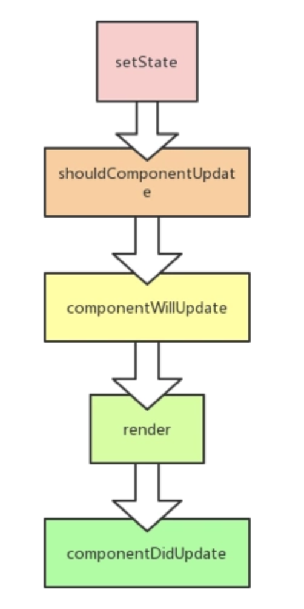

### 1. props和state异同点
**相同处：**
他们的改变都会触发组件重新渲染。
**区别：**
> props是一个从外部传进组件的参数或是组件设置的默认参数，主要作用是从父组件向子组件传递数据，它具有可读性和不变性，只能通过外部组件主动传入新的

> props来重新渲染子组件，否则子组件的props以及展现形式不会改变。
```
class Welcome extends React.Component {
  render() {
    return <h1>Hello {this.props.name}</h1>;
  }
}
// 外部传进来的参数
const element = <Welcome name="Sara" />;

// 默认参数
Welcome.defaultProps = {
  name: "world",
};
```
> state的主要作用是用于组件保存、控制以及修改自己的状态，它一般在constructor中初始化，是组件的私有属性，不可通过外部访问和修改，只能通过组件内部的this.setState来修改。
```
class Button extends React.Component {
  constructor() {
    super();
    this.state = {
      count: 0,
    };
  }

  updateCount() {
    this.setState((prevState, props) => {
      return { count: prevState.count + 1 }
    });
  }

  render() {
    return (<button
              onClick={() => this.updateCount()}
            >
              Clicked {this.state.count} times
            </button>);
  }
}
```
### 2. setState参数
```
setState(updater[, callback])
```
- updater有两种形式:

a. 第一种为一个函数：
```
this.setState((state, props) => {
  return {counter: state.counter + props.step};
});
```
updater 函数中接收的 state 和 props 都保证为最新。updater 的返回值会与 state 进行浅合并。
b. 第二种为一个对象，会将传入的对象浅层合并到新的 state 中。
```
this.setState({ count: this.state.count + 1 });
```
- callback是可选的，它将在 setState 完成合并并重新渲染组件后执行。

### 3. setState是'异步的'
react通常会集齐一批需要更新的组件，然后一次性更新来保证渲染的性能，所以这就给我们埋了一个坑：

那就是在使用setState改变状态之后，立刻通过this.state去拿最新的状态往往是拿不到的。
```
class App extends Component {
    state = {
        count: 0
    }
    componentDidMount() {
        this.setState({ count: this.state.count + 1 })
        console.log(this.state.count) // 0
    }
}
```
怎么办，可以在componentDidUpdate或者setState的回调函数里获取。(注：官方推荐第一种做法)
```
this.setState({count: this.state.count + 1}, ()=>{
    console.log(this.state.count) // 1
})
```
### 4. setState是批量更新的
设想有一个需求，需要在在onClick里累加两次，如下
```
  onClick = () => {
    this.setState({ count: this.state.count + 1 });
    this.setState({ count: this.state.count + 1 });
  }
```
实际最终的 count 会等于 1，在react眼中，这个方法最终会变成
```
Object.assign(
  previousState,
  {count: state.count+ 1},
  {count: state.count+ 1},
  ...
)
```
由于后面的数据会覆盖前面的更改，所以最终只加了一次。所以如果是下一个state依赖前一个state的话，推荐给setState传function：
```
onClick = () => {
    this.setState((prevState, props) => {
      return {count: prevState.count + 1};
    });
    this.setState((prevState, props) => {
      return {count: prevState.count + 1};
    });
}
```
5. 为什么setState是异步的


每一次setState如果都引发一次组件更新，走完一圈生命周期，实在是有点粗糙和浪费，生命周期函数为纯函数性能应当还能够接受，可是render函数内返回的虚拟DOM去做比较这个就比较费时间了。

直观的感受是，React将多个setState产生的修改放在一个队列里，缓一缓，攒在一起，等待时机，觉得差不多了再引发一次更新过程。这样，在每次更新过程中，会把积攒的setState结果合并，做一个merge的动作，节省render触发的频率。

这样，对于开发者而言，可以在同步代码中随意多行调用setState函数而不用担心重复setState重复render的问题。

### 5. but,setState真的是异步的吗？
事实上，在React中，如果是由React引发的事件处理（比如通过onClick引发的合成事件处理）和组件生命周期函数内（比如componentDidMount），调用this.setState不会同步更新this.state，除此之外的setState调用会同步执行this.state。

所谓“除此之外”，指的是绕过React通过addEventListener直接添加的事件处理函数，还有通过setTimeout/setInterval产生的异步调用。
- 1. 生命周期中调用 - 异步
- 2. react的event callback中调用 - 异步
- 3. setTimeout中调用 - 同步
- 4. 原生事件中调用 - 同步
```
class App extends Component {
  state = {
    count: 0
  };

  componentDidMount() {
    // 1. 生命周期中调用 - 异步
    this.setState({ count: this.state.count + 1 });
    console.log("lifecycle: " + this.state.count);  // 0

    // 2. setTimeout中调用 - 同步
    setTimeout(() => {
      this.setState({ count: this.state.count + 1 });
      console.log("setTimeout: " + this.state.count);   // 1
    }, 0);
    document.getElementById("div2").addEventListener("click", this.increment2);
  }
    // 3. event callback中调用 - 异步
   increment = () => {
    this.setState({ count: this.state.count + 1 });
    console.log("react event: " + this.state.count);  // 0
  };
    // 4. 原生事件中调用 - 同步
   increment2 = () => {
    this.setState({ count: this.state.count + 1 });
    console.log("dom event: " + this.state.count);  // 1
  };

  render() {
    return (
      <div className="App">
        <h2>couont: {this.state.count}</h2>
        <div id="div1" onClick={this.increment}>
          click me and count+1
        </div>
        <div id="div2">click me and count+1</div>
      </div>
    );
  }
}
```
[demo](https://codesandbox.io/s/k2jwvz03m3?expanddevtools=1)

探讨前，我们先简单了解下react的事件机制：react为了解决跨平台，兼容性问题，自己封装了一套事件机制，代理了原生的事件，像在jsx中常见的onClick、onChange这些都是合成事件。

那么以上4种方式调用setState()，后面紧接着去取最新的state，按之前讲的异步原理，应该是取不到的。然而，setTimeout中调用以及原生事件中调用的话，是可以立马获取到最新的state的。根本原因在于，setState并不是真正意义上的异步操作，它只是模拟了异步的行为。React中会去维护一个标识（isBatchingUpdates），判断是直接更新还是先暂存state进队列。setTimeout以及原生事件都会直接去更新state，因此可以立即得到最新state。而合成事件和React生命周期函数中，是受React控制的，其会将isBatchingUpdates设置为 true，从而走的是类似异步的那一套。

### 6. 总结
此处总结是直接引用了：

- setState 只在合成事件和钩子函数中是“异步”的，在原生事件和 setTimeout 中都是同步的。
- setState的“异步”并不是说内部由异步代码实现，其实本身执行的过程和代码都是同步的，只是合成事件和钩子函数的调用顺序在更新之前，导致在合成事件和钩子函数中没法立马拿到更新后的值，形式了所谓的“异步”，当然可以通过第二个参数 setState(partialState, callback) 中的callback拿到更新后的结果。
- setState 的批量更新优化也是建立在“异步”（合成事件、钩子函数）之上的，在原生事件和setTimeout 中不会批量更新，在“异步”中如果对同一个值进行多次 setState ， setState 的批量更新策略会对其进行覆盖，取最后一次的执行，如果是同时 setState 多个不同的值，在更新时会对其进行合并批量更新。

### 7. 参考文献
[1. setState异步、同步与进阶](https://juejin.im/post/5bf1444cf265da614a3a1660#heading-4)
[2. 浅入深出setState](https://segmentfault.com/a/1190000015615057)
[3. 揭密React setState](https://imweb.io/topic/5b189d04d4c96b9b1b4c4ed6)
[4. react官方文档setState api](https://zh-hans.reactjs.org/docs/react-component.html#setstate)