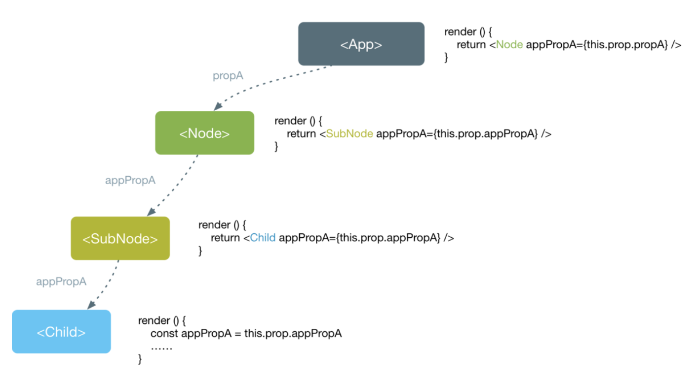
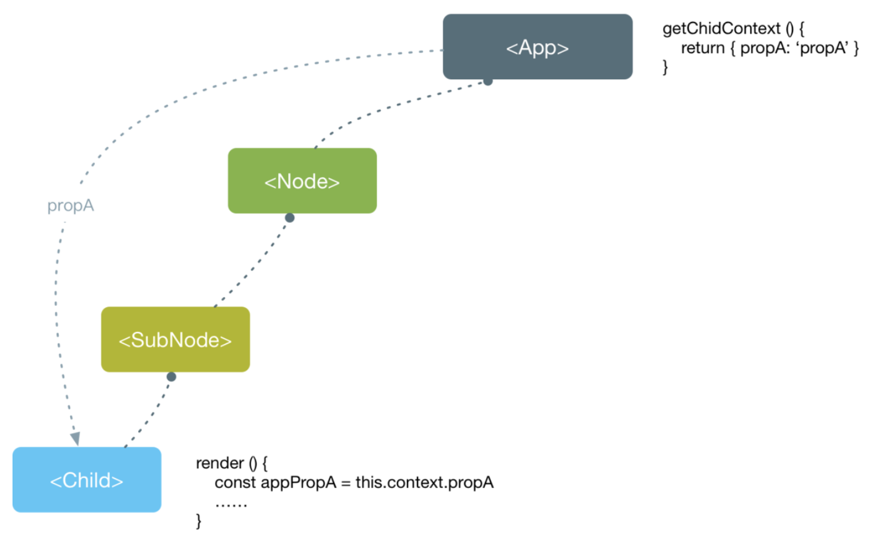

[TOC]
## 父组件向子组件通信
React数据流动是单向的,父组件向子组件通信也是最常见的;父组件通过props向子组件传递需要的信息。
```
// parent.js
import Child from './Child';
class Parent extends Component {
    render() {
        return (
            <div>
                <Child name="Sara" />
            </div>
        );
    }
}


// child.js
export default function Child({ name }) {
    return <h1>Hello, {name}</h1>;
}
```
## 子组件向父组件通信
- 利用回调函数
```
import React, { useState } from "react";

export default function App() {
  let [value, setValue] = useState("");
  return (
    <div className="App">
      <div>child value : {value}</div>
      <Child transfer={value => setValue(value)} />
    </div>
  );
}

function Child({ transfer }) {
  let [value, setValue] = useState("");
  function change(e) {
    setValue(e.target.value);
    transfer(e.target.value);
  }
  return <input value={value} onChange={change} />;
}
```
## 跨级组件通信
- 中间组件层层传递props
- 使用context对象
### 中间组件层层传递props
对于这种方式，如果父组件结构较深，那么中间每一层组件都要去传递props，增加了复杂度，并且这些props可能并不是中间组件自己需要的。
### context
当你不想在组件树中通过逐层传递props的方式来传递数据时，可以使用Context来实现跨层级的组件数据传递。

使用props传递数据，数据自顶向下。

使用Context，可以跨越组件进行数据传递。
```

```
### 使用context对象
## 没有嵌套关系组件之间的通信