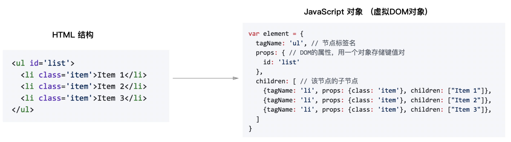
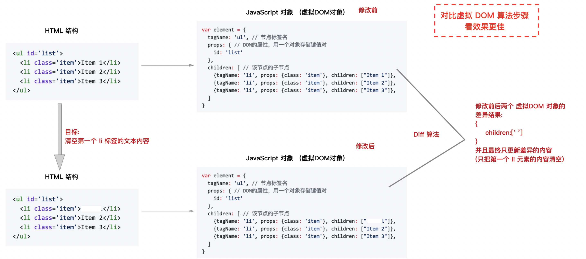
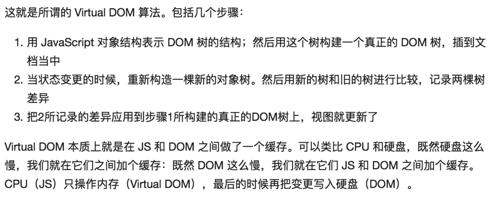
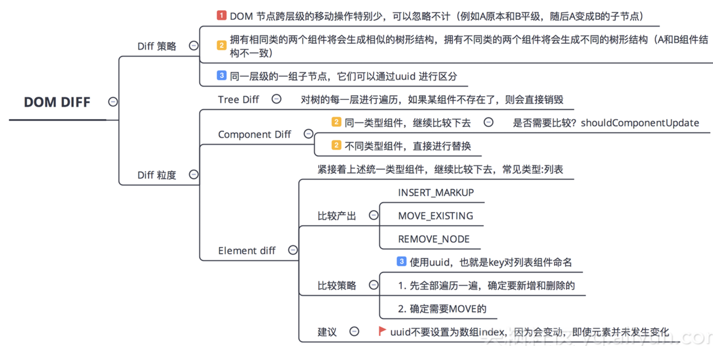
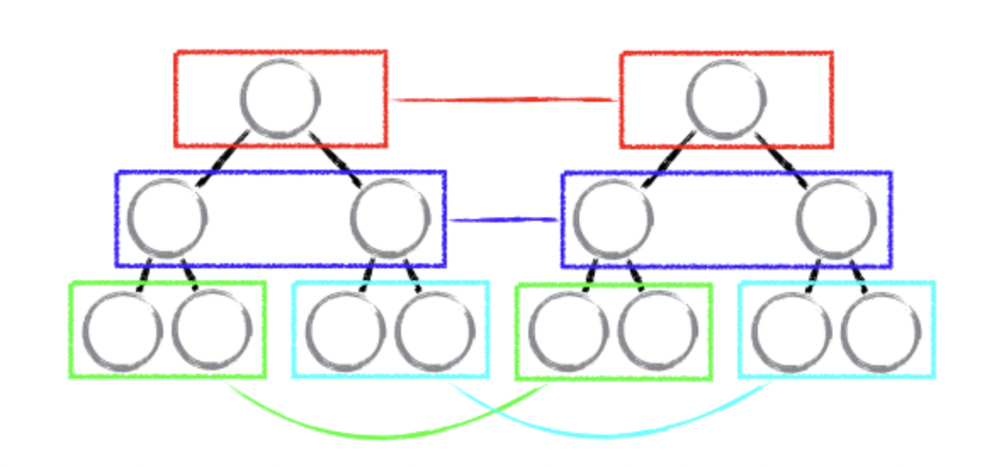
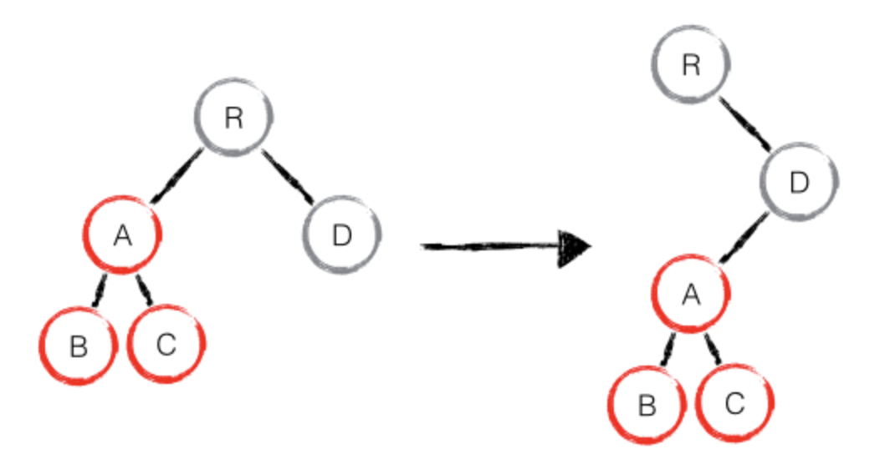
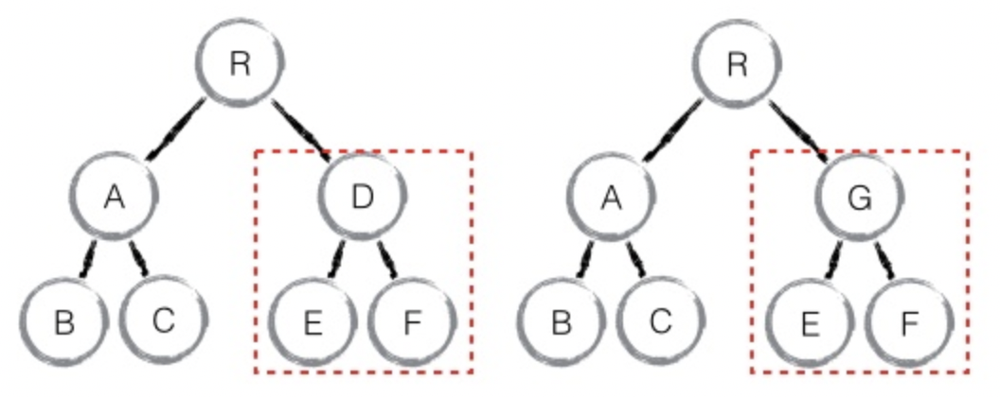

[TOC]
### 虚拟DOM
React将DOM抽象为虚拟DOM, 然后通过新旧虚拟DOM 这两个对象的差异(Diff算法),最终只把变化的部分重新渲染,提高渲染效率的过程; (概念讲完再描述一遍)

一句话: 用 JS 对象的形式,来表现一棵真是的 DOM 树;

### diff算法

diff算法是react应用中的精华所在，diff在使用时有一些约定如下：
- Web UI 中 DOM 节点跨层级的移动操作特别少，可以忽略不计。
- 拥有相同class的两个组件将会生成相似的树形结构，拥有不同class的两个组件将会生成不同的树形结构。
- 对于同一层级的一组子节点，它们可以通过唯一 id 进行区分。

基于以上三个前提策略，React 分别对 `tree diff`、`component diff` 以及 `element diff` 进行算法优化，事实也证明这三个前提策略是合理且准确的，它保证了整体界面构建的性能。

#### tree diff
基于策略一，React 对树的算法进行了简洁明了的优化，即对树进行分层比较，两棵树只会对同一层次的节点进行比较。

既然 DOM 节点跨层级的移动操作少到可以忽略不计，针对这一现象，React 只会对相同颜色方框内的 DOM 节点进行比较，即同一个父节点下的所有子节点。当发现节点已经不存在，则该节点及其子节点会被完全删除掉，不会用于进一步的比较。这样只需要对树进行一次遍历，便能完成整个 DOM 树的比较。

如果出现了 DOM 节点跨层级的移动操作，React diff 会有怎样的表现呢？

最高效的算法应该是直接将 A 子树移动到 D 节点，但这样就涉及到跨层级比较，时间复杂度会陡然上升。React 的做法比较简单，它会先删除整个 A 子树，然后再重新创建一遍。结合到实际的使用场景，改变一个组件的从属关系的情况也是很少的。

由此可发现，当出现节点跨层级移动时，并不会出现想象中的移动操作，而是以 A 为根节点的树被整个重新创建，这是一种影响 React 性能的操作，因此 React 官方建议不要进行 DOM 节点跨层级的操作。

> 注意：在开发组件时，保持稳定的 DOM 结构会有助于性能的提升。例如，可以通过 CSS 隐藏或显示节点，而不是真的移除或添加 DOM 节点。

#### component diff

React 是基于组件构建应用的，对于组件间的比较所采取的策略也是简洁高效。

如果是同一类型的组件，按照原策略继续比较 virtual DOM tree。

如果不是，则将该组件判断为 dirty component，从而替换整个组件下的所有子节点。

对于同一类型的组件，有可能其 Virtual DOM 没有任何变化，如果能够确切的知道这点那可以节省大量的 diff 运算时间，因此 React 允许用户通过 shouldComponentUpdate() 来判断该组件是否需要进行 diff。

同样道理，当 D 节点改为 G 节点时，整棵 D 子树也会被删掉，E、F 节点会重新创建。

#### element diff
对于同一层级的element节点，diff提供了以下3种节点操作：  
- INSERT_MARKUP 插入节点：对全新节点执行节点插入操作
- MOVE_EXISING 移动节点：组件新集合中有组件旧集合中的类型，且element可更新，即组件调用了receiveComponent，这时可以复用之前的dom，执行dom移动操作
- REMOVE_NODE 移除节点：此时有两种情况：组件新集合中有组件旧集合中的类型，但对应的element不可更新、旧组建不在新集合里面，这两种情况需要执行节点删除操作

### 4.总结
- React 通过 diff 策略，将 O(n3) 复杂度的问题转换成 O(n) 复杂度的问题；
- React 通过分层求异的策略，对 tree diff 进行算法优化；
- React 通过相同类生成相似树形结构，不同类生成不同树形结构的策略，对 component diff 进行算法优化；
- React 通过设置唯一 key的策略，对 element diff 进行算法优化；
- 建议，在开发组件时，保持稳定的 DOM 结构会有助于性能的提升；
- 建议，在开发过程中，尽量减少类似将最后一个节点移动到列表首部的操作，当节点数量过大或更新操作过于频繁时，在一定程度上会影响 React 的渲染性能。