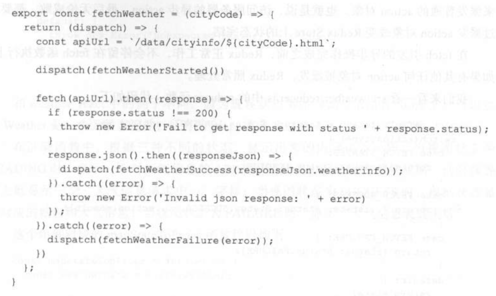

[toc]
## 中间件
### 概念
中间件就是一个函数，对store.dispatch方法进行了改造，在发出 Action 和执行 Reducer 这两步之间，添加了其他功能。
### 接口
### 使用中间件
```
import { applyMiddleware, createStore } from 'redux';
import thunk from 'redux-thunk';


const store = createStore(
  reducer,
  applyMiddleware(thunk)
);
```
### redux-thunk
`redux-thunk`的工作是检查`action`对象是不是函数，如果不是函数就放行，完成普通`action`对象的生命周期，而如果发现`action`对象是函数，那就执行这个函数，并把`store`的`dispatch` 和 `getState`函数作为参数传递到函数中去，处理过程到此为止，不会让这个`action`对象继续前往派发到`reducer`函数中去。

异步action最终还是要产生同步action派发才能对redux系统产生影响。



```
dispatch(fetchWeather('001'))
```
### Redux-promise
## store Enhancer