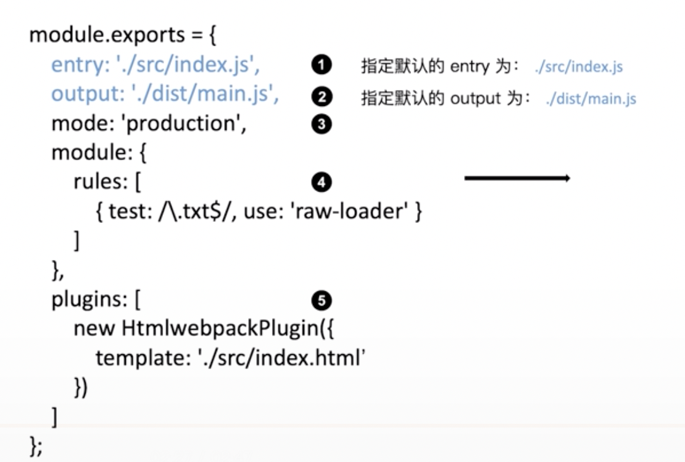
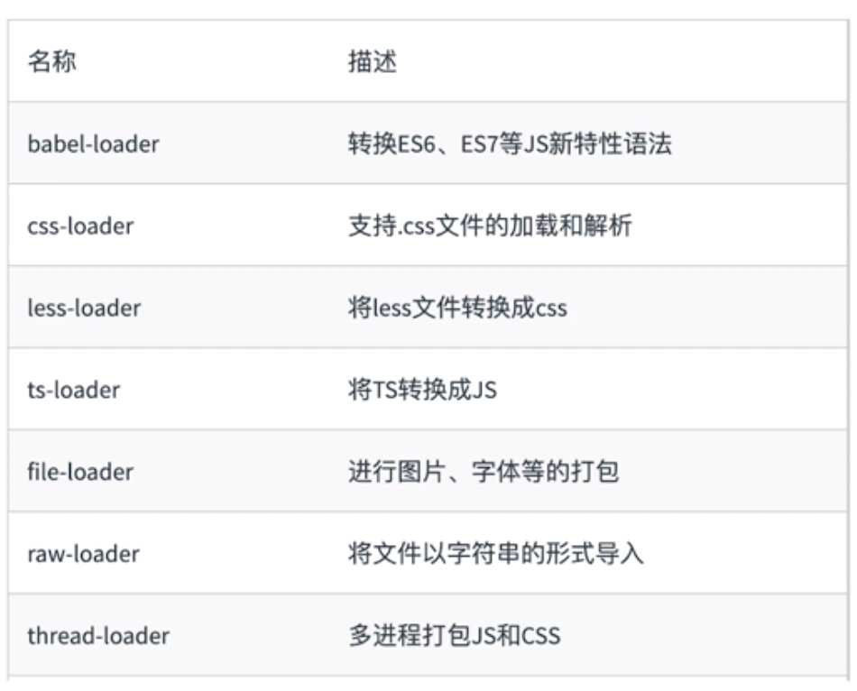
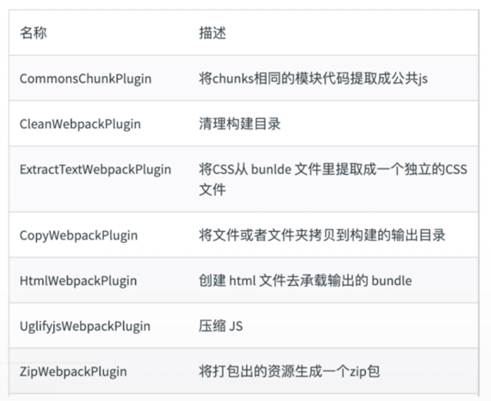
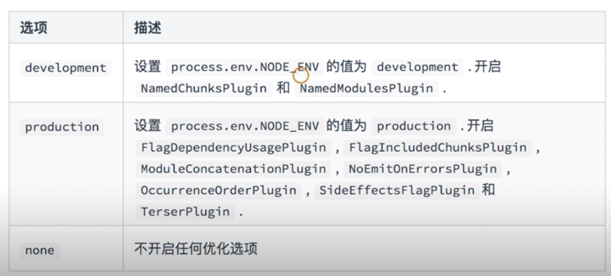

[TOC]
## webpack基础配置
### 零配置webpack内容：

enter默认为：`./src/index.js`
output默认为：`./dist/main.js`
### entry
用来指定打包入口
```javascript
entry : string | object | array

// 单个入口文件，只会生成一个chunk，chunk的名称是main
entry: "./app/entry", 

// 数组中的文件一般是没有相互依赖关系的，但是又处于某些原因需要将它们打包在一起，只会生成一个chunk，chunk的名称是main
entry: ["jquery", "lodash"],

// 配置多个入口，每个入口生成一个chunk，用于配置多页面应用，chunk的名称是object键值对中键的名称
entry: {
    a: "./app/entry-a",
    b: ["./app/entry-b1", "./app/entry-b2"]
  }, 
```
### output
用来告诉webpack如何将编译后的文件输出到磁盘。
```
module.exports = {
    output: {
        path: './output',
        filename: '[name].js'   // name是占位符，代表了entry中键的名称
    }
}
```
### loaders
webpack开箱即用只支持JS和JSON两种文件类型，通过loaders去支持其他文件类型，把它们转化成有效的模块，并添加到依赖图中。loader本身是一个函数，放哪回转化的结果。

**常见loader:**

**loader配置:**
```javascript
module.exports = {
    module: {
        rules: [
            {
                test: /\.js$/,  //指定匹配规则
                exclude: /node_modules/,
                use: {
                    loader: "babel-loader"
                }  // 指定使用的loader名称
            }
        ]
    }
};
```
### plugin
插件用于对Bundle文件的优化，资源管理和环境变量注入。它作用于webpack的整个构建过程。

**常见plugin有：**

**plugin配置：**
```
const HtmlWebPackPlugin = require("html-webpack-plugin");
module.exports = {
    plugins :[
        new HtmlWebPackPlugin({
            template : './index.html'
            //会使用根目录下的index.html作为模板
        })
    ]
};
```
### mode
mode用来指定当前的构建环境是：production / development / none

设置mode可以使用webpack内置的函数，默认值为production。

```javascript
module.exports = {
    mode : 'production'
};
```
**mode作用：**


### 监听
文件监听是在发现源码发生变化时，自动重新构建出新的输出文件。

- 启动webpack命令时，带上--watch参数
- 在配置webpack.config.js中设置watch : true

文件监听原理分析 ：轮询判断文件的最后编辑时间是否发生变化，某个文件发生了变化，并不会立即告诉监听者，而是先缓存起来，等aggregateTimeout。
```javascript
module.exports = {
  //...
  watch:true,
  watchOptions: {
    ignored: /node_modules/,  // 不监听的文件或文件夹
    aggregateTimeout: 200,  //监听到变化后会再等300ms再去执行
    poll: 1000  // 判断文件是否发生变化是通过不停轮询系统指定文件有没有变化实现的，默认每秒问1000次
  }
};
```
### 热更新
参考 ： [Hot Module Replacement](./webpack热更新HRM.md)
## webpack资源解析

### 解析ES6 
> loader ：babel-loader

**a. 要使用babel-loader，我们需要安装如下依赖：**
```
npm i @babel/core babel-loader @babel/preset-env --save-dev
```
`babel-loader`：使用 Babel 转换 JavaScript依赖关系的 Webpack 加载器；
`@babel/core`：即 babel-core，将 ES6 代码转换为 ES5；
`@babel/preset-env`：即 babel-preset-env，根据您要支持的浏览器，决定使用哪些 transformations / plugins 和 polyfills，例如为旧浏览器提供现代浏览器的新特性。

**b. 创建webpack.config.js和.babelrc文件，并配置babel-loader及babel选项**

**.babelrc**
```
{
    "presets": [
        "@babel/preset-env"
    ]
}
```
**webpack.config.js**
```
module.exports = {
    module: {
        rules: [
            {
                test: /\.js$/,
                exclude: /node_modules/,
                use: {
                    loader: "babel-loader"
                }
            }
        ]
    }
};
```
### 解析react
> loader ：babel-loader

**a. 安装babel-preset-react**
```
npm i @babel/preset-react --save-dev
```
**b.配置.babelrc**
```
{
    "presets": [
        "@babel/preset-env",
        "@babel/preset-react"
    ]
}
```
**c.配置webpack.config.js**
```
module.exports = {
  module: {
    rules: [
      {
        test: /\.(js|jsx)$/,
        exclude: /node_modules/,
        use: {
          loader: "babel-loader"
        }
      }
    ]
  }
};
```
### 解析css
> loader 
> sass-loader : 将sass语法转换为css
> css-loader : 用于加载.css文件，并且转换为js对象
> style-loader : 将样式通过`<style>`标签插入到`<head>`中

**a. 安装依赖**
```
npm install --save-dev css-loader style-loader sass-loader node-sass  
```
**b. 更新webpack.config.js配置**
```
const HtmlWebPackPlugin = require("html-webpack-plugin");
module.exports = {
    module: {
        rules: [
            {
                test: /\.(js|jsx)$/,
                exclude: /node_modules/,
                use: {
                    loader: "babel-loader"
                }
            },
            {
                test: /\.html$/,
                use: [
                    {
                        loader: "html-loader"
                    }
                ]
            },
            {
                test: /\.(css|scss)$/,
                use: ['style-loader', 'css-loader', 'sass-loader']
            }
        ]
    },
    plugins :[
        new HtmlWebPackPlugin({
            template : './index.html'
        })
    ]
};
```
### 解析图片和字体
> loader : file-loader

**a. 安装依赖**
```
npm install --save-dev file-loader
```
**b. 配置**
```
module.exports = {
    module: {
        rules: [
            {
                test: /\.(png|jpg|gif|jpeg)$/,
                use: 'file-loader'
            },
            {
                test: /\.(woff|woff2|eot|ttf|otf)$/,
                use: 'file-loader'
            }
        ]
    }
}
```
**c. 使用图片**
- 在js中引入该图片
- webpack打包后的目录会出现该图片
```javascript
import React from 'react';
import ReactDOM from 'react-dom';
import './main.scss';
import merge from './merge.png';

const Hello = () => {
    return (
    <div className='title'>
        Hello world! hello lucy hello webpack
        
    </div>);
};
```
**d. 使用字体**
- 首先去网上下载一个字体文件保存在本地
- 在css文件中引入该字体文件
- webpack打包后的目录会出现该字体文件
```css
@font-face{
    font-family: 'wawa';
    src:url('./FenPinYinTi-2.ttf')
}
.title {
    font-size: 20px;
    color:green;
    border:1px solid red;
    font-family: 'wawa';
}
```
