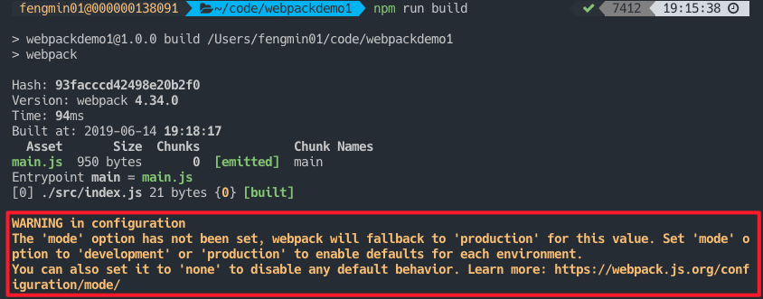
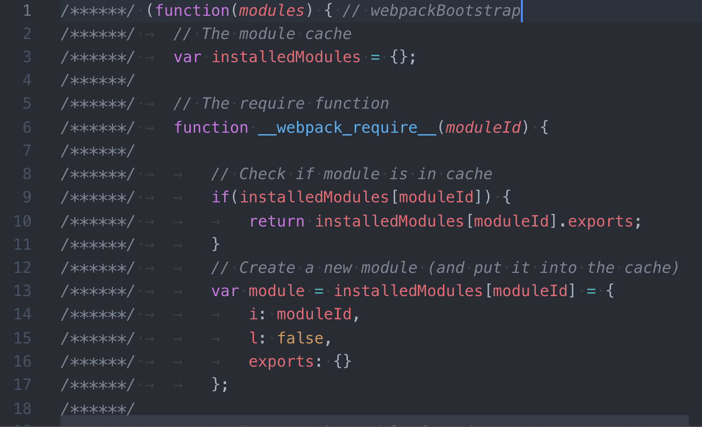
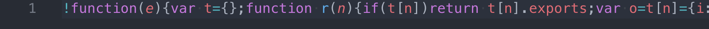
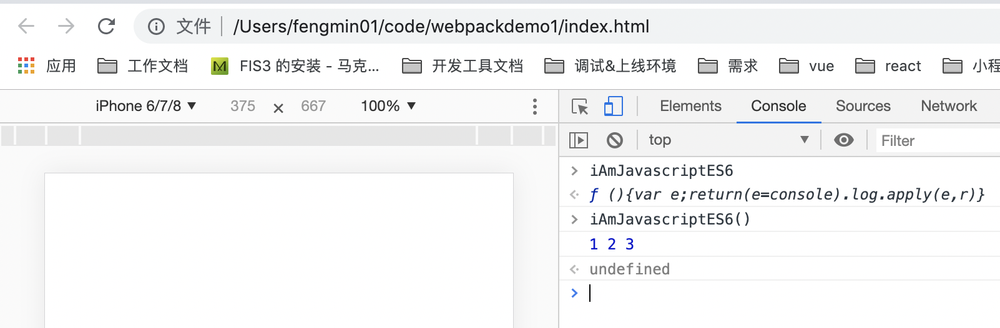

### 1. 首先新建一个文件夹
```
mkdir webpackdemo1
cd webpackdemo1
```
### 2. **初始化项目** : 
`npm init `,该命令会要你输入一些配置信息，这里一路按回车下去就好，会生成一个默认的项目配置文件`package.json`。如果你想跳过所有问题，可以添加`-y`标志。
```
npm init
npm init -y
```
此时package.json文件如下：
```
{
  "name": "webpackdemo1",
  "version": "1.0.0",
  "description": "",
  "main": "index.js",
  "scripts": {
    "test": "echo \"Error: no test specified\" && exit 1"
  },
  "author": "",
  "license": "ISC"
}
```
###3. 安装`webpack`和`webpack-cli`作为`dev`依赖项
```
npm i -D webpack webpack-cli
```
此时：
> a. 安装的模块会放在`./node_modules`目录下。
> b. 根目录下会新增一个`package-lock.json`。
> c. `package.json`会增加`devDependencies`。
```
"devDependencies": {
    "webpack": "^4.34.0",
    "webpack-cli": "^3.3.4"
  }
```

注：在`webpack3`中，`webpack`和它的`CLI`都是在同一个包中，但在第4版中，他们已经将两者分开来更好地管理它们。官方文档说，如果使用`webpack4+`版本，还需要安装`CLI`。
####4. 在package.json的scripts添加命令
```
"scripts": {
  "build": "webpack"
}
```
####5. 到这里就可以先简单地测试一下了
由于在webpack4下面，不需要定义入口文件和输出文件，它会自动将`./src/index.js`作为默认的入口文件，并将创建的bundles输出到`./dist/main.js`。

**a. 现在我们将创建以下目录结构、文件和内容：**
```
  webpackdemo1
  |- package.json
+ |- index.html
+ |- /src
+   |- index.js
```
**src/index.js**
```
alert('hello world');
```
**index.html**
```
<!DOCTYPE html>
<html lang="en">
<head>
    <meta charset="UTF-8">
    <meta name="viewport" content="width=device-width, initial-scale=1.0">
    <meta http-equiv="X-UA-Compatible" content="ie=edge">
    <title>Document</title>
    <script src = './dist/main.js'></script>
</head>
<body>
</body>
</html>
```
**b. 然后执行`npm run build`，会在根目录下生成`./dist/main.js`.**
```
  webpackdemo1
+ |- /dist
+   |- main.js
  |- package.json
  |- index.html
  |- /src
    |- index.js
```
**c.测试效果**
在浏览器打开这个index.html，可以看到页面弹出hello world了。此时文件的url是`file:///Users/fengmin01/code/webpackdemo1/index.html`。
### 6. production and development mode
如果仔细观察，会发现，上述执行`npm run build`时，控制台会报如下错误：

该warning大致含义为：'mode' 选项还未设置。**webpack将会把该值设置为'production'**。将 'mode' 选项设置为 'development' 或 'production'，来启用环境默认值。

**两种模式的区别**：mode分为两种环境，一种是开发环境（development）,一种是生产环境（production）。开发环境就是我们写代码的环境，生产环境就是代码放到线上的环境。这两种环境的最直观区别就是，开发环境的代码不提供压缩，生产环境的代码提供压缩。

**production模式：**
> a. 默认提供所有可能的优化，如代码压缩/作用域提升等
> b. 不支持 watching
> c. process.env.NODE_ENV 的值不需要再定义，默认是 production

**development模式:**
> a. 主要优化了增量构建速度和开发体验
> b. process.env.NODE_ENV 的值不需要再定义，默认是 development
> c. 开发模式下支持注释和提示，并且支持 eval 下的 source maps

现在将webpack配置改成如下：
```
"scripts": {
  "dev": "webpack --mode development",
  "build": "webpack --mode production"
}
```
运行`npm run dev`，`./dist/main.js`文件如下，并没有压缩等。

运行`npm run build`，`./dist/main.js`文件如下，文件有被压缩，作用域提升等。


### 7. 用babel-loader将>=ES6转化成ES5
**a. 要使用babel-loader，我们需要安装如下依赖：**
```
npm i @babel/core babel-loader @babel/preset-env --save-dev
```
`babel-loader`：使用 Babel 转换 JavaScript依赖关系的 Webpack 加载器；
`@babel/core`：即 babel-core，将 ES6 代码转换为 ES5；
`@babel/preset-env`：即 babel-preset-env，根据您要支持的浏览器，决定使用哪些 transformations / plugins 和 polyfills，例如为旧浏览器提供现代浏览器的新特性。

**b. 创建webpack.config.js和.babelrc文件，并配置babel-loader及babel选项**
```
  webpackdemo1
  |- /dist
  |- main.js
  |- package.json
  |- index.html
  |- /src
    |- index.js
+ |- .babelrc
+ |- webpack.config.js
```
**.babelrc**
```
{
    "presets": [
        "@babel/preset-env"
    ]
}
```
**webpack.config.js**
```
module.exports = {
    module: {
        rules: [
            {
                test: /\.js$/,
                exclude: /node_modules/,
                use: {
                    loader: "babel-loader"
                }
            }
        ]
    }
};
```
**c. 现在来测试一下Es6语法**
在`.src/index.js`里面写一点Es6的语法
```
const arr = [1, 2, 3];
const iAmJavascriptES6 = () => console.log(...arr);
window.iAmJavascriptES6 = iAmJavascriptES6;
```
执行`npm run build`，浏览器打开index.html，可以在控制台执行`iAmJavascriptES6`函数。


### 8. 构建React
**a. 安装npm**
```
npm i react react-dom --save-dev
```
**b. 安装babel-preset-react**
```
npm i @babel/preset-react --save-dev
```
**c.配置.babelrc**
```
{
    "presets": [
        "@babel/preset-env",
        "@babel/preset-react"
    ]
}
```
**d.配置webpack.config.js**
```
module.exports = {
  module: {
    rules: [
      {
        test: /\.(js|jsx)$/,
        exclude: /node_modules/,
        use: {
          loader: "babel-loader"
        }
      }
    ]
  }
};
```
**e. 测试react**
在`.src/index.js`里面写一些react的语法
```
import React from 'react';
import ReactDOM from 'react-dom';

const Hello = () => {
    return <div>Hello React!</div>;
};

ReactDOM.render(<Hello />, document.getElementById('app'));

```
在`index.html`里面新增`id`为`app`的`dom`节点。
```
<!DOCTYPE html>
<html lang="en">
<head>
    <meta charset="UTF-8">
    <meta name="viewport" content="width=device-width, initial-scale=1.0">
    <meta http-equiv="X-UA-Compatible" content="ie=edge">
    <title>Document</title>
</head>
<body>
    <div id="app"></div>
    <script src='./dist/main.js'></script>
    //这里要把script标签放在div标签的后面，否则执行的时候会div还没有渲染，会报找不到dom节点的错误：Target container is not a DOM element.
</body>
</html>
```

