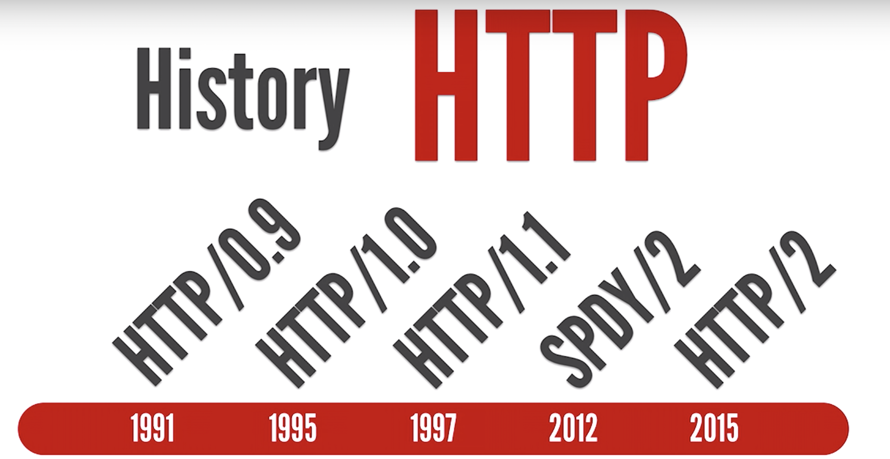
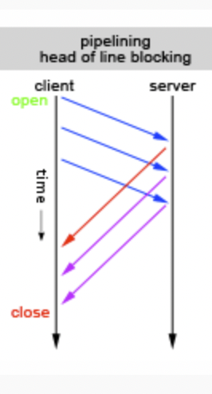
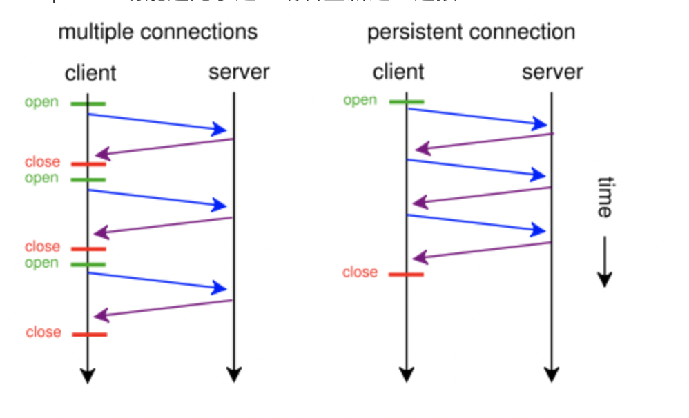
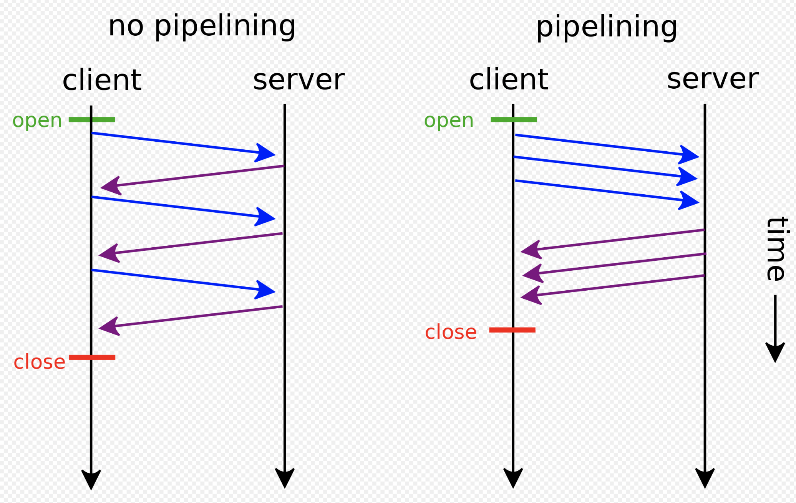
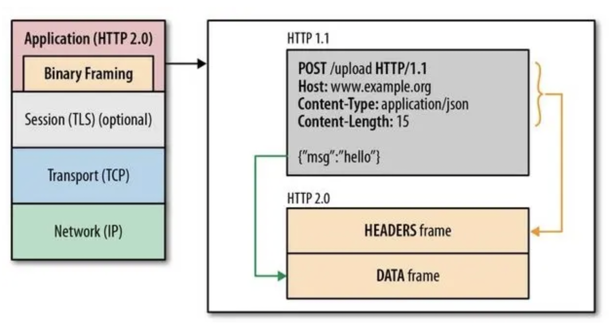
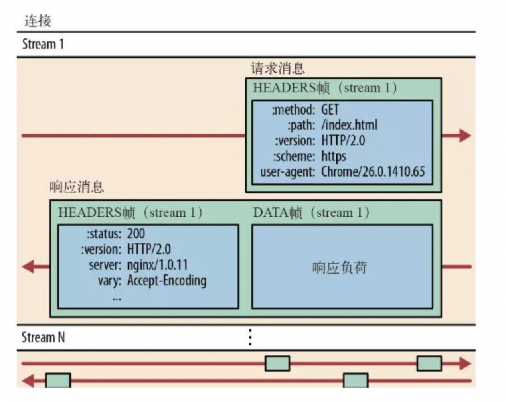
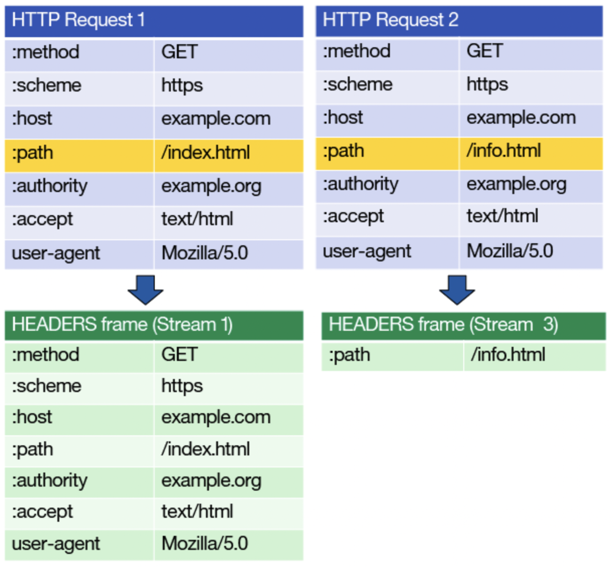
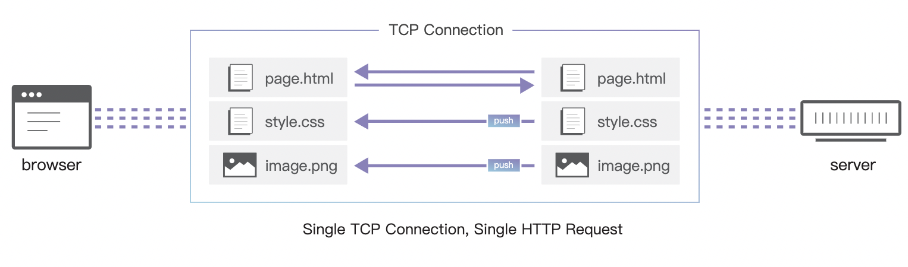

[TOC]

## http的发展


### http/0.9
我们把时间拨回到 1991年， 万维网协会（World Wide Web Consortium，W3C）和互联网工程任务组（IETF）制定了 HTTP 0.9 标准。因为那个年代互联网还在普及，加上网速带宽低，所以 HTTP 0.9 只支持 GET 请求。

**请求**
由单行指令构成，以唯一可用方法GET开头，其后跟目标资源的路径
```
GET /mypage.html
```
**响应**
响应也极其简单的：只包含响应文档本身，是HTML格式。
```
<HTML>
这是一个非常简单的HTML页面
</HTML>
```
### http/1.0
1995年，HTTP/1.0 版本发布，HTTP 协议新增很多内容。首先是请求方式的多样化，从单一的 GET 请求，增加了 POST 命令和 HEAD 命令。除此之外，还支持发送任何格式的内容。这两项新增内容，不仅使得互联网不仅可以传输文字、传输图像、视频、二进制文件，还丰富了浏览器与服务器的互动方式。这为互联网的大发展奠定了基础。
#### 优势
- 引入了HTTP头的概念，无论是对于请求还是响应，允许传输元数据，使协议变得非常灵活，更具扩展性；
- 增加了 POST 命令和 HEAD 命令；
- 支持发送任何格式的内容。使得互联网可以传输文字、图像、视频、二进制文件，丰富了浏览器与服务器的互动方式；
- 状态码会在响应开始时发送，使浏览器能了解请求执行成功或失败，并相应调整行为（如更新或使用本地缓存）。
- 其他的新增功能还包括多字符集支持、多部分发送（multi-part type）、权限（authorization）、缓存（cache）、内容编码（content encoding）等。
#### 缺点
但 HTTP/1.0 还是存在缺点：

- 第一点是：连接无法复用。HTTP 1.0 规定浏览器与服务器只保持短暂的连接，浏览器的每次请求都需要与服务器建立一个TCP连接，服务器完成请求处理后立即断开TCP连接。如果还要请求其他资源，就必须再新建一个连接。
- 第二点是：Head-Of-Line Blocking（HOLB，队头阻塞）。HOLB 是在建立起一个 TCP 连接之后，假设客户端在这个连接连续向服务器发送了几个请求。按照标准，服务器应该按照收到请求的顺序返回结果，假设服务器在处理首个请求时花费了大量时间，那么后面所有的请求都需要等着首个请求结束才能响应。。观察下图红线标识的响应，因为红线标识的响应被阻塞了，它后面的所有响应都会被阻塞，这就是队头阻塞。

### http/1.1
1997年初，HTTP1.1 标准发布。它进一步完善了 HTTP 协议，一直用到了20年后的今天，直到现在还是最流行的版本。具体优化点：
#### 优势
- 持久连接（keep-alive）在一个TCP连接上可以传送多个HTTP请求和响应，减少了建立和关闭连接的消耗和延迟。

- 增加管线化技术，允许在第一个应答被完全发送之前就发送第二个请求，以降低通信延迟。

- 使用多个tcp连接，可以同时开多个tcp链接，这样就可以做到并行啦。不过，由于浏览器限制，每个域名的tcp链接最多只能开6个。
- 增加了缓存管理和控制、错误通知的管理。
- 增加Host头，使不同域名配置在同一个IP地址的服务器上。
- 新增PUT、DELETE等新的方法
- 允许响应分块(chunked),利于传输大文件
#### 缺点
- "队头堵塞"（Head-of-line blocking）。虽然 1.1 版允许复用 TCP 连接，但是同一个 TCP 连接里面，所有的数据通信是按次序进行的。服务器只有处理完一个回应，才会进行下一个回应。要是前面的回应特别慢，后面就会有许多请求排队等着。
- header 里携带的内容过大，在一定程度上增加了传输的成本，并且每次请求 header 基本不怎么变化，尤其在移动端增加用户流量。
### http2.0
在2010年到2015年，谷歌通过实践了一个实验性的SPDY协议，证明了一个在客户端和服务器端交换数据的另类方式。其收集了浏览器和服务器端的开发者的焦点问题。明确了响应数量的增加和解决复杂的数据传输，SPDY成为了HTTP/2协议的基础。

- 对1.x协议语意的完全兼容
2.0协议是在1.x基础上的升级而不是重写，1.x协议的方法，状态及api在2.0协议里是一样的。
- 性能的大幅提升
2.0协议重点是对终端用户的感知延迟、网络及服务器资源的使用等性能的优化。

#### 优势：
HTTP/2优化的内容:
##### 二进制分帧
**HTTP/2 将请求和响应数据分割为更小的帧，并且它们采用二进制编码** HTTP/2 中，同域名下所有通信都在单个连接上完成，该连接可以承载任意数量的双向数据流。每个数据流都以消息的形式发送，而消息又由一个或多个帧组成，其中，http1.X中的首部信息header封装到Headers帧中，而body将被封装到Data帧中。HTTP/2 数据分帧后，“Header+Body" 的报文结构就完全消失了，协议看到的只是一个个 " 碎片”。多个帧之间可以乱序发送，根据帧首部的流标识可以重新组装。


##### Header 压缩
http1.x的头带有大量信息，而且每次都要重复发送。HTTP/2 协议拥有配套的 HPACK。HPACK 的目的是减少客户端请求与服务器响应之间的header信息重复所导致的开销。http/2使用encoder来减少需要传输的header大小，通讯双方各自缓存一份头部字段表，避免重复header的传输。
具体来说：
- 在客户端和服务器端使用“首部表”来跟踪和存储之前发送的键 - 值对，对于相同的数据，不再通过每次请求和响应发送。
- 首部表在 HTTP/2 的连接存续期内始终存在，由客户端和服务器共同渐进地更新 。
- 每个新的首部键 - 值对要么被追加到当前表的末尾，要么替换表中之前的值。

在下图的两个请求中，header信息是重复的。唯一的不同在请求的资源上（已采用黄色突出显示）。HPACK 报头压缩可以在这里派上用场。在第一个请求后，它仅需发送与前一个header的不同之处，因为服务器保留着以前看见的header的列表。除非设置了header值，否则会假设后续请求拥有与之前的请求相同的header值。

##### 服务器推送
HTTP2 还在一定程度上改变了传统的“请求 - 应答”工作模式，服务器不再完全被动地响应请求，也可以新建“流”主动向客户端发送消息。比如，在浏览器刚请求 HTML 的时候就提前把可能会用到的 JS、CSS 文件发给客户端，减少等待的延迟，这被称为 " 服务器推送 "（ Server Push，也叫 Cache push）。

另外需要补充的是，服务端可以主动推送，客户端也有权利选择是否接收。如果服务端推送的资源已经被浏览器缓存过，浏览器可以通过发送 RST_STREAM 帧来拒收。主动推送也遵守同源策略。换句话说，服务器不能随便将第三方资源推送给客户端，而必须是经过双方确认才行。
##### 多路复用
主要体现在：
- 同个域名只需要占用一个 TCP 连接，使用一个连接并行发送多个请求和响应, 这样整个页面资源的下载过程只需要一次慢启动，同时也避免了多个 TCP 连接竞争带宽所带来的问题。
- 并行交错地发送多个请求 / 响应，请求 / 响应之间互不影响。
##### 请求优先级
请求优先级
- 把 HTTP 消息分解为很多独立的帧之后，就可以通过优化这些帧的交错和传输顺序，每个流都可以带有一个 31 比特的优先值：0 表示最高优先级；2 的 31 次方-1 表示最低优先级。
- 服务器可以根据流的优先级，控制资源分配（CPU、内存、带宽），而在响应数据准备好之后，优先将最高优先级的帧发送给客户端。
- HTTP 2.0 一举解决了所有这些低效的问题：浏览器可以在发现资源时立即分派请求，指定每个流的优先级，让服务器决定最优的响应次序。这样请求就不必排队了，既节省了时间，也最大限度地利用了每个连接。
#### 缺点
是不是启用HTTP 2.0后性能必然提升了？任何事情都不是绝对的，虽然总体而言性能肯定是能提升的。
我想HTTP 2.0会带来新的性能瓶颈。因为现在所有的压力集中在底层一个TCP连接之上，TCP很可能就是下一个性能瓶颈，单个TCP packet丢失导致整个连接阻塞，无法逃避，此时所有消息都会受到影响。
## 参考文献
[1. 白话http队头阻塞](https://cloud.tencent.com/developer/article/1509279)
[2. HTTP/2 101 (Chrome Dev Summit 2015)](https://www.youtube.com/watch?v=r5oT_2ndjms)
[3. http协议-http2.0原理详细分析](https://www.huaijiujia.com/2018/06/30/http%E5%8D%8F%E8%AE%AE-http2-0%E5%8E%9F%E7%90%86%E8%AF%A6%E7%BB%86%E5%88%86%E6%9E%90/)