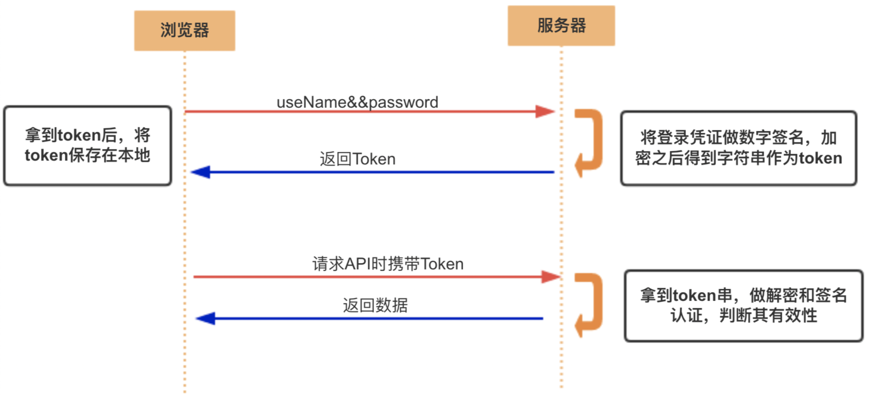

[TOC]
### Cookie
Cookie和Session是为了在无状态的HTTP协议之上维护会话状态，使得服务器可以知道当前是和哪个客户在打交道。因为HTTP协议是无状态的，即每次用户请求到达服务器时，HTTP服务器并不知道这个用户是谁、是否登录过等。现在的服务器之所以知道我们是否已经登录，是因为服务器在登录时设置了浏览器的Cookie！Session则是借由Cookie而实现的更高层的服务器与浏览器之间的会话。

#### cookie的实现机制
Cookie是由客户端保存的小型文本文件，其内容为一系列的键值对。 Cookie是由HTTP服务器设置的，保存在浏览器中， 在用户访问其他页面时，会在HTTP请求中附上该服务器之前设置的Cookie。
其流程如下：
- 浏览器向某个URL发起HTTP请求（可以是任何请求，比如GET一个页面、POST一个登录表单等）
- 对应的服务器收到该HTTP请求，并计算应当返回给浏览器的HTTP响应。
- 在响应头加入Set-Cookie字段，它的值是要设置的Cookie。
- 浏览器收到来自服务器的HTTP响应。
- 浏览器在响应头中发现Set-Cookie字段，就会将该字段的值保存在内存或者硬盘中Set-Cookie字段的值可以是很多项Cookie，每一项都可以指定过期时间Expires。 默认的过期时间是用户关闭浏览器时。
- 浏览器下次给该服务器发送HTTP请求时， 会将服务器设置的Cookie附加在HTTP请求的头字段Cookie中。浏览器可以存储多个域名下的Cookie，但只发送当前请求的域名曾经指定的Cookie， 这个域名也可以在Set-Cookie字段中指定）。
- 服务器收到这个HTTP请求，发现请求头中有Cookie字段， 便知道之前就和这个用户打过交道了。
- 过期的Cookie会被浏览器删除。

总之，服务器通过Set-Cookie响应头字段来指示浏览器保存Cookie， 浏览器通过Cookie请求头字段来告诉服务器之前的状态。 Cookie中包含若干个键值对，每个键值对可以设置过期时间。

#### 为什么需要Cookie？ 
因为HTTP协议是无状态的，对于一个浏览器发出的多次请求，WEB服务器无法区分 是不是来源于同一个浏览器。所以，需要额外的数据用于维护会话。 Cookie 正是这样的一段随HTTP请求一起被传递的额外数据。

#### Cookie能做什么？ 
Cookie只是一段文本，所以它只能保存字符串。而且浏览器对它有大小限制以及 它会随着每次请求被发送到服务器，所以应该保证它不要太大。 Cookie的内容也是明文保存的，有些浏览器提供界面修改，所以， 不适合保存重要的或者涉及隐私的内容。

#### Cookie 的限制。
 大多数浏览器支持最大为 4096 字节的 Cookie。由于这限制了 Cookie 的大小，最好用 Cookie 来存储少量数据，或者存储用户 ID 之类的标识符。用户 ID 随后便可用于标识用户，以及从数据库或其他数据源中读取用户信息。 浏览器还限制站点可以在用户计算机上存储的 Cookie 的数量。大多数浏览器只允许每个站点存储 20 个 Cookie；如果试图存储更多 Cookie，则最旧的 Cookie 便会被丢弃。有些浏览器还会对它们将接受的来自所有站点的 Cookie 总数作出绝对限制，通常为 300 个。

通过前面的内容，我们了解到Cookie是用于维持服务端会话状态的，通常由服务端写入，在后续请求中，供服务端读取。 

#### Cookie 的安全隐患

Cookie提供了一种手段使得HTTP请求可以附加当前状态， 现今的网站也是靠Cookie来标识用户的登录状态的：

- 用户提交用户名和密码的表单，这通常是一个POST HTTP请求。
- 服务器验证用户名与密码，如果合法则返回200（OK）并设置Set-Cookie为authed=true。
- 浏览器存储该Cookie。
- 浏览器发送请求时，设置Cookie字段为authed=true。
- 服务器收到第二次请求，从Cookie字段得知该用户已经登录。 按照已登录用户的权限来处理此次请求。

我们知道可以发送HTTP请求的不只是浏览器，很多HTTP客户端软件（包括curl、Node.js）都可以发送任意的HTTP请求，可以设置任何头字段。 假如我们直接设置Cookie字段为authed=true并发送该HTTP请求， 服务器岂不是被欺骗了？这种攻击非常容易，Cookie是可以被篡改的！

#### Cookie 防篡改机制

服务器可以为每个Cookie项生成签名，由于用户篡改Cookie后无法生成对应的签名， 服务器便可以得知用户对Cookie进行了篡改。一个简单的校验过程可能是这样的：

- 在服务器中配置一个不为人知的字符串（我们叫它Secret），比如：x$sfz32。
- 当服务器需要设置Cookie时（比如authed=false），不仅设置authed的值为false， 在值的后面进一步设置一个签名，最终设置的Cookie是authed=false|6hTiBl7lVpd1P。
签名6hTiBl7lVpd1P是这样生成的：Hash('x$sfz32'+'true')。 要设置的值与Secret相加再取哈希。
- 用户收到HTTP响应并发现头字段Set-Cookie: authed=false|6hTiBl7lVpd1P。
- 用户在发送HTTP请求时，篡改了authed值，设置头字段Cookie: authed=true|???。 因为用户不知道Secret，无法生成签名，只能随便填一个。
- 服务器收到HTTP请求，发现Cookie: authed=true|???。服务器开始进行校验： Hash('true'+'x$sfz32')，便会发现用户提供的签名不正确。

通过给Cookie添加签名，使得服务器得以知道Cookie被篡改。然而故事并未结束。

因为Cookie是明文传输的， 只要服务器设置过一次authed=true|xxxx我不就知道true的签名是xxxx了么， 以后就可以用这个签名来欺骗服务器了。因此Cookie中最好不要放敏感数据。 一般来讲Cookie中只会放一个Session Id，而Session存储在服务器端。

### Session
#### Session是什么
Session 是存储在服务器端的，避免了在客户端Cookie中存储敏感数据。 Session 可以存储在HTTP服务器的内存中，也可以存在内存数据库（如redis）中， 对于重量级的应用甚至可以存储在数据库中。
#### Session的用途
- Session可以记录用户的登录与行为数据，即记录下用户目前访问服务器上的那些内容，状态是什么，而考虑到这些数据用户修改的随意性很大，并没有必要直接存储在数据库中。
- 在用户执行刷新操作时，即再次访问服务器时，可以直接根据Session，打开用户上次访问时网页的状态（如用户输入的表单内容等等），为用户带来更优的体验，提供个性化服务。
- 用户的session信息非常关键，它记录了用户在进入页面、查看结果、点击结果以及后继的操作（比如翻页、加购物车等）。只有通过session信息才能把用户的行为联系起来，构建出完整的模型，因此从海量数据中把每一个用户所有session的操作都完整地挖掘出来非常重要。
#### Session的实现机制
我们以存储在redis中的Session为例，还是考察如何验证用户登录状态的问题。

- 用户提交包含用户名和密码的表单，发送HTTP请求。
- 服务器验证用户发来的用户名密码。
- 如果正确则把当前用户名（通常是用户对象）存储到redis中，并生成它在redis中的ID。这个ID称为Session ID，通过Session ID可以从Redis中取出对应的用户对象， 敏感数据（比如authed=true）都存储在这个用户对象中。
- 设置Cookie为sessionId=xxxxxx|checksum并发送HTTP响应， 仍然为每一项Cookie都设置签名。
- 用户收到HTTP响应后，便看不到任何敏感数据了。在此后的请求中发送该Cookie给服务器。
- 服务器收到此后的HTTP请求后，发现Cookie中有SessionID，进行放篡改验证。
- 如果通过了验证，根据该ID从Redis中取出对应的用户对象， 查看该对象的状态并继续执行业务逻辑。

Web应用框架都会实现上述过程，在Web应用中可以直接获得当前用户。 **相当于在HTTP协议之上，通过Cookie实现了持久的会话。这个会话便称为Session。**

### token
#### session认证的问题
- 每次认证用户发起请求时，服务器需要去创建一个记录来存储信息。当越来越多的用户发请求时，内存的开销也会不断增加。
- 在服务端的内存中使用 Seesion 存储登录信息，伴随而来的是可扩展性问题。
#### 过程
使用基于 Token 的身份验证方法，在服务端不需要存储用户的登录记录。大概的流程是这样的：

- 客户端使用用户名跟密码请求登录
- 服务端收到请求，去验证用户名与密码
- 验证成功后，服务端会签发一个 Token，再把这个 Token 发送给客户端
- 客户端收到 Token 以后可以把它存储起来，比如放在 Cookie 里或者 Local Storage 里
- 客户端每次向服务端请求资源的时候需要带着服务端签发的 Token
- 服务端收到请求，然后去验证客户端请求里面带着的 Token，如果验证成功，就向客户端返回请求的数据

### Cookie、Session、Token
#### Cookie与Session的区别与联系
具体来说cookie机制采用的是在客户端保持状态的方案，而session机制采用的是在服务器端保持状态的方案。两者存储的都是用户登录信息，操作行为等等的数据。
- cookie是把用户的数据写在用户本地浏览器上, 其他网站也可以扫描使用你的cookie，容易泄露自己网站用户的隐私，而且一般浏览器对单个网站站点有cookie数量与大小的限制。
- Session是把用户的数据写在用户的独占session上，存储在服务器上，一般只将session的id存储在cookie中。但将数据存储在服务器对服务器的成本会高。
- session是由服务器创建的，开发人员可以在服务器上通过request对象的getsession方法得到session。
- 一般情况，登录信息等重要信息存储在session中，其他信息存储在cookie中。
#### token与session的区别
- 相同点是，它们都是存储用户信息；然而，Session 是在服务器端的，而 JWT 是在客户端的。
- Session 方式存储用户信息的最大问题在于要占用大量服务器内存，增加服务器的开销。而 JWT 方式将用户状态分散到了客户端中，可以明显减轻服务端的内存压力。
- 作为身份认证Token安全性比Session好，因为每一个请求都有签名还能防止监听以及重放攻击，而Session就必须依赖链路层来保障通讯安全了
#### Cookie、Session的有效时长
**session的有效时长**
服务器会把长时间没有活动的Session从服务器内存中清除，此时Session便失效。
**cookie的有效时长**
cookie的内容主要包括：名字，值，过期时间，路径和域。路径与域一起构成cookie的作用范围。通过过期时间可以设置cookie的有效时长，若不设置过期时间: 表示这个cookie的生命周期为浏览器回话期间，关闭访问服务器的浏览器窗口，cookie就消失了，一般称为会话cookie，保存在内存中。若设置了过期时间：则cookie会存储在硬盘上，直到超过有效时间。
### 总结
cookie，session，Token没有绝对的好与坏之分，只要还是要结合实际的业务场景和需求来决定采用哪种方式来管理回话，当然也可以三种都用。
### 参考资料
[理解 cookie、session、token、jwt](https://learnku.com/articles/30051)
[细说Cookie](http://www.cnblogs.com/fish-li/archive/2011/07/03/2096903.html)
[Cookie/Session的机制与安全](http://harttle.com/2015/08/10/cookie-session.html)
[COOKIE和SESSION有什么区别？](https://www.zhihu.com/question/19786827)

