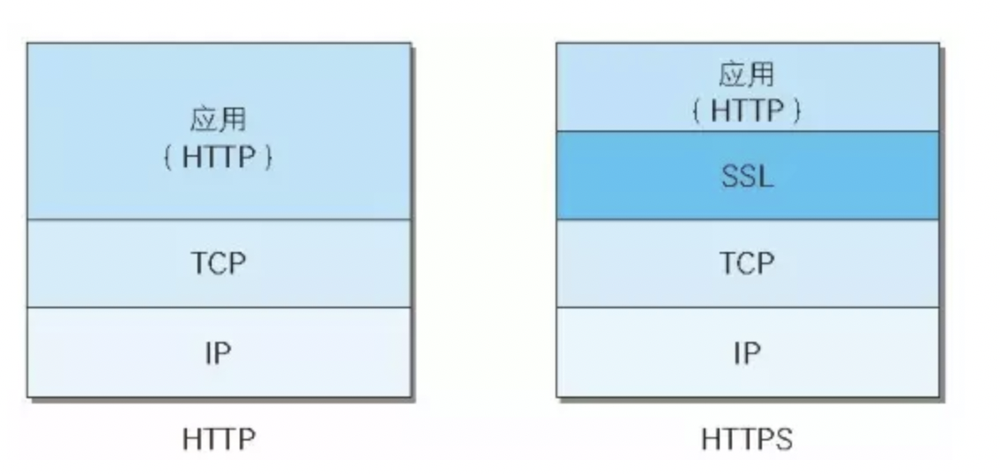

[TOC]

## http的缺点
- 通信使用明文，内容可能会被**窃听**
- 不验证通信方的身份，因此可能遭遇**伪装**
- 无法验证报文的完整性，所以有可能被**篡改**
## https
https = http + 加密 + 认证 + 完整性保护

HTTPS并非是应用层的一种新协议。只是HTTP通信接口部分用SSL和TLS协议代替而已。
通常，HTTP直接和TCP通信。当使用SSL时，则演变成先和SSL通信，再由SSL和TCP通信了。简言之，所谓HTTPS，其实就是身披SSL协议这层外壳的HTTP。

### https通信过程
详细过程比较复杂
可参考[从加密解密演进看 HTTPS 通信（下）——HTTPS 通信流程](https://juejin.im/post/5d8e98b96fb9a04e2c014bd9)这篇文章的HTTPS 通信流程部分，讲得很详细。
[学习笔记—浏览器](https://note.youdao.com/ynoteshare1/index.html?id=4cf504041a7e1981749bd84672e7ee29&type=note)中HTTP 向 HTTPS 演化的过程部分
### 简易过程
- 客户端向服务端发送请求
- 服务端返回数字证书
- 客户端用自己的CA（主流的CA机构证书一般都内置在各个主流浏览器中）公钥去解密证书，如果证书有问题会提示风险
- 如果证书没问题，客户端会生成一个对称加密的随机秘钥然后再和刚刚解密的服务器端的公钥对数据进行加密，然后发送给服务器端
- 服务器端收到以后会用自己的私钥对客户端发来的对称秘钥进行解密
- 之后双方就拿着这个对称加密秘钥来进行正常的通信
### 总结
对于报文的加密，HTTPS 采用混合加密机制，在交换密钥环节，使用非对称加密，在之后通信交换报文阶段则使用对称加密方式。HTTPS 的握手流程，其实就是 SSL 建立连接的过程，身份验证就是利用 CA 证书来验证对方的身份，有单向认证也有双向认证。
## http和https的比较