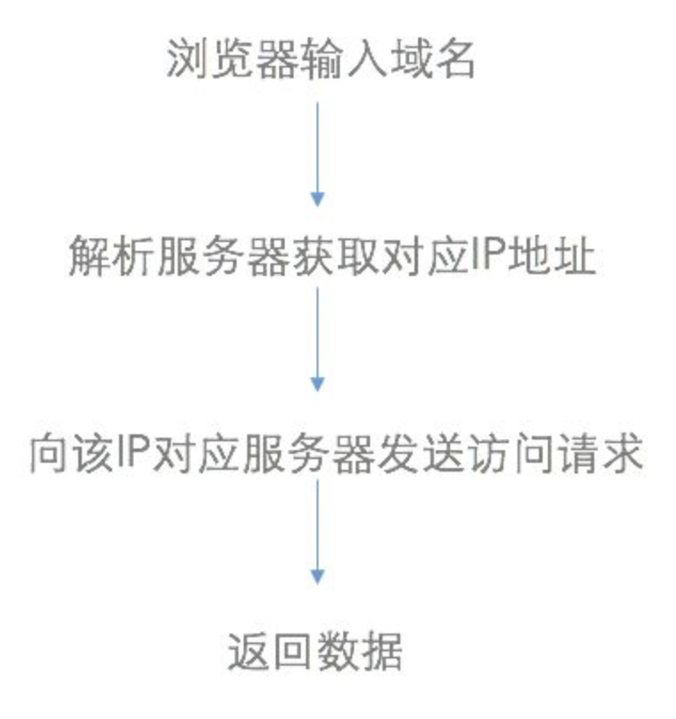
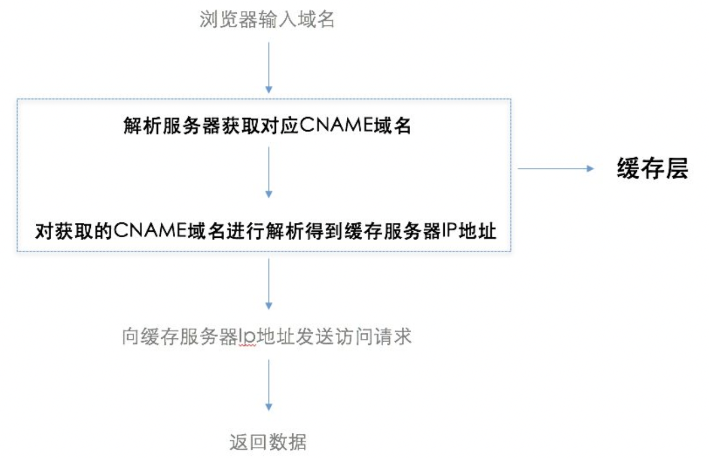
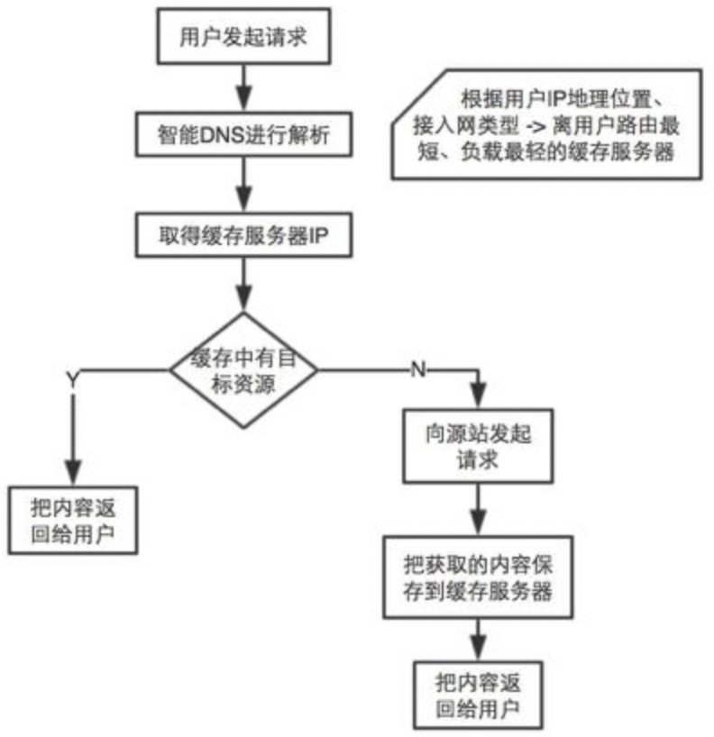
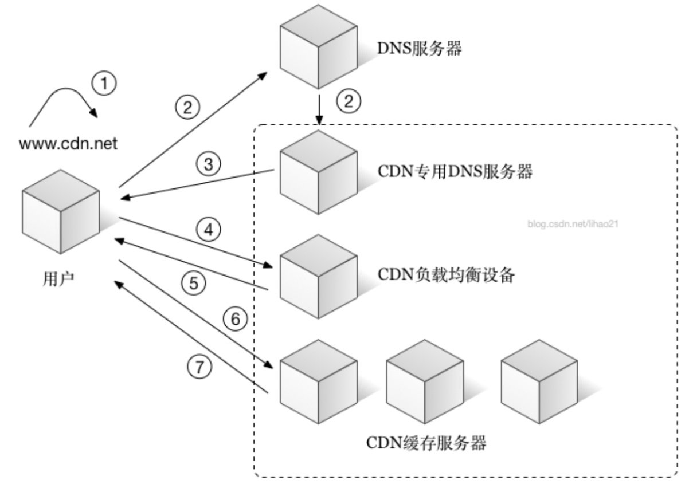

[TOC]
### cdn是什么
**全称**:Content Delivery Network或Content Ddistribute Network，即内容分发网络。

**基本思路**：尽可能避开互联网上有可能影响数据传输速度和稳定性的瓶颈和环节，使内容传输的更快、更稳定。通过在网络各处放置节点服务器所构成的在现有的互联网基础之上的一层智能虚拟网络，CDN系统能够实时地根据网络流量和各节点的连接、负载状况以及到用户的距离和响应时间等综合信息将用户的请求重新导向离用户最近的服务节点上。
者所有。商业转载请联系作者获得授权，非商业转载请注明出处。
### cdn的功能
CDN主要功能是在不同的地点缓存内容，通过负载均衡技术，将用户的请求定向到最合适的缓存服务器上去获取内容，提高用户访问的响应速度和成功率。解决因分布、带宽、服务器性能带来的访问延迟问题，适用于站点加速、点播、直播等场景。比如说，是北京的用户，我们让他访问北京的节点，深圳的用户，我们让他访问深圳的节点。通过就近访问，加速用户对网站的访问。解决Internet网络拥堵状况，提高用户访问网络的响应速度。

如果cdn节点的缓存失效，它会根据服务配置去我们的内容源服务器获取最新的资源响应给用户，并将内容缓存下来以便响应给后续访问的用户，这就意味着一个地区的用于只要访问一次服务器，后续的用户都会因此受益。
### cdn的原理
- 传统访问

- cdn加速访问

- 工作流程

最简单的CDN网络由一个DNS服务器和几台缓存服务器组成：
1. 当用户点击网站页面上的内容URL，经过本地DNS系统解析，DNS系统会最终将域名的解析权交给CNAME指向的CDN专用DNS服务器。
2. CDN的DNS服务器将CDN的全局负载均衡设备IP地址返回用户。
3. 用户向CDN的全局负载均衡设备发起内容URL访问请求。
4. CDN全局负载均衡设备根据用户IP地址，以及用户请求的内容URL，选择一台用户所属区域的区域负载均衡设备，告诉用户向这台设备发起请求。
5. 区域负载均衡设备会为用户选择一台合适的缓存服务器提供服务，选择的依据包括：根据用户IP地址，判断哪一台服务器距用户最近；根据用户所请求的URL中携带的内容名称，判断哪一台服务器上有用户所需内容；查询各个服务器当前的负载情况，判断哪一台服务器尚有服务能力。基于以上这些条件的综合分析之后，区域负载均衡设备会向全局负载均衡设备返回一台缓存服务器的IP地址。
6. 全局负载均衡设备把服务器的IP地址返回给用户。
7. 用户向缓存服务器发起请求，缓存服务器响应用户请求，将用户所需内容传送到用户终端。如果这台缓存服务器上并没有用户想要的内容，而区域均衡设备依然将它分配给了用户，那么这台服务器就要向它的上一级缓存服务器请求内容，直至追溯到网站的源服务器将内容拉到本地。

总结一下CDN的工作原理：通过权威DNS服务器来实现最优节点的选择，通过缓存来减少源站的压力。
### 参考
[CDN是什么？使用CDN有什么优势？](https://www.zhihu.com/question/36514327?rf=37353035)