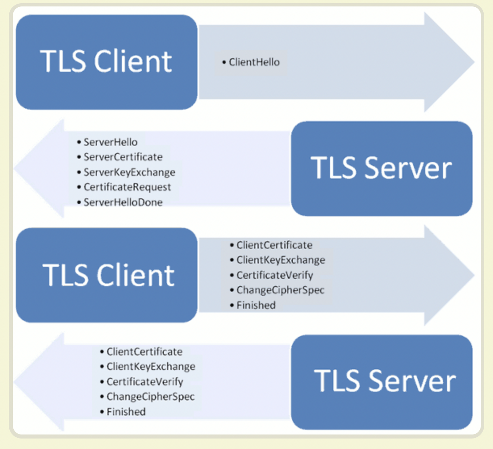

[TOC]

## http的缺点
- 通信使用明文，内容可能会被**窃听**
- 不验证通信方的身份，因此可能遭遇**伪装**
- 无法验证报文的完整性，所以有可能被**篡改**
## https
https = http + 加密 + 认证 + 完整性保护

https并非是应用层的一种新协议。只是http通信接口部分用ssl/tls协议代替而已。
通常，http直接和tcp通信。当使用ssl/tls时，则演变成先和ssl/tls通信，再由ssl/tsl和tcp通信了。简言之，所谓https，其实就是身披ssl/tls协议这层外壳的http。目前，应用最广泛的是TLS 1.2。

ssl/tls协议希望达到：
- 所有信息都是加密传播，第三方无法窃听。
- 具有校验机制，一旦被篡改，通信双方会立刻发现。
- 配备身份证书，防止身份被冒充。

### https通信过程
ssl/tls协议的基本过程是这样的：
- 客户端向服务器端索要并验证公钥。
- 双方协商生成"对话密钥"。
- 双方采用"对话密钥"进行加密通信。

上面过程的前两步，又称为"握手阶段"（handshake）。
- 客户端发出请求（ClientHello）： 客户端向服务端发起加密通信的请求
- 服务器回应（SeverHello）： 服务器收到客户端请求后，确认加密通信协议版本是否一致，如果版本一致则返回服务器证书，否则关闭加密通信
- 客户端回应：客户端收到服务器回应后，客户端首先验证证书是否有效。如果证书失效，则会给访问者一个警示，由其决定是否继续连接。如果证书没失效，则使用证书中的公钥加密一个随机数(pre-master key)返回给服务器，同时返回客户端握手结束通知。
- 服务器的最后回应：服务器收到客户端发来的pre-master key后，计算生成本次会话的“会话密钥”，向客户端发送服务器握手结束通知。

至此， 整个握手阶段结束。接下来，客户端与服务器进入加密通信。

更详细的过程可参考：

[从加密解密演进看 https 通信（下）——https 通信流程](https://juejin.im/post/5d8e98b96fb9a04e2c014bd9)这篇文章的https通信流程部分。
[学习笔记—浏览器](https://note.youdao.com/ynoteshare1/index.html?id=4cf504041a7e1981749bd84672e7ee29&type=note)中http 向 https 演化的过程部分
[SSL/TLS协议运行机制的概述](http://www.ruanyifeng.com/blog/2014/02/ssl_tls.html)

### 如何验证证书
- 先对服务端发来的证书用指定的摘要算法进行摘要，得到指纹 P1；
- 然后使用证书颁发CA的公钥对数字签名进行验签，得到指纹 P2；
- 最后看看 P1 和 P2 是否相等，相等就说明证书没有被窜改过，如果不相同就说证书被人篡改过，因为 P2 是无法伪造的，CA 的签名时使用的私钥是只有 CA 自己才有；
- 确证证书有效后，验证证书有效期；验证证书域名与浏览器地址栏中域名是否匹配；验证证书吊销状态(CRL+OCSP)；验证证书颁发机构是可信的。

### 总结
对于报文的加密，https 采用混合加密机制，在交换密钥环节，使用非对称加密，在之后通信交换报文阶段则使用对称加密方式。https 的握手流程，其实就是 ssl 建立连接的过程，身份验证就是利用 CA 证书来验证对方的身份，有单向认证也有双向认证。
## http和https的比较
http传输的数据都是未加密的，也就是明文的，网景公司设置了ssl协议来对http协议传输的数据进行加密处理，简单来说https协议是由http和ssl协议构建的可进行加密传输和身份认证的网络协议，比http协议的安全性更高。 主要的区别如下：

|                 | http                                                     | https                                                 |
| --------------- | -------------------------------------------------------- | ----------------------------------------------------- |
| 全称            | Hyper Text Transfer Protocol                             | Hyper Text Transfer Protocol over Secure Socket Layer |
| 中文名          | 超文本传输协议                                           | 超文本传输安全协议                                    |
| CA证书          | 不需要                                                   | 需要到CA申请证书，一般免费证书较少，因而需要一定费用  |
| 端口            | 80                                                       | 443                                                   |
| 安全性          | 不安全，信息明文传输，容易被篡改，无法验证通信双方的身份 | 安全，具有安全性的ssl加密传输协议                     |
| 访问速度        | 访问快                                                   | ssl握手，对https访问速度可能会有一定程度的降低        |
| 服务器端cpu压力 | 不会对cpu产生太大的压力                                  | https中大量的密钥算法计算，会消耗大量的cpu资源        |
## https的优缺点
### 优点
- https协议是由ssl+http协议构建的可进行加密传输、身份认证的网络协议，要比http协议安全，可防止数据在传输过程中不被窃取、改变，确保数据的完整性。
- 使用https协议可认证用户和服务器，确保数据发送到正确的客户机和服务器。
### 缺点
- https协议握手阶段比较费时，会使页面的加载时间延长；
- ssl证书需要钱，功能越强大的证书费用越高；
- https大量的加密解密算法对服务端cpu压力较大。
