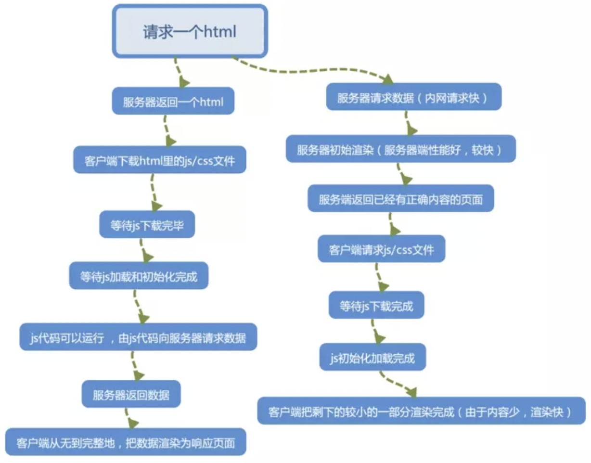

[TOC]
### 前置知识
为了方便解释，我们引入几个概念：
- 数据：通常来自数据库，或者第三方服务，比如用户的信息。数据使用某些数据结果来存储和传输。
- 模板：一个页面的基本轮廓和展示，模板定义了某个元素显示在什么位置。比如smarty模板。
- 页面：为了简化后面的说明，我们就把页面狭义的定义为 HTML。

再引入一个公式：

页面 = 模板 + 数据

上面的加号（+）并不是加法，它就是我们今天要讲到的渲染。
### 客户端渲染：
前端做视图和交互，后端只提供接口数据，前端通过ajax向服务端请求数据，获取到数据后通过js生成DOM插入HTML页面，最终渲染给用户。

客户端渲染优点：
- 使得服务器计算压力变轻
- 做到了前后端分离，在团队开发中只要负责各自的任务即可，使开发效率有明显提升。

客户端渲染缺点：
- 不利于SEO、搜索引擎爬虫看不到完整的程序源码
- 请求增多时用户等待时间变长，导致首屏渲染慢
- 消耗的是用户浏览器的性能

### 服务端渲染：
渲染过程在服务器端完成，最终的渲染结果 HTML 页面通过 HTTP 协议发送给客户端。对于客户端而言，只是看到了最终的 HTML 页面，看不到数据，也看不到模板。

服务端渲染优点：

- 响应快，用户体验好，首屏渲染快
- 对搜索引擎友好，搜索引擎爬虫可以看到完整的程序源码，有利于SEO

服务端渲染缺点：
- 增加了服务器的计算压力，消耗服务器性能

### 为什么使用服务端渲染

- 首屏加载快
客户端渲染下，除了加载html,还要等待js/css加载完成，之后执行js渲染出页面，这个期间用户一直在等待，而服务端只需要加载当前页面的内容，而不需要一次性加载全部的 js 文件。等待时间大大缩短，首屏加载变快。

- 利于SEO优化
服务端渲染出的页面有助于搜索引擎识别页面内容，有利于SEO, 所谓SEO，指的是利用搜索引擎的规则提高网站在有关搜索引擎内的自然排名。现在的搜索引擎爬虫一般是全文分析的模式，分析内容涵盖了一个网站主要3个部分的内容:文本、多媒体(主要是图片)和外部链接，通过这些来判断网站的类型和主题。对于客户端渲染来说，搜索引擎并不能收录到 ajax 爬取数据之后然后再动态 js 渲染出来的页面。而服务端渲染的页面代码都可以在源代码中看到，这有助于搜索引擎识别。
