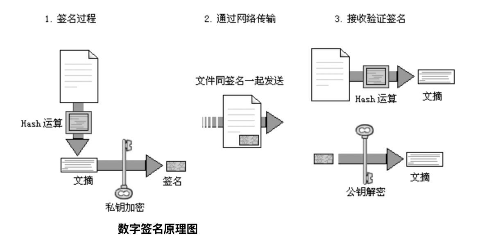

[TOC]
## 对称加密和非对称加密
加密算法通常分为两类，称为对称和非对称加密。这两种加密算法之间的根本区别在于对称加密算法使用单个密钥，而非对称加密算法使用一个密钥来加密数据，再使用另一个密钥来解密它。

### 对称加密
（1）甲方选择某一种加密规则，对信息进行加密；
（2）乙方使用同一种规则，对信息进行解密。
对称加密算法运算速度快，并且需要较少的计算资源，但它的主要缺点是密钥的分发。因为在加密和解密信息时，使用相同的密钥，所以必须将该密钥分发给需要访问数据的人，这也随之带来了安全风险。

常见的对称加密算法：DES，AES等。
### 非对称加密
（1）乙方生成两把密钥（公钥和私钥）。公钥是公开的，任何人都可以获得，私钥则是保密的。
（2）甲方获取乙方的公钥，然后用它对信息加密。
（3）乙方得到加密后的信息，用私钥解密。

接收方在发送消息前需要事先生成公钥和私钥，然后将公钥发送给发送方。发送放收到公钥后，将待发送数据用公钥加密，发送给接收方。接收到收到数据后，用私钥解密。

在这个过程中，公钥负责加密，私钥负责解密，数据在传输过程中即使被截获，攻击者由于没有私钥，因此也无法破解。如果公钥加密的信息只有私钥解得开，那么只要私钥不泄漏，通信就是安全的。

非对称加密算法的加解密速度低于对称加密算法，但是安全性更高。

常用的非对称加密算法有 RSA、ElGamal、ECC 等。

## 数字签名

现实生活中，签名有什么作用？在一封信中，文末的签名是为了表示这封信是签名者写的。计算机中，数字签名也是相同的含义：证明消息是某个特定的人，而不是随随便便一个人发送的（有效性）；除此之外，数字签名还能证明消息没有被篡改（完整性）。

举个🌰：假设甲方向乙方汇款，乙方需要将银行卡号发送给甲方。如果第三方将乙方传给甲方的银行卡账号篡改，那么甲方则将钱转到了第三方，这显然是不行的。因此甲方需要确认接收到的银行卡信息确实是乙方发送的。

数字签名的主要用途包括：
- 验证签名数据的完整性
- 保证发送者事后不能抵赖对数据的签名

数字签名依赖于非对称加密，非对称密钥由公钥/私钥对组成。私钥用于创建签名，对应的公钥用于验证签名。一旦签名验证成功，根据公私钥数学上的对应关系，就可以知道该消息是唯一拥有私钥的用户发送的，而不是随便一个用户发送的。

### 生成签名
一般来说，不直接对消息进行签名，而是对消息的哈希值进行签名，步骤如下。

- 对消息进行哈希计算，得到哈希值
- 利用私钥对哈希值进行加密，生成签名
- 将签名附加在消息后面，一起发送过去

### 验证签名
- 收到消息后，提取消息中的签名
- 用公钥对签名进行解密，得到哈希值1。
- 对消息中的正文进行哈希计算，得到哈希值2。
- 比较哈希值1和哈希值2，如果相同，则验证成功。

为什么不直接对内容加密，而是先生成摘要，对摘要加密？

答：可能是内容很长吧，直接加密算半天！摘要算法可以把无限长的内容输出成长度固定的摘要，再进行加密时间就是可以预估的。

## 数字证书

上面的一切都很完美，你用公钥能够解密，说明确实是私钥方发送的，你很放心……

但有没有想过，万一这把公钥本身，就被人做了手脚？？？

为了保证“公钥”是可信的，数字证书应运而生。

数字证书里有个重要概念，CA,发送方先把自己的公钥给CA，CA对其进行加密得到加密后的发送方公钥（用的是CA的私钥和CA加密算法），也就是CA的数字证书。

注意这里有两个不同的非对称算法（对应2个公钥私钥对），一个算法是发送方加密摘要的，用于生成数字签名；另一个算法是CA加密发送方公钥的，用于生成数字证书。两个算法相互独立，没有必然联系。

发送时不仅发送内容、数字签名，还包含发送方的数字证书。接收方拿到后，首先从数字证书中解密出发送方公钥（用的是CA的公钥和CA解密算法），这个公钥必然是可信的。然后就是和前面一样的流程，拿发送方公钥去解密数字证书，得到摘要；最后比对摘要是否一致。

一个问题：既然数字证书是为了保证发送方公钥不是别人伪造的，那怎么保证“CA”的公钥不是伪造的呢？

答：CA是第三方机构，CA公钥是公开的，接收方可以跟别人比对（比如在网上查询），因此不可能伪造。但是发送方公钥，接收方是通过通信得到的，收到后无法验证。

## 参考文献
[1. 摘要、数字签名、数字证书](https://zhuanlan.zhihu.com/p/32754315)
[2. 数字签名是什么？](https://www.ruanyifeng.com/blog/2011/08/what_is_a_digital_signature.html)
[3. 学习笔记非对称加密和签名认证](https://aaron67.cc/2018/03/02/asymmetric-cryptography-primer/)
