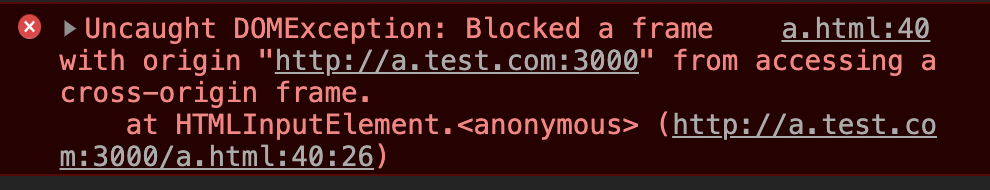

[TOC]
## 什么是同源策略
同源策略（Same Origin Policy）是一种约定，它是浏览器最核心也是最基本的安全功能，如果缺少了同源策略，则浏览器的正常功能可能会受到影响。可以说Web是构建在同源策略的基础之上的，浏览器只是针对同源策略的一种实现。
### 同源含义
所谓"同源"指的是"三个相同"。
- 协议相同，如都是http或者https。
- 域名相同，如都是http://baidu.com/a和http://baidu.com/b，即host相同。
- 端口相同，如都是80端口，默认不写的话是80端口。

### 同源策略分类

另外，同源策略又分为以下三种：

- Cookie、LocalStorage 和 IndexDB 同源策略：只有同源的网页才能共享。
- DOM 同源策略：禁止对不同源页面 DOM 进行操作。这里主要场景是 iframe 跨域的情况，不同域名的 iframe 是限制互相访问的。
- XMLHttpRequest 同源策略：禁止使用 XHR 对象向不同源的服务器地址发起 HTTP 请求。

但是有`<script><iframe><link><video><audio>`等带有`src`或`href`属性的标签是允许跨域加载资源的，这是因为：

- 现在很多大型网站的js脚本、图片等都不是存放在存储网站页面的那台服务器上，他们很可能通过CDN等方式传送到浏览器端。

- 一个网站要加载哪些脚本，由网站的编写人员说了算，他们不会故意加载恶意脚本，所以只要是写在网页中的脚本，我们认为它是安全的。

- 所以，a.com的网页中可以写`<script src="b.com/test.js"></script>`，a网站加载了b网站的脚本，这是完全可以的，不受任何限制。

## 如何跨域访问
### AJAX请求
同源政策规定，AJAX请求只能发给同源的网址，否则就报错。有三种方法规避这个限制。

- JSONP
- CORS
- WebSocket

#### JSONP
在JS中，我们直接用XMLHttpRequest请求不同域上的数据时，是不可以的。但是，在页面上引入不同域上的JS脚本文件却是可以的，JSONP正是利用这个特性来实现的。

比如我们在http://localhost:3000.com里面用ajax请求http://localhost:3001.com/getData接口，浏览器会报错：


错误显示不能在localhost:3000的脚本里面通过ajax向localhost:3001发请求，因为他们是跨域的。

http://localhost:3000.com 前端和服务端代码：

```
// 前端
<!DOCTYPE html>
<html lang="en">
<head>
    <meta charset="UTF-8">
    <title>A</title>
</head>
<body>
    <div>我是A页面</div>
    <script>
        var xhr = new XMLHttpRequest();
        xhr.open('get', 'http://localhost:3001/getData');
        xhr.send();
        xhr.onreadystatechange = function () {
            if (xhr.readyState === 4 && xhr.status === 200) {
                alert(xhr.responseText);
            }
        };

    </script>
</body>
</html>

// 服务端
const Koa = require('koa');
const app = new Koa();
const router = require('koa-router')();
const fs = require('fs');

// response
router.get('/', async (ctx, next) => {
    let data = fs.readFileSync('index.html', 'utf-8');
    ctx.body = data;
})
app.use(router.routes());
app.listen(3000);
```
http://localhost:3001.com 服务端代码：
```
const Koa = require('koa')
// 注意 require('koa-router') 返回的是函数:
const router = require('koa-router')()
const app = new Koa()

// 添加路由
router.get('/getData', async (ctx, next) => {
    ctx.body = 'hello world';
})

// 调用路由中间件
app.use(router.routes())
app.listen(3001, () => {
    console.log('server is running at http://localhost:3001')
})
```
JSONP是“JSON with Padding”的略称，可以让网页从别的域名（网站）那获取资料，即跨域读取数据，将JSON数据填充进回调函数callback。

步骤如下：
- 首先在客户端注册一个callback, 然后把callback的名字传给服务器。
- 服务器先生成 json 数据。
- 然后以 javascript 语法的方式，生成一个function , function 名字就是传递上来的参数 jsonp.
- 将 json 数据直接以入参的方式，放置到 function 中，这样就生成了一段 js 语法的文档，返回给客户端。
- 客户端浏览器，解析script标签，并执行返回的 javascript 文档，此时数据作为参数，传入到了客户端预先定义好的 callback 函数里.（动态执行回调函数）

http://localhost:3000.com 前端代码，通过script标签加载接口，并将定义好的回调函数以query的形式添加到接口后面。
```
<!DOCTYPE html>
<html lang="en">
<head>
    <meta charset="UTF-8">
    <title>A</title>
</head>
<body>
    <div>我是A页面</div>
    <script>
        function addScriptTag(src) {
            var script = document.createElement('script');
            script.setAttribute("type", "text/javascript");
            script.src = src;
            document.body.appendChild(script);
        }

        window.onload = function () {
            addScriptTag('http://localhost:3001/getData?callback=log');
        }

        function log(data) {
            alert(data);
        };
    </script>
</body>
</html>
```

http://localhost:3000.com 服务端代码，服务端将callback 和 要返回的json数据 拼接成字符串返回。
```
const Koa = require('koa')
// 注意 require('koa-router') 返回的是函数:
const router = require('koa-router')()
const app = new Koa()

// 添加路由
router.get('/getData', async (ctx, next) => {
    let data = 'hello world';
    console.log(ctx.request.query);
    let { callback } = ctx.request.query;
    ctx.body = `${callback}('hello world')`;
})

// 调用路由中间件
app.use(router.routes())
app.listen(3001, () => {
    console.log('server is running at http://localhost:3001')
})
```
#### CORS
CORS全称是"跨域资源共享"（Cross-origin resource sharing）。它允许浏览器向跨源服务器，发出XMLHttpRequest请求，从而克服了AJAX只能同源使用的限制。

整个CORS通信过程，都是浏览器自动完成，不需要用户参与。对于开发者来说，CORS通信与同源的AJAX通信没有差别，代码完全一样。浏览器一旦发现AJAX请求跨源，就会自动添加一些附加的头信息，有时还会多出一次附加的请求，但用户不会有感觉。

因此，实现CORS通信的关键是服务器。只要服务器实现了CORS接口，就可以跨源通信。

详细参考 阮一峰老师 [跨域资源共享 CORS 详解](https://www.ruanyifeng.com/blog/2016/04/cors.html) 的介绍。

因此上面的例子，http://localhost:3000.com中前端的代码还是可以用ajax发请求，http://localhost:3001.com服务端的代码需要往响应头加入一些参数。

http://localhost:3000.com前端代码:

```
var xhr = new XMLHttpRequest();
xhr.open('get', 'http://localhost:3001/getData');
xhr.send();
xhr.onreadystatechange = function () {
    if (xhr.readyState === 4 && xhr.status === 200) {
        alert(xhr.responseText);
    }
}; 
```
http://localhost:3001.com服务端代码:

```
router.get('/getData', async (ctx, next) => {
    let data = 'hello world';
    ctx.set("Access-Control-Allow-Origin", '*')
    ctx.body = 'hello world';
})
```

如上图所示，在A页面中给这个接口`http://localhost:3001/getData`发请求时，会在请求头上添加`origin:Origin: http://localhost:3000`，`http://localhost:3001/getData`收到请求时，如果觉得可以响应数据，就会在响应头上添加`Access-Control-Allow-Origin: *`，浏览器收到响应后，发现`origin`属于响应头`Access-Control-Allow-Origin`的值包含的范围内，就会把数据返回给A页面。
#### WebSocket
WebSocket是一种通信协议，使用ws://（非加密）和wss://（加密）作为协议前缀。该协议不实行同源政策，只要服务器支持，就可以通过它进行跨源通信。

### DOM 同源策略
#### 降域
对于主域名相同，而子域名不同的情况，可以使用 document.domain 来跨域。这种方式非常适用于 iframe 跨域和共享cookie。

比如，有一个页面，它的地址是 `http://a.test.com/a.html`，在这个页面里面有一个 iframe，它的 src 是 `http://b.test.com/b.html`。很显然，这个页面与它里面的 iframe 框架是不同域的，所以我们是无法通过在页面中书写 js 代码来获取 iframe 中的东西的。

这个时候，`document.domain` 就可以派上用场了，我们只要把 `http://a.test.com//a.html` 和 `http://b.test.com//b.html` 这两个页面的 `document.domain` 都设成相同的域名就可以了。但要注意的是，`document.domain` 的设置是有限制的，我们只能把 `document.domain` 设置成自身或更高一级的父域，且主域必须相同。例如：`a.b.test.com` 中某个文档的 `document.domain` 可以设成 `a.b.test.com、b.test.com 、test.com` 中的任意一个，但是不可以设成 `c.b.test.com` ，因为这是当前域的子域，也不可以设成 `baidu.com`，因为主域已经不相同了。

```
// a.html
<html>
<style>
    .ct {
        width: 910px;
        margin: auto;
    }
    .main {
        float: left;
        width: 450px;
        height: 300px;
        border: 1px solid #ccc;
    }
    .main input {
        margin: 20px;
        width: 200px;
    }
    .iframe {
        float: right;
    }
    iframe {
        width: 450px;
        height: 300px;
        border: 1px dashed #ccc;
    }
</style>
<div class="ct">
    <h1>使用降域实现跨域</h1>
    <div class="main">
        <input type="text" placeholder="http://a.test.com:3000/a.html">
    </div>
    <iframe src="http://b.test.com:3000/b.html" frameborder="0"></iframe>
</div>
<script>
    document.querySelector('.main input').addEventListener('input', function () {
        console.log(this.value);
        window.frames[0].document.querySelector('input').value = this.value;
    })
    document.domain = 'test.com'
</script>
</html>

// b.html
<html>
<style>
    html,
    body {
        margin: 0;
    }
    input {
        margin: 20px;
        width: 200px;
    }
</style>
<input id="input" type="text" placeholder="http://b.test.com:3000/b.html">
<script>
    document.querySelector('#input').addEventListener('input', function () {
        window.parent.document.querySelector('input').value = this.value;
    })
    document.domain = 'test.com'
</script>
</html>

// 服务端代码
const koa = require('koa');
const server = require('koa-static');
const app = new koa();
app.use(server('.'))
app.listen(3000); 
```
注意启动服务器后，需要在host文件里面增加两条配置：
```
host文件
127.0.0.1	a.test.com
127.0.0.1	b.test.com
```
启动服务器后，在浏览器通过http://a.test.com:3000/a.html访问页面，在a页面的input框输入内容后，b页面的input框会显示同样的内容，反之亦然。

如果不添加`document.domain = 'test.com'`这行代码，浏览器会报错：

#### postMessage
`window.postMessage(message，targetOrigin)` 方法是 HTML5 新引进的特性，允许跨窗口通信，不论这两个窗口是否同源。

调用 `postMessage` 方法的 `window` 对象是指要接收消息的那一个 `window` 对象，该方法的第一个参数 `message` 为要发送的消息，类型只能为字符串；第二个参数 `targetOrigin` 用来限定接收消息的那个 `window` 对象所在的域，即`"协议 + 域名 + 端口"`。也可以设为`*`，表示不限制域名，向所有窗口发送。

父窗口和子窗口都可以通过`message`事件，监听对方的消息。

```
// a.html
<script>
document.querySelector('.main input').addEventListener('input', function () {
    console.log(this.value);
    window.frames[0].postMessage(this.value, '*');
})

window.addEventListener('message', function (e) {
    document.querySelector('.main input').value = e.data
    console.log(e.data);
});
</script>

// b.html
<script>
document.querySelector('#input').addEventListener('input', function () {
    window.parent.postMessage(this.value, '*');
})
window.addEventListener('message', function (e) {
    document.querySelector('#input').value = e.data
    console.log(e.data);
});
</script>

// 其余代码同上
```
#### window.name
`window.name`有一个奇妙的性质，页面如果设置了`window.name`，在不关闭页面的情况下，即使进行了页面跳转`location.href=...`，这个`window.name`还是会保留。
比如我们打开`https://www.baidu.com/`页面，然后在控制台做如下输入:
```
window.name = 'test'
location.href='http://www.google.com';
页面跳转至 ：https://www.google.com/

window.name     //test
```
利用这一点，我们就可以拿到其他域中的数据了。
- 利用`window.name`的性质，我们可以在`iframe`中加载一个跨域页面。

- 这个跨域页面载入之后，让它设置自己的`window.name`

- 然后再让它进行当前页面的跳转，跳转到与`iframe`外的页面同域的页面，此时`window.name`是不会改变的。

- 这样，`iframe`内外就属于同一个域了，且`window.name`还是跨域的页面所设置的值。
```
// a.html
<html>
<style>
    iframe {
        display: none;
    }
</style>
<div class="ct">
    <h1>使用降域实现跨域</h1>
    <div id="ct"></div>
    <iframe id="myIframe" src="http://b.test.com:3000/b.html" frameborder="0" onload="test()"></iframe>
</div>
<script>
    function test() {
        var iframe = document.getElementById('myIframe');
        iframe.onload = function () {
            var data = iframe.contentWindow.name;
            var ct = document.getElementById('ct');
            ct.innerHTML = data;
        };
        iframe.src = 'http://a.test.com:3000/c.html';
    }
</script>
</html>

// b.html
<html>
<style>
</style>
<script>
    window.name = 'hello world'
</script>
</html>

// c.html
<!DOCTYPE html>
<html lang="en">
<head>
    <meta charset="UTF-8">
    <meta name="viewport" content="width=device-width, initial-scale=1.0">
    <title>Document</title>
</head>
<body>
</body>
</html>
```
#### location.hash

## 参考文章
[1. 浏览器同源政策及其规避方法](https://www.ruanyifeng.com/blog/2016/04/same-origin-policy.html)
[2. 浏览器同源策略及跨域的解决方法](https://juejin.im/post/5ba1d4fe6fb9a05ce873d4ad#heading-18)
[3. 怎样利用window.name拿到跨域数据](https://www.jianshu.com/p/835bc9534281)