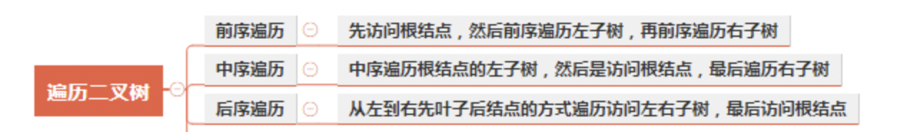
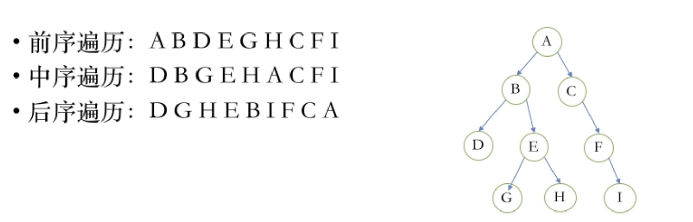

[TOC]
## 二叉树的遍历
二叉树的遍历是指从根结点出发，按照某种次序依次访问二叉树中所有结点，使得每个结点被访问一次且仅被访问一次。

二叉树的遍历根据根节点的访问顺序不同，可分为：



### 前序遍历
具体过程：
- 首先申请一个新的栈，记为stack；
- 将根结点root压入stack中；
- 每次从stack中弹出栈顶节点，记为node，然后将node的值压入结果数组，如果node右孩子不为空，则将右孩子压入栈中；如果node的左孩子不为空，将其压入stack中；
- 重复步骤3，直到stack为空.
```
var preorderTraversal = function(root) {
    var result = [];
    var stack = [];
    stack.push(root);
    while(stack.length > 0){
        var node = stack.pop();
        if(node!=null){
            result.push(node.val);
            if(node.right!=null){
                stack.push(node.right);
            }
            if(node.left!=null){
                stack.push(node.left);
            }
        }
    }
    return result;
};
```
过程模拟:

### 中序遍历
具体过程：
- 申请一个新栈，记为stack，申请一个变量node，初始时令node为头节点；
- 先把node节点压入栈中，对以node节点为头的整棵子树来说，依次把整棵树的左子树压入栈中，即不断令node=node.left，然后重复步骤2；
- 不断重复步骤2，直到发现node为空，此时从stack中弹出一个节点记为node，并将其值压入结果数组中，并让node = node.right，然后继续重复步骤2；
- 当stack为空并且node为空时结束。
```
var inorderTraversal = function(root) {
    var result = [];
    var stack = [];
    var node = root;
    while(stack.length > 0 || node != null){
        if(node!=null){
            stack.push(node);
            node = node.left;
        }else{
            node = stack.pop();
            result.push(node.val);
            node = node.right;
        }
    }
    return result;
};
```
过程模拟:

### 后序遍历
具体过程：使用两个栈实现
- 创建两个空的栈stack和result，将root压入stack;
- 当stack不为空，执行以下操作
    - 弹出stack中的元素，并将该节点的值压入结果数组；
    - 如果节点的左子节点不是null，则将节点的左子节点压入stack；
    - 如果节点的右子节点不是null，则将节点的右子节点压入stack；
- result逆序，即为后序遍历顺序。
```
var postorderTraversal = function(root) {
    var stack = [];
    var result = [];
    stack.push(root);
    while(stack.length>0){
        let node = stack.pop()
        if(node!=null){
            result.push(node.val);
            if(node.left!=null){
                stack.push(node.left);
            }
            if(node.right!=null){
                stack.push(node.right);
            }
        }
    }
    return result.reverse();
};
```
过程模拟：

## 参考资料
[图解数据结构 二叉树遍历](https://www.cnblogs.com/songwenjie/p/8955856.html)