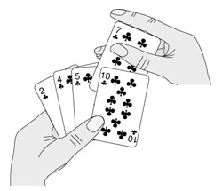

[TOC]
## 排序算法概览
一般排序算法：
- 插入排序
- 冒泡排序
- 快速排序
- 归并排序
- 堆排序

特殊排序：
- 计数排序
- 桶排序
### 插入排序
#### 原理
像排序⼀⼿扑克牌，把⼀张牌开始时，我们的左⼿为空并且桌⼦上的牌⾯向下。然后我们每次从桌⼦上拿⾛⼀张牌并将它插⼊左⼿中正确的位置。为了找到⼀张牌的正确位置，我们从右到左将它与在⼿中的每张牌进⾏⽐较。

#### 代码
```
function insertSort(nums) {
    let len = nums.length;
    for (let i = 1; i < len; i++) {
        let current = nums[i];
        let j = i - 1;
        while (j >= 0 &&  nums[j] > current) {
            nums[j + 1] = nums[j];
            j--;
        }
        nums[j + 1] = current
    }
}
```
#### 时间复杂度
**最好情况：** 数组已经排好序。$O(n)$
**最坏情况：** 数组反向排序。$O(n^2)$
**平均情况：** 确定在什么位置插入新元素num，平均数组中有一半大于num，一半小于num。$O(n^2)$
### 冒泡排序
#### 原理
冒泡排序是最易懂的排序算法，但是效率较低，生产环境中很少使用
基本原理：
1、依次比较相邻的两个数，如果不符合排序规则，则调换两个数的位置。这样一边比较下来，能够保证最大（或最小）的数排在最后一位。
2、再对最后一位以外的数组，重复前面的过程，直至全部排序完成。
 
#### 代码
```
function bubbleSort(nums) {
    let len = nums.length;
    for (let i = 0; i < len - 1; i++) {
        for (let j = 1; j < len - i; j++) {
            if (nums[j - 1] > nums[j]) {
                let temp = nums[j - 1];
                nums[j - 1] = nums[j];
                nums[j] = temp;
            }
        }
    }
    return nums
}
```
#### 时间复杂度
**最好情况 = 最坏情况 = 平均情况 ：** $O(n^2)$。
### 归并排序
#### 原理
- 分解：将数组划分为两个规模为n/2的⼦数组
- 解决：递归地对两个⼦数组分别排序
- 合并：递归地合并两个⼦数组


#### 代码
```
function mergeSort(nums) {
    if (nums.length == 1) {
        return nums;
    }
    let middle = Math.floor(nums.length / 2);
    let left = mergeSort(nums.slice(0, middle));
    let right = mergeSort(nums.slice(middle));
    return merge(left, right);
}
function merge(left, right) {
    let result = [];
    let i = 0, j = 0, index = 0;
    while (i < left.length && j < right.length) {
        if (left[i] < right[j]) {
            result[index++] = left[i++];
        } else {
            result[index++] = right[j++];
        }
    }
    while (i < left.length) {
        result[index++] = left[i++];
    }
    while (j < right.length) {
        result[index++] = right[j++];
    }
    return result;
}
```
#### 时间复杂度
**最好情况 = 最坏情况 = 平均情况 ：** $O(nlogn)$。
### 快速排序
#### 原理
- 分解：选择数组中某个数作为基数,将数组划分为两个（可能为空）⼦数组，使得前⼀个⼦数组中的每个元素都⼩于或等于nums[pivot]，后⼀个都⼤于nums[pivot]；
- 解决：递归地对两个⼦数组分别排序；
- 合并：由于⼦数组都是原地排序不需要合并。


#### 代码
```
function quickSort(nums, begin, end) {
    if (begin >= end) {
        return;
    }
    let pivot = partition(nums, begin, end)
    quickSort(nums, begin, pivot - 1);
    quickSort(nums, pivot + 1, end)
}
function partition(nums, begin, end) {
    let value = nums[begin]
    while (begin < end) {
        while (begin < end && nums[end] >= value) {
            end--;
        }
        nums[begin] = nums[end]
        while (begin < end && nums[begin] <= value) {
            begin++;
        }
        nums[end] = nums[begin]
    }
    nums[begin] = value;
    return begin;
}

let a = [5,3,8,4,6,2,7,1]
quickSort(a,0,7)
a // [1,2,3,4,5,6,7,8]
```
#### 时间复杂度
**最好情况 = 平均情况 ：** $O(nlogn)$。
**最坏情况：** 数组反向排序。$O(n^2)$