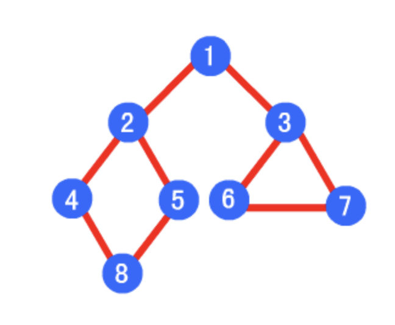

## 深度优先遍历（depth first search）
会访问一个顶点的所有相邻顶点，不过深度优先的方式为，首先访问一个相邻顶点，并继续访问该相邻顶点的一个相邻顶点，重复执行直到当前正在被访问的顶点出度为零，或者不存在未访问状态的相邻顶点，则回退到上一个顶点继续按照该深度优先方式访问。因为存在回溯行为，所以需要借助栈结构保存顶点，或者直接利用递归调用产生的方法栈帧来完成回溯。

深度优先遍历顺序为：1->2->4->8->5->3->6->7

**本质**：将根节点的子节点从右往左依次入栈，利用栈后进先出的特征，每次优先遍历的是左节点，从而总会按照深度优先方式遍历所有节点。

**递归**
```
function deepTraverse(node, nodeList = []) {
    if (node != null) {
        nodeList.push(node)
        let children = node.children
        for (let i = 0; i < children.length; i++) {
            deepTraverse(children[i], nodeList)
        }
    }
    return nodeList
}

```
**非递归**
```
function deepTraverse(node) {
    if (node == null) {
        return []
    }
    let stack = [];
    let nodeList = [];
    stack.push(node)
    while (stack.length) {
        let item = stack.pop();
        let children = item.children;
        nodeList.push(item);
        for (let i = children.length - 1; i >= 0; i--) {
            stack.push(children[i])
        }
    }
    return nodeList
}
```
## 广度优先遍历（breadth first search）
广度优先遍历图的方式为，一次性访问当前顶点的所有未访问状态相邻顶点，并依次对每个相邻顶点执行同样处理。因为要依次对每个相邻顶点执行同样的广度优先访问操作，所以需要借助队列结构来存储当前顶点的相邻顶点。

广度优先的遍历顺序为：1->2->3->4->5->6->7->8

**本质**：利用队列先进先出的特征，将根节点的子节点从左往右依次入列，这样每次会优先遍历同一层的所有节点，等该层所有节点都被访问过，才会遍历下一层的节点。
```
function breadTraverse(node) {
    if (node == null) {
        return []
    }
    let queue = [];
    let nodeList = [];
    queue.push(node)
    while (queue.length) {
        let item = queue.shift();
        let children = item.children;
        nodeList.push(item);
        for (let i = 0; i < children.length; i++) {
            queue.push(children[i])
        }
    }
    return nodeList
}
```
