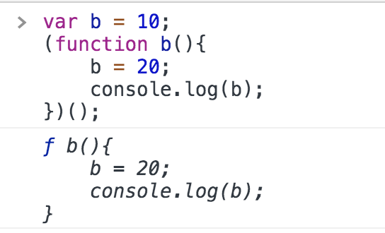
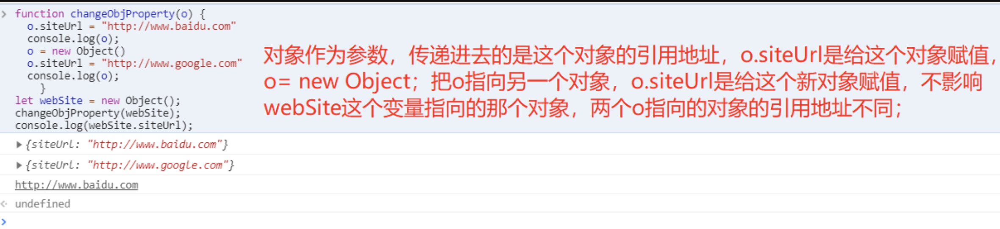

### 第2题 ['1', '2', '3'].map(parseInt) what & why ?
**输出：** [1, NaN, NaN]，哈哈，想不到吧！
**解答：**
map函数的第一个参数callback：
```
var new_array = arr.map(function callback(currentValue[, index[, array]]) { // Return element for new_array }[, thisArg])
```
这个callback一共可以接收三个参数，其中第一个参数代表当前被处理的元素，而第二个参数代表该元素的索引，第三个参数是map方法调用的数组。

parseInt(string, radix) 则是用来解析字符串的，**把string所对应的值当做radix对应的进制看待，然后转换成相应的10进制值。**


| string |                                                                                            必需。要被解析的字符串。                                                                                            |
| :----: | :------------------------------------------------------------------------------------------------------------------------------------------------------------------------------------------------------------: |
| radix  | 可选。表示要解析的数字的基数。该值介于 2 ~ 36 之间。如果省略该参数或其值为 0，则数字将以 10 为基础来解析。如果它以 “0x” 或 “0X” 开头，将以 16 为基数。如果该参数小于 2 或者大于 36，则 parseInt() 将返回 NaN。 |

因此上面等价于：
```
['1', '2', '3'].map((item, index) => {
	return parseInt(item, index)
})

parseInt('1', 0) // 1
parseInt('2', 1) // NaN
parseInt('3', 2) // NaN, 二进制中没有3
```
### 第21题
有以下 3 个判断数组的方法
1. Object.prototype.toString.call
2. instance
3. constructor
4. Array.isArray

请分别介绍它们之间的区别和优劣

1. Object.prototype.toString.call()

每一个继承 Object 的对象都有 toString 方法，如果 toString 方法没有重写的话，会返回 [Object type]，其中 type 为对象的类型。但当除了 Object 类型的对象外，其他类型直接使用 toString 方法时，会直接返回都是内容的字符串，所以我们需要使用call或者apply方法来改变toString方法的执行上下文。

数组的toString方法返回数组的字符串形式。
```
const arr = ['Hello','An'];
arr.toString(); // "Hello,An" 
Object.prototype.toString.call(arr); // "[object Array]"

Object.prototype.toString.call(arg) === '[object Array]' //判断是否为数组
```
这种方法对于所有基本的数据类型都能进行判断，即使是 null 和 undefined 。
```
Object.prototype.toString.call('An') // "[object String]"
Object.prototype.toString.call(1) // "[object Number]"
Object.prototype.toString.call(Symbol(1)) // "[object Symbol]"
Object.prototype.toString.call(null) // "[object Null]"
Object.prototype.toString.call(undefined) // "[object Undefined]"
Object.prototype.toString.call(function(){}) // "[object Function]"
Object.prototype.toString.call({name: 'An'}) // "[object Object]"
```

2. instanceof

instanceof  的内部机制是通过判断对象的原型链中是不是能找到类型的 prototype。

使用 instanceof判断一个对象是否为数组，instanceof 会判断这个对象的原型链上是否会找到对应的 Array 的原型，找到返回 true，否则返回 false。
```
[]  instanceof Array; // true
```
但 instanceof 只能用来判断对象类型，原始类型不可以。并且所有对象类型 instanceof Object 都是 true。
```
[]  instanceof Object; // true
```
instance 不准确的原因：
```
var iframe = document.createElement('iframe');
document.body.appendChild(iframe);

var arr = [1,2,3];
xArray = window.frames[0].Array;  //iframe中的构造函数
var arrx = new xArray(4,5,6);

console.log(arrx instanceof Array);  //false
console.log(arrx.constructor == Array);// false

console.log(Array.prototype == xArray.prototype); //false
console.log(arr instanceof xArray); //false

console.log(arrx.constructor === Array);// false
console.log(arr.constructor === Array);// true
console.log(arrx.constructor === xArray);// true
console.log(Array.isArray(arrx));  //true
```
instanceof操作符的问题在于，它假定只有一个全局环境。如果网页中包含多个框架，那实际上就存在两个以上不同的全局执行环境，从而存在两个以上不同版本的Array构造函数。
如果你从一个框架向另一个框架传入一个数组，那么传入的数组与在第二个框架中原生创建的数组分别具有各自不同的构造函数。

3. constructor
```
var arr = [4,67,23];
arr.constructor == Array;   // return true
```
constructor 不准确的原因
因为constructor可以被重写，所以不能确保一定是数组
```
var str = 'abc';
str.constructor = Array;
str.constructor === Array // return true
```
很明显str不是数组。
而且constructor和instanceof存在同样问题，不同执行环境下，constructor判断不正确问题。

4. isArray()
```
var arr = [1, 2, 3];

Array.isArray(arr) // true
```
当检测Array实例时，Array.isArray 优于 instanceof ，因为 Array.isArray 可以检测出 iframes
```
var iframe = document.createElement('iframe');
document.body.appendChild(iframe);
xArray = window.frames[0].Array;;
var arr = new xArray(1,2,3); // [1,2,3]

// Correctly checking for Array
Array.isArray(arr);  // true
Object.prototype.toString.call(arr); // true
// Considered harmful, because doesn't work though iframes
arr instanceof Array; // false
```
因为这个方法是ES5新添加的，在不支持的浏览器上可能有兼容性，用的时候需要兼容下不支持的浏览器，这个时候可以用Object.prototype.toString.call兼容。
```
if(!Array.isArray){
    Array.isArray = function(arg){
        return Object.prototype.toString.call(arg)==='[object Array]'
    }
}
```
### 第31题
改造下面的代码，使之输出0 - 9，写出你能想到的所有解法。
```
for (var i = 0; i< 10; i++){
	setTimeout(() => {
		console.log(i);
    }, 1000)
}
```
**改造1：**
- 利用 let 变量的特性 — 在每一次 for 循环的过程中，let 声明的变量会在当前的块级作用域里面（for 循环的 body 体，也即两个花括号之间的内容区域）创建一个文法环境（Lexical Environment），该环境里面包括了当前 for 循环过程中的 i。
```
for (let i = 0; i < 10; i++) {
    setTimeout(() => {
        console.log(i);
    }, 1000)
}
```
**改造2：**
- 利用函数自执行的方式，把当前 for 循环过程中的 i 传递进去，构建出块级作用域
```
for (var i = 0; i < 10; i++) {
    (function (i) {
        setTimeout(() => {
            console.log(i);
        }, 1000)
    })(i)
}
```
**改造3**
- 利用 setTimeout 函数的第三个参数，会作为回调函数的第一个参数传入
```
for (var i = 0; i < 10; i++) {
  setTimeout(i => {
    console.log(i);
  }, 1000, i)
}
```
### 33. 下面的代码打印什么内容，为什么？
```
var b = 10;
(function b(){
    b = 20;
    console.log(b); 
})();
```
**输出**

**解析**
- 函数表达式与函数声明不同，函数名只在该函数内部有效，并且此绑定是常量绑定。
- 对于一个常量进行赋值，在 strict 模式下会报错，非 strict 模式下静默失败。
- IIFE中的函数是函数表达式，而不是函数声明。
  
执行 b = 20 时，顺着作用域链向上找，找到函数 b, 尝试给 b 赋值为 20，由于函数 b 是函数表达式，而函数表达式的函数名是常量，无法二次赋值(在正常模式下静默失效，在严格模式下报错)，赋值失败，所以输出的还是该函数

### 34. 简单改造下面的代码，使之分别打印 10 和 20。
```
var b = 10;
(function b(){
    b = 20;
    console.log(b); 
})();
```
**打印20**：
```
var b = 10;
(function b(b){
    b = 20;
    console.log(b);  //20
})(b);
等价于：
var b = 10;
(function b(){
    var b = 10;
    b = 20;
    console.log(b);  //20
})(b);
```
形参相当于在函数内部定义了`var b = 10`;当执行 b = 20 时，顺着作用域链向上找，于是在函数内找到了局部变量 b(也就是 var b 的), 将其修改为 20。console.log(b)同理，顺着作用域链向上找，找到了局部变量 b，且其值为 20.

**打印10**：
```
var b = 10;
(function b(b){
    console.log(b); //10
    b = 20;
})(b);
等价于：
var b = 10;
(function b(){
    var b = 10;
    console.log(b);  //10
    b = 20;
})(b);
```

### 38. （京东）下面代码中 a 在什么情况下会打印 1？
```
var a = ?;
if(a == 1 && a == 2 && a == 3){
 	console.log(1);
}
```
**解法：**
如果一个操作数是对象，另一个操作数不是，则隐式调用对象的toString或valueOf方法。
```
var a = {
    value: 1,
    toString() {
        return this.value++
    }
};
if(a == 1 && a == 2 && a == 3) {
  console.log('1');
}
```
### 41. 下面代码输出什么
```
var a = 10;
(function () {
    console.log(a) // undefined
    a = 5
    console.log(window.a)   // 10
    var a = 20;
    console.log(a)  //20
})()
```
说明：立即执行函数内部，`var a = 20`会使得变量提升。
### 42. 实现一个 sleep 函数，比如 sleep(1000) 意味着等待1000毫秒，可从 Promise、Generator、Async/Await 等角度实现
```
// promise
function sleep(delay) {
    return new Promise((resolve, reject) => {
        setTimeout(resolve, delay)
    })
}
sleep(1000).then(() => {
    // your code
})

// async
async function sleep(delay) {
    await new Promise((resolve, reject) => {
        setTimeout(resolve, delay)
    })
    // your code
}

// 回调
function sleep(delay, callback) {
    setTimeout(callback, delay)
}

//Generator
function* sleepGenerator(time) {
    yield new Promise(function (resolve, reject) {
        setTimeout(resolve, time);
    })
}
sleepGenerator(1000).next().value.then(() => {
    // your code
})
```
### 43. 使用 sort() 对数组 [3, 15, 8, 29, 102, 22] 进行排序，输出结果
```
[3, 15, 8, 29, 102, 22].sort((a,b)=>a-b)
```
### 53. 输出以下代码的执行结果并解释为什么
```
var a = {n: 1};
var b = a;
a.x = a = {n: 2};

console.log(a.x) 	 // undefined
console.log(b.x)	 // {n:2}
```
解析：
 1、`.`运算符优先，a.x此时保持对`{n: 1}`的引用，也就是b也保持对`{n: 1}`的引用，于是`{n: 1}` => `{n: 1, x: undefined}`，此时a和b还是对原来对象的引用，只不过原来对象增加了x属性
 2、`=`从右往左，`a = {n: 2}`，此时a的引用已经变成了`{n: 2}`这个对象
 3、`a.x=a`，此时a.x是保持对`{ n: 1, x: undefined}`中的x引用，也就是b.x，于是`{ n: 1, x: undefined}` => `{n: 1, x: { n: 2}}`，即`b.x = { n: 2 }`

### 98 .（京东）写出如下代码的打印结果
```
function changeObjProperty(o) {
  o.siteUrl = "http://www.baidu.com"
  o = new Object()
  o.siteUrl = "http://www.google.com"
} 
let webSite = new Object();
changeObjProperty(webSite); 
console.log(webSite.siteUrl);  //http://www.baidu.com
```
**解析：**
